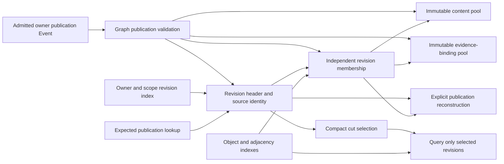

# Graph representation and query recommendation

Status: proposed successor shape, following the [use-case contracts](graph_use_case_contracts.md). The user authorized comparing complete designs against those contracts. This document recommends a design and its implementation boundary; it does not record a production cutover. Existing owner publications and domain meaning remain the input contract.

The subsequent [native delivery](agdb_native_delivery.md) selects agdb for publication storage, indexed selection and adjacency, while explicitly deferring compact cut receipts, metadata colocation, high-degree work budgets and retention collection. The proposal below remains the broader target; its engine-selection discussion records the pre-integration assessment.

## Recommendation

Current engine investigation: [agdb](agdb_implementation_assessment.md) is the lead candidate after a small disposable engine correction passes the full bounded publication screen. Released agdb remains unqualified for interrupted transactions, and Cozo promotion remains on hold. Representation recommendations below remain engine-independent.

Meld should retain each owner's revision as independently queryable membership over shared immutable content and exact evidence bindings. Small indexes should select those revisions and locate objects or occurrences. Full publications should be reconstructible for explanation, rather than the mandatory unit of every read.

Engine selection remains open after the [graph-crate feasibility screen](graph_crate_experiment.md) and [Cozo implementation assessment](cozo_implementation_assessment.md). The earlier Sled-first recommendation remains held. Cozo's useful query delegation warrants consideration, but the follow-up reproduces a correctness defect in released 0.7.6 and puts native promotion on hold. Sled remains the existing integrated reference. The important replacement is the Graph representation and access path. A second database holding indexes beside Sled publication bodies adds a consistency boundary without yet removing the source of duplication.

The recommended shape changes four things together: publication storage, currentness and visibility lookup, query preparation, and the receipt carried by frequent readers. An index-only cutover would leave significant costs in the other three. None of these changes requires Graph to decide domain truth, prescribe Strategy, or accept knowledge outside Events.

## New evidence: what can actually be reused

The external harness now includes a [publication accounting tool](../../../../../meld-eval/tools/account-graph-publications.py) and [retained analysis](../../../../../meld-eval/evidence/graph-representation-v1/README.md). It reads successful public Event and Graph command captures from both verified baseline runs. It never opens a private database. It models a lossless decomposition of every captured Codebase Semantics publication and verifies exact reconstruction of each original operation.

| Account | Each verified run | Interpretation |
| --- | --- | --- |
| Distinct captured publications | 11 | Includes the duplicate-occurrence and incomplete-successor challenges |
| Object and occurrence records across revisions | 12,241 | Historical membership records, not the upstream syntax-node count |
| Original canonical JSON operation array | 12,698,029 bytes | Excludes outer Event envelopes, hints and engine storage |
| Modeled shared-content layout | 5,091,289 bytes | A 59.9 percent logical JSON reduction, with all fields and membership preserved |
| Unique content fragments | 2,027 | Object address, state and qualifications, or relation endpoints, type and qualifications |
| Unique evidence-binding fragments | 363 | All remaining record fields except the publication or occurrence ID |
| Modeled revision and membership portion | 3,807,682 bytes | Most of the remaining model; long identities and full membership still cost space |

These are layout measurements, not predicted file sizes or query timings. The model charges JSON dictionary keys, 64-character content references and all original completeness lists. It excludes adjacency indexes, database pages, compression, allocation and reconstruction CPU cost. Both runs produce the same aggregate sizes independently; their actual Event and cut identities remain distinct.

Reuse is mostly historical. The initial operation decreases from 1,065,648 to 909,476 modeled bytes, about 14.7 percent. Across revisions, unchanged content can be retained once while renewed evidence remains distinct. This is evidence for separating those units, not evidence that the owner should publish fewer facts or that every unchanged-looking record is the same observation.

The initial compact cut is 79,918 bytes, with 78,405 bytes in its completeness membership array. More than 98 percent of the cut is that list. The measured depth-one read after history growth still returns 261 objects and 260 occurrences, with an explicit depth frontier. Its roughly 1.14 MB formatted response is not a tiny neighborhood query. The earlier spike demonstrates history amplification; it does not establish the latency floor for a genuinely small consumer question.

## Candidate shapes against the contracts

The following compares representation designs, separately from engines. `Unknown` means no native implementation evidence for that claim. A proposed design satisfying a requirement on paper is not a measured pass.

| Shape | Preserves the semantic account | Selection and bounded work | Change and retained history | Decision |
| --- | --- | --- | --- | --- |
| A — Full publications plus literal revision indexes | Exercised parity for selected contracts; shared recovery and identity gaps remain | Cut and traversal history scans improved; visibility, runtime catch-up, large heads and high-degree materialization remain | Full publication history plus copied row payloads; retention still unbounded | Keep as reference evidence, not the completed successor |
| B — Shared immutable content, exact bindings and independent revision membership | Lossless reconstruction demonstrated on captured JSON; native G01–G12 qualification remains unknown | Direct head and visibility lookup; per-revision address and adjacency access; compact cuts; bounded candidate iteration | Full membership per revision, shared content and bindings; no historical delta replay on reads | Recommended first successor shape |
| C — Revision deltas with checkpoints or shared persistent membership trees | Can preserve meaning in principle; no native proof | Read cost depends on checkpoint depth or persistent structure traversal | Potentially smaller membership writes; base retention, chain limits and reclamation become additional obligations | Defer until membership cost is measured after B |

Current-state-only storage violates retained-cut and explanation requirements and is unsuitable. A graph-native engine is not another semantic shape: it could implement B or C. It remains unexercised and would need to show exact occurrence, revision and cut mapping. There is no evidence here to claim it cannot do so.

B deliberately stops short of a general persistent graph algorithm or an owner delta protocol. The accounting says substantial payload reuse is available before taking on that complexity. Its remaining cost is explicit: every full incoming revision is validated and retains its membership. It does not promise admission proportional only to the changed function.

## Concrete representation

The records below belong to one Graph projection generation. Names describe private storage roles, not new domain products. Stored keys use a versioned structured encoding, preserving complete component boundaries and the unsigned Event sequence range. Do not use delimiter concatenation as identity. Content-address lookup must verify the stored content identity rather than silently overwrite on disagreement.

| Stored role | Content and key boundary | Read responsibility |
| --- | --- | --- |
| Revision header | Ledger and source Event, operation and revision identity, owner, full scope, source route, enumeration rule revision, work-input basis and completeness descriptor | Select or validate an exact revision without reading every member |
| Membership | Revision identity, record kind, exact owner publication or occurrence ID, content reference and evidence-binding reference | Reconstruct records for this revision without following predecessor deltas |
| Content pool | Exact native object address, state and qualifications, or relation endpoints, type and qualifications | Share equal content across revisions without equating observations |
| Evidence-binding pool | Exact remaining record fields, including source product, hydration and provenance | Share equal bindings within or across revisions; retain changed bindings independently |
| Completeness account | Status, scope, exclusions, failures and canonical membership correspondence | Keep full explanation available; derive membership IDs only if exact reconstruction is proved |
| Revision selection index | Owner and full scope, with source-route-specific access and ordered Event position | Select newest eligible revision, including incomplete successors |
| Publication lookup | Expected Event record identity and exact source position mapped to revision | Establish Graph visibility without history enumeration |
| Address and adjacency indexes | Selected revision, structured address, direction and deterministic occurrence order, referencing membership | Decode selected records once; retain both directions without duplicating relation bodies |
| Generation and progress | Schema generation, source ledger, projection and route coverage | Open consistent state, constrain visible revisions and support replay |

The full Event remains canonical ingress. The successor need not retain another intact publication blob in Graph if it can reconstruct the exact operation and projected source account from these records. Existing consumers such as causal walks still receive the intact public product. Public operation identity, provenance and membership equality are the reconstruction oracle. Ordinary Event retention remains a separate source of bytes and is not removed by this design.

A membership entry references an occurrence; it is not merely an endpoint pair. Two equal-looking relationships with distinct occurrence IDs therefore remain two members. Likewise, an address can have several selected publications. Object and path bounds must retain their current meaning rather than accidentally counting unique addresses where the contract counts published records.

The accounting tool uses whole record fragments to show a conservative sharing opportunity. Production need not intern every tiny value or copy its exact JSON layout. Start with these two useful fragment boundaries. More aggressive field dictionaries, binary IDs, compressed membership and shared membership trees need their own measured benefit.

## Query contract and access paths

Currentness selection and frozen reads have different preparation requirements. Capture the requested Event frontier once. Projection may be advanced to that frontier through bounded work, or the caller receives a typed lag result and uses the existing wait machinery. Do not keep extending the target as new Events arrive. A valid retained cut needs no catch-up beyond its own available dependencies.

| Consumer question | Successor access path | Work that must disappear |
| --- | --- | --- |
| Which revisions satisfy this owner selection? | Owner, scope and route index at the captured frontier; read small revision descriptors | Scan and decode retained publication bodies; scan unrelated route history |
| Is this exact publication visible here? | Validate cut and selected revision, then direct expected-Event lookup and source-bound checks | Full-history search for a known operation |
| What is connected to this selected object? | Per-revision address and ordered adjacency iterators; load selected membership and payload | Constructing the full selected graph before applying bounds |
| Why did this product or plan exist? | Resolve retained revision and reconstruct the requested publication or explanation | Substitution with latest owner data; mandatory broad hydration for ordinary reads |
| Has a dependency progressed? | Existing progress and coverage descriptors | Rebuilding unchanged graph state for idle consumers |

The source-route-specific index matters. The indexed Sled prototype finds an owner/scope head and searches backward for a matching route. With many interleaved routes, that can still walk unrelated revision headers. Both unqualified owner selection and exact-route selection deserve explicit keys, rather than hiding a route scan behind an indexed API.

Traversal should merge ordered candidate iterators across selected revisions and directions using the existing deterministic semantic order. A relation filter must not change the relative order of eligible occurrences. The visited set uses structured addresses; occurrence deduplication uses qualified identity. Decode content after selection where the required ordering and qualification permit it.

Independent result bounds remain. Add an explicit examined-entry or decoded-byte work budget for candidate preparation, reported separately from depth, object, occurrence and path truncation. A high-degree root may exhaust that budget before yielding a complete neighborhood. This first design should return explicit work exhaustion and frontier rather than introduce persistent query sessions or an unbounded continuation mechanism. Planner must treat insufficient input as insufficient, not a complete negative answer.

## Compact receipts require an explicit API correction

Moving the completeness list out of a stored head is insufficient while every frequent reader reconstructs it into a cut. Recommend a versioned compact cut receipt that identifies the exact completeness account and membership commitment, retaining status, source, scope, coverage and material basis. Full included IDs, exclusions and failures remain retrievable through an exact explanation read.

Summary counts are derived from admitted completeness, not independently authored truth. Consumers that need only to know whether exclusions or failures exist can use the validated descriptor. Curation paths that interpret their contents must resolve the exact account before making their judgment. The compact cut's identity binds that account, so changed completeness remains a changed input even when the summary counts are equal. A client-supplied hash alone never establishes Graph admission.

This changes the serialized cut and receipt contract. It must be versioned and disclosed as such before implementation commits. Existing saved cuts and persisted Agent or Curation products are a demonstrated compatibility need: retain a v1 reader that resolves their exact revisions through the successor projection and preserves their old identity. New runtime callers use the new canonical selection representation. The adapter translates representation; it must not retain the old selection algorithm as a second authority.

Planner's product-basis identity must not change solely because storage was normalized or a new receipt encoding was adopted. During compatibility reads, preserve the old basis needed by persisted work. For newly assembled contexts, use a versioned logical basis over exact selected products, not private row IDs, storage generation or incidental receipt serialization. Material source changes still reach Strategy. This is a real migration obligation, not justification for Graph to calculate semantic equivalence.

## Mutation, isolation and recovery

Preserve one serialized Graph mutation authority. For each admitted Event, validate the operation and protected owner revision, construct the immutable rows and indexes, apply them using engine atomic primitives, and make their data durable before advancing the canonical Graph cursor. The runtime's consumer registry remains an observational mirror, as in the current implementation.

The current Sled API supplies atomic batches and transactions, including transactions across trees. There is no need for Meld to implement a WAL or transaction engine for these records. The distinction between applying writes and durably flushing them remains part of Graph's publication boundary. See the [locked Sled API](https://docs.rs/sled/0.34.7/sled/struct.Tree.html). SQLite also supplies an engine-owned atomic commit mechanism; that would not remove Meld's source-cursor and publication-visibility obligations. See [SQLite atomic commit](https://www.sqlite.org/atomiccommit.html).

Readers first capture a visible projection frontier and select immutable revisions no later than it. Later row insertions cannot alter those revisions. A query lock must not cover an owner's script or provider call. Concurrent access still requires native evidence; the model does not claim that every storage iterator is a database snapshot. Selection must reject missing or inconsistent retained records, and publication visibility must verify exact durable source correspondence rather than trust a receipt supplied by a caller.

An interrupted write may leave reusable content or an idempotently repeatable operation ahead of the durable cursor. It must not leave advertised coverage pointing at missing data. An incomplete owner publication is a valid indexed successor whose status blocks current complete selection; it must not be omitted from the head index. Invalid or divergent publications fail admission without claiming successful coverage.

Build a replacement projection generation from retained canonical Events, or from validated existing publications with preserved route and ledger coverage evidence. Refuse a rebuild when the available source cannot prove the required history. Activate a generation only after its data and completeness are durable, then route all Graph callers through it. The old reader may decode stored formats for migration or saved-cut compatibility; it must not remain a parallel writer or query authority.

The native crash-restart gap still blocks production recovery qualification. Broad lifecycle hardening remains deferred. If the selected implementation cannot obtain the consistency evidence it needs through native commands, that becomes a bounded dependency to resolve; it does not authorize bypassing lifecycle or treating replay as proved.

## Retention boundary

For the first implementation, retain all admitted revisions within the selected product state. This preserves the current historical promise and avoids unsafe collection. State size still grows with new membership and evidence; shared content does not make retention free. Diagnostics must expose that growth. This is an explicit bounded-experiment policy, not a claim of bounded storage for indefinite operation.

Before introducing collection, account for current selections, persisted planning and execution dependencies, retained explanation policy, external saved cuts, and owner hydration lifetime. A projection cursor is not a retention root. Choose a supported horizon or explicit pin contract and an expired-cut outcome before deleting anything. Membership references can later support collection; introducing reference-count maintenance now is unnecessary for the initial policy.

## Engine and maintenance choice

The [spike](graph_engine_spike.md) showed a history-sensitive query at 54.4–55.1 ms in baseline, 18.4–18.9 ms in indexed Sled and 27.6–30.8 ms in its SQLite adapter. Those timings apply to the exercised command and literal index designs. They do not predict normalized B, concurrent readers or a different SQLite implementation.

| Realization of B | Benefit grounded in current evidence | Cost or uncertainty | Recommendation |
| --- | --- | --- | --- |
| Existing Sled resource | Existing integration, successful native parity and smaller prototype adapter; atomic primitives already available | Meld owns schema and access paths; upstream maintenance risk remains; B itself is unqualified | First candidate implementation |
| One SQLite Graph store | Could colocate all Graph-derived state under one engine transaction boundary | Requires a different design from the two-store spike, migration of Graph state and new concurrency evidence | Credible alternate if B's implementation or support account favors it |
| External graph-native store | May supply more traversal machinery | No exercised mapping or operating account; durable Meld cuts remain an obligation | Reopen for a demonstrated traversal or maintenance shortfall |

The existing engine recommendation is provisional. Reconsider it if the implementation requires a custom optimizer, page management, a WAL, a general snapshot manager or complicated cross-store commit recovery. Also reconsider if selective queries still exceed the measured operating envelope once actual output size is accounted for. Modest domain-specific indexes and immutable record assembly are ordinary projection work; they do not by themselves amount to writing a database.

## Candidate implementation boundary

The justified runtime changes are within Graph admission and storage, query and visibility, the catch-up-aware facade, and the directly affected cut consumers and adapters. Shared address encoding needs an explicit caller and stored-key account. Owners continue publishing existing operations, and README and Codebase Semantics theory remain external. No `meld-lang` extension is indicated by this assessment.

The completed successor must retire publication-history reconstruction from cut selection, traversal and visibility, use the same authority for runtime and CLI reads, reconstruct intact publications for existing explanation consumers, and preserve saved-cut meaning. A partial performance result is useful evidence but is not completion of that replacement.

Use the [G01–G12 and W01–W06 frame](graph_use_case_contracts.md) as the acceptance account. New evidence must cover small exact reads as well as the existing broad root query, shared content with changed provenance, high-degree work exhaustion, visibility before and after projection, incomplete supersession, saved cuts during change and after restart, and actual owner/Planner paths. Compare retained payload, membership and adjacency sizes separately; the JSON model is not the acceptance result.

This is an internal Graph architecture correction with a justified receipt API change. The evidence does not call for a new domain model, a new planner, or a storage-engine tournament. The next useful result is a native implementation of this bounded shape measured through the harness, with recovery and retention claims kept within their demonstrated limits.
