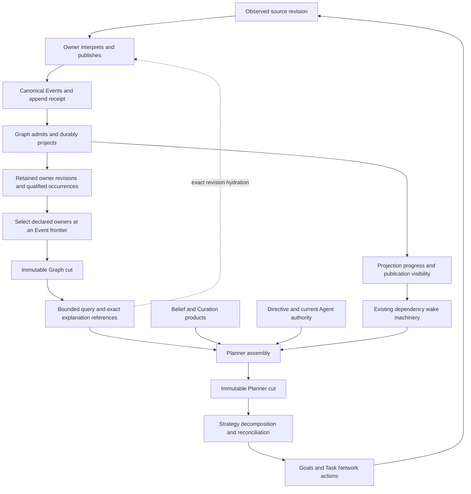

# Graph use-case contracts and candidate assessment

Status: proposed design invariants for assessing Graph candidates, requested after the engine spike. This document defines required meaning and useful work boundaries. It selects no engine, changes no runtime authority and does not claim production qualification. The [evidence and domain assessment](graph_contract_evidence.md) records the source basis and confidence limits.

The subsequent [candidate design](graph_candidate_design.md) applies this frame to concrete representation alternatives and recommends independent revision membership over shared immutable content and evidence bindings. It includes new public-capture accounting and the implications for compact cut receipts. The recommendation remains separate from native implementation qualification.

## The shape that must hold

Meld must let an Agent repeatedly ask a small question about retained knowledge without repeatedly reconstructing everything that was ever published. At the same time, that answer must remain tied to the exact owner products, evidence and revisions that justified it. An index improves access; the architecture must also define the units being indexed, retained and reused.

**Graph is a revision-aware projection of owner publications, with qualified relationships and explicit evidence boundaries.** It is neither the authority that decides domain truth nor the complete world state used by Strategy. Owners publish meaning through Events. Graph makes selected meaning traversable and proves its visibility. Planner combines that selection with Belief, Curation and authority into a reasoning cut. Strategy decides what to do.

The [canonical Graph design](../../../cognitive_architecture/world_model/graph/README.md) already provides these boundaries. The correction under assessment is how publication, storage, selection and query work implement them. The [earlier architecture assessment](graph_architecture_assessment.md) remains the interpretation of the engine spike; this document supplies the candidate-independent contracts it called for.

These are responsibilities and products, not proposed processes or tables. A single projection may serve several boxes. The diagram does not introduce a Graph planner, a second Event log or a universal hydration service.

## Distinctions that storage must preserve

The reusable unit is not one choice among address, assertion, observation and revision. They answer different questions and can change independently.

| Logical identity | Question it answers | What equality does not establish |
| --- | --- | --- |
| Object address | Which domain object is being referred to? | Existence, currentness, truth or permission |
| Object publication or relation occurrence | What did this owner publish about that object or relationship? | That another owner, scope or observation makes the same assertion |
| Source Event and provenance | Where did this publication enter Meld, and what supports it? | That its source remains current |
| Owner revision and membership | Which exact products belong to this owner's selected scope revision? | That another owner's selected revision used compatible inputs |
| Graph cut | Which owner revisions and coverage were selected at this ledger boundary? | A simultaneous snapshot of the physical world or a complete Planner context |
| Planner cut | Which admitted knowledge, policy and authority justified this planning decision? | That later information cannot require a successor |
| Material work basis | Which inputs justify reusing a product or considering new work? | Exact snapshot equality or permission to discard changed evidence |

Consider an unchanged function observed twice. Its address can remain stable. Its semantic content may be identical. Its observation, source Event, owner revision and provenance bindings may change. Deduplicating content is valid only if both observations and revision memberships remain recoverable. Conversely, redelivery of the same operation is a retry, not a second independent observation. The owner defines materiality; Graph must not infer that a changed provenance field is unimportant because the prose is unchanged.

Today `OwnerObjectPublication`, `OwnerRelationOccurrence` and `OwnerPublicationBatch` package several of these identities together. A physical design may separate them without inventing new public entities. Reusing a whole record is possible only when that whole record is equal; reusing just its unchanged semantic portion requires retaining the changed bindings separately.

## Semantic invariants

The following IDs are stable assessment references. **Standing** means a requirement inherited from current governance or canonical design. **Derived** means the design criterion proposed here to make those requirements assessable. Neither label means every runtime path is already qualified.

| ID | Invariant | Basis |
| --- | --- | --- |
| G01 | External and owner-authored knowledge enters through canonical Events. Graph admission and projection remain the sole Graph authority. Owner stores remain authoritative for their own products. | Standing |
| G02 | Addresses and compound identities remain unambiguous across storage, lookup, traversal, export and restart. A reference does not prove existence. Encodings preserve full supported values, including ledger identity and sequence range. | Standing |
| G03 | Selected object publications and relation occurrences retain owner identity, scope, source, hydration reference, qualifications and provenance. Equal endpoints and relation type do not merge distinct occurrences. | Standing |
| G04 | A revision is immutable. Replaying the same operation is idempotent; a different operation claiming the same protected revision identity must not overwrite its meaning. Admission failure must not advertise that failed publication as projected. | Standing |
| G05 | Selection names owner, full scope, applicable source route, currentness policy and Event frontier. For `LatestComplete`, select the newest eligible publication and require its completeness; a newer incomplete publication must not silently expose an older one as current. | Standing |
| G06 | Complete coverage, qualified absence, withdrawal, unresolved reference, unsupported source, projection lag, unavailable retained data and query truncation are distinguishable. Only declared exhaustive coverage can justify absence, and only within that coverage. | Standing, with richer failure reporting derived |
| G07 | A retained cut and normalized query preserve the same logical answer despite later Events, another reader, or a clean restart. A missing historical dependency must produce an explicit failure, never a substitution with current data. | Standing; retention expiry policy unresolved |
| G08 | Published Graph progress never exceeds the data and coverage made durable for that ledger. A cut beyond projection progress is incomplete. Event append, Graph visibility, Belief settlement and action completion are distinct milestones. | Standing |
| G09 | Traversal preserves deterministic selection, occurrence-qualified paths, independent bounds and an explicit unexplored frontier. A bounded result cannot imply exhaustive knowledge outside its explored and covered scope. | Standing |
| G10 | Planner assembly validates its selected sources and authority. Graph completeness alone cannot establish that Belief consumed current evidence or that two owners share a compatible causal basis. Strategy remains the owner of decomposition and successor judgment. | Standing |
| G11 | Exact evidence remains attached to planning and execution while later material information can cause reconciliation. Unrelated transport progress alone must not manufacture an executable obligation. No universal prohibition on acting from an older cut is introduced. | Standing continuous-reconciliation intent and current product-basis behavior |
| G12 | Physical reuse, indexes and rebuilds preserve the logical publication and query contracts. Representation generation and supported identity versions must be explicit when they change. Hash equality is an identity check, not independent proof of admission or authority. | Derived from standing identity and authority boundaries |

For a cut on one ledger, eligible publication positions are bounded by `min(requested_event_seq, durable_graph_seq)`. Positions from different ledgers are not numerically interchangeable. Within the retention promise, `read(cut, normalized_query)` is stable in logical records, ordering, paths, qualifications and coverage. A candidate may change private bytes; changing public result identity or selection semantics requires an explicit version and compatibility account.

## Use-case contracts

Each contract describes a real consumer need, its minimum information, and the failure that would disqualify a candidate. The listed operations are logical capabilities, not a mandate for one new API per row.

### U01 — Admit a first publication and resume projection

An installed owner supplies a publication operation through an admitted Event route. Graph needs the canonical source Event, owner revision, scope, operation identity, objects, occurrences and completeness. It validates these and makes a durable projection before advancing the associated progress. A cold replay and an ordinary live observation must produce equivalent queryable meaning.

Retries must converge without duplicating semantic occurrences. A conflicting revision or invalid publication must remain diagnosable without silently skipping evidence to claim coverage. Route installation and its historical coverage are part of admission; seeing no publication on an unexamined route does not prove an empty owner. Applies G01–G04 and G08.

### U02 — Reobserve, change, add and remove knowledge

The Codebase Semantics owner publishes a successor after a source observation. Graph must preserve the earlier revision while exposing the new membership and qualifications under the requested currentness policy. An object omitted from a selected full revision must not remain current merely because an old index entry exists. An explicit withdrawn record must retain its state and evidence.

A failed or partial successor is not evidence that the previous complete revision is still current. Removal, parse failure and an unchanged observation have different meanings. Graph preserves the owner's account; it does not choose which syntax deserves elevation into semantic facts. Applies G03–G07.

This is a full-publication contract today. Graph can reuse unchanged stored content internally, but ingest must still read and validate the submitted publication. Claiming change-proportional ingestion would require a separate owner contribution contract, including a base revision and complete membership accounting. That extension is not presumed necessary.

### U03 — Select current inputs, or explain why they are unavailable

A README owner, Curation rule or Planner request asks for particular installed owner scopes at a captured Event frontier. It needs selected revision receipts, source coverage, independent Event and Graph positions, and completeness or refusal grounds. It does not inherently need every object body to find the head.

Required and optional owners must remain distinguishable. Qualified empty source coverage can be useful knowledge; missing installation, missing publication and projection lag are different conditions. A consumer cannot use `Complete` as shorthand for the repository being fully understood. The guarantee is relative to the declared owners, scopes and interpretation coverage. Applies G05, G06 and G08.

Current multi-owner selection establishes a ledger-bounded vector of owner products. It does not itself establish that README revision B was derived from Codebase Semantics revision A. That compatibility belongs to explicit provenance and consumer validation, as Planner already does for Curation-supported Belief.

### U04 — Ask a bounded relationship question

README currently requests outgoing relationships from a bound source root with relation filters and depth, object, occurrence and path bounds. Other consumers can ask incoming or bidirectional questions. The answer must retain selected records, receipt context, qualified paths, unresolved endpoints and truncation, even when several occurrences share the same endpoints or cycles exist.

A consumer can choose a simpler presentation of the returned graph. That does not authorize Graph to discard the richer occurrence account. Domain-specific category filters and README materiality remain owner logic. Pushing a useful generic filter into Graph is an API decision to justify from workload evidence, not a requirement to embed `code.category` in the runtime. Applies G02, G03, G06 and G09.

### U05 — Resolve and explain an exact product

Causal inspection and owner evidence consumers need to move from a source Event or selected publication to its intact meaning and exact hydration reference. They must be able to explain which revision supported a decision after the current head has moved. A stable address alone is insufficient for this operation.

The representation may retrieve or reconstruct a full publication from retained pieces. It may leave large source bodies in owner storage. Either way, revision, membership, occurrence distinctions and provenance must survive. Owner unavailability is explicit; hydration must not fetch today's product under yesterday's reference. A reference contract exists today, but generic successful hydration across all owners is not qualified. Applies G02, G03, G07 and G12.

### U06 — Freeze a planning basis and reconcile during ongoing work

Planner assembles Graph selections with Belief, required Curation support, policy and Agent authority. A plan can remain explainable while new Events arrive and an action runs. The next selection can expose material change to Strategy, which can retain completed work and derive a successor. Graph neither silently mutates the old cut nor decides the new plan.

Keep exact cut identity separate from product reuse identity. Current `PlannerCut::source_basis_id` deliberately removes transport-only distinctions; this does not promise that all semantically equivalent owner revisions are interchangeable. Action-specific validity checks remain with their owners. Cost-based settling delays remain future planner policy. Applies G07, G10 and G11.

### U07 — Prove an output became visible

An Agent or Curation completion path asks whether an exact expected publication was admitted into a qualifying cut. Minimum information includes expected owner, scope, revision and Event record, plus the selected receipt and its durable coverage. An append receipt or successful script exit alone cannot answer this question.

Graph must re-establish the relevant selection and provide its owned visibility proof. An unchanged Curation result may legitimately cite an earlier selected publication; the proof still has to match that product. This is an exact membership and visibility question, not a request to traverse the graph or decode its whole retained history. Applies G04, G05 and G08.

### U08 — Observe progress and wake the right reconciliation

Runtime dependency checks need ledger and projection positions, owner source coverage and the existing dependency identities. They must be able to notice progress without repeatedly reconstructing publication bodies. A wake permits reconsideration; it does not establish material change or authorize work.

The architecture must account for quiet consumers as well as active writers. It can support targeted dependency lookups or reuse already selected inputs, but must not suppress a necessary successor merely because a broad cache key remained equal. Subscription indexing is a candidate option, not a new Graph-owned scheduler. Applies G08, G10 and G11.

### U09 — Read across branches and retain old evidence

Branch adapters can query separately scoped projections and report their results together. Each retains ledger identity, branch scope, exact cut and its own unavailable or incomplete result. Aggregation cannot synthesize one atomic cross-ledger world state or combine identical-looking addresses from different cuts without their context.

In-flight plans, retained explanations and externally saved cuts may outlive the current head. A candidate must declare what keeps their dependencies available and what happens when that promise ends. No current cursor alone proves old revisions disposable. Pinning, retention horizons and archived retrieval are alternatives requiring a policy decision. An expired cut must never look like a successfully queried empty graph. Applies G02, G05–G07 and G12.

### U10 — Recover or replace the projection without changing knowledge

After interruption or representation migration, Graph must open a consistent generation or rebuild from a declared retained authority. It must not advertise new progress with missing rows, serve a mixed generation, or make old cuts resolve to different meaning. Rebuildability depends on source retention; it is not a substitute for a retention policy.

Existing engines should provide their normal durability and transaction facilities. Meld still owns the semantic commit boundary, source cursor, version mapping and replay rules. The native crash journey is currently blocked before recovery qualification by a predecessor lease. That is an evidence gap, not proof of data loss or successful recovery. Broad [lifecycle hardening](lifecycle_hardening_followup.md) remains deferred unless it changes the recommendation or blocks evidence needed for a particular change. Applies G01, G04, G07, G08 and G12.

## Work and resource invariants

These are proposed scaling requirements, not measured production latency guarantees. Let `H` denote retained historical publication volume, `L` live selected membership, `P` incoming publication bytes, `A` affected membership and index entries, `V` query-visited records, and `R` returned explanation bytes. Ledger lookup and index navigation may have logarithmic or other declared overhead; the requirement is to eliminate unrelated payload reconstruction.

| ID | Required work boundary | Legitimate work and explicit exceptions |
| --- | --- | --- |
| W01 | Selecting heads, reading progress and checking exact visibility must not decode publication bodies proportional to `H`. | Selected receipt membership or an explicitly requested explanation can have its own size; the minimal selection path must not require all of it. |
| W02 | A fixed small frozen query must not prepare the entire live or historical graph before applying its bounds. It must not require draining later unrelated Events. | Work tracks the necessary indexed neighborhood, filters, ordering and `R`. High-degree neighborhoods can still be costly; charge examined entries and expose work exhaustion. |
| W03 | Admission work must be attributable to `P` and the affected projection, not replay or copying of unrelated retained history. | Full snapshots impose at least publication parsing and validation work. Internal reuse can reduce storage without making that CPU cost disappear. |
| W04 | Persistent size and write amplification must have a component account. Repeated identical payload should not be unavoidable merely because another revision or adjacency direction references it. | New evidence, membership, indexes and retention all cost space. Compression and indirection can cost CPU and random reads; measure the tradeoff. |
| W05 | More idle consumers must not multiply reconstruction of unchanged state. Sustained writes must not indefinitely prevent a reader from using an already available cut. | Currentness requests can explicitly wait for their captured frontier. Scheduling, backpressure and cancellation need a stated policy rather than an implicit latest-forever drain. |
| W06 | Full enumeration and historical export must identify themselves as broad work, with explicit limits or continuation behavior. | Enumerating `L` records and serializing `R` bytes is inherently proportional to that output. A small depth does not imply a small neighborhood. |

The current traversal bounds primarily constrain the result. A physical read budget, deadline or continuation protocol is a separate design choice. Do not promise bounded decoding while silently reading and sorting every edge of a high-degree root. Similarly, splitting payload from metadata cannot remove the bytes a consumer actually asks to receive.

Measure Graph payload, repeated evidence bindings, revision membership, indexes, Event retention, owner state and temporary buffers separately. The spike's 128–170 MB whole-product directory sizes are not Graph-only size. Separate admission, selection, visibility, traversal preparation, visited rows, hydration, serialization, query-triggered catch-up and wake work. Report trace overhead separately from timings.

## The four architectural questions, made assessable

| Question | Required answer from a candidate | Contracts it must satisfy | Design freedom |
| --- | --- | --- | --- |
| Q1 — What is reusable? | Show how address, content, evidence binding, occurrence and revision membership change for one unchanged reobservation and one changed assertion. Account for what is copied and why. | G02–G04, G07, G12; U02, U05; W03, W04 | Full records, normalized pieces, content-addressed payloads, compact snapshots or deltas with explicit reconstruction cost |
| Q2 — What must traversal carry? | Identify fields needed to select, filter, order and qualify the answer, and how exact explanation data remains reachable. Show the cost of a narrow query and of expanding its explanation. | G03, G06, G09; U04, U05; W02, W06 | Inline or referenced payloads, shared qualification records, owner hydration, query projection options |
| Q3 — What are consumers asking? | Map head selection, frozen query, exact visibility, publication retrieval, Planner assembly and wake checks to explicit access paths. Include actual runtime callers, not only the CLI benchmark. | G05, G08, G10, G11; U03–U08; W01, W02, W05 | Separate methods or shared internals, batching, materialized heads, reusable immutable results, dependency indexes |
| Q4 — How do change and history scale? | Explain durable mutation boundaries, membership reuse, concurrent readers, retained-cut lifetime, collection and rebuild prerequisites. Give costs for growing history at fixed live size and growing live size at fixed query scope. | G04, G07, G08, G12; U01, U02, U09, U10; W03–W06 | Existing storage engines, snapshot sharing, versioned indexes, retention and pinning policies |

These questions are coupled. Normalization that saves bytes can create expensive joins. A head that embeds exhaustive membership can make selection expensive again. Delta chains can save writes and turn every historical query into replay. Keeping only current state can make reads fast while destroying the evidence that makes reconciliation explainable. Assess the complete path, not each local optimization in isolation.

## Candidate comparison contract

Every candidate should describe the same representative operations and show its outcome against the IDs above. Use `satisfied`, `violated`, `unknown` or `not exercised`, with evidence and limits. Unknown is not a pass. Current baseline parity is necessary where behavior is valid, but insufficient where the baseline violates a standing invariant.

| Evidence scenario | Meaning held fixed | Architectural distinction it reveals |
| --- | --- | --- |
| Initial owner publication and exact retry | Operation, source route, membership and qualification | Admission cost and idempotence |
| Unchanged content with new evidence, then one changed assertion | Distinct evidence and exact historical membership | Reuse unit and write amplification |
| New incomplete revision, deletion and qualified empty source | Coverage and absence rules | Whether indexes retain stale current evidence |
| Same endpoints with distinct occurrences, ambiguous delimiter addresses and cycles | Qualified multiplicity and structured identity | Lossy modeling or key encoding |
| Old saved cut while unrelated Events and owner updates arrive | Exact old answer and explicit new currentness | Read isolation, catch-up coupling and contention |
| Current source paired with old derived evidence | Provenance compatibility and Planner refusal | Whether Graph completeness is incorrectly promoted into reasoning readiness |
| Expected output appended but not yet projected | Distinct append and visibility milestones | Exact completion lookup and cursor correctness |
| Small repeated query with more history, more live objects and more idle consumers | Same requested neighborhood | Hidden reconstruction and wake amplification |
| Broad query and a high-degree root under tight bounds | Explicit coverage and frontier | Preparation work hidden by result limits |
| Retained cut after restart, interrupted persistence and eventual retention expiry | Historical meaning or explicit unavailability | Recovery and retention contract, with currently blocked crash evidence marked unknown |

Keep the external harness driving native commands and observable runtime paths. When a necessary operation is not visible through that surface, record an observability gap; do not qualify a candidate by reading its private store directly. Private inspection can explain costs but cannot replace product proof. The same requirement applies to the runtime owner callback, Planner and visibility paths that the isolated traversal comparison did not comprehensively measure.

Compare semantics first, then scaling and whole-product cost, then maintenance. A candidate account must name which responsibilities Meld owns and which the engine supplies: transactions, indexing, concurrency, compaction, backup, recovery, migration and support. A graph-native engine may implement traversal but still needs durable Meld cuts and occurrence semantics. A key-value or relational engine may need modest application indexes without requiring Meld to own a database implementation. Neither category is disqualified in advance.

The circuit breaker is a demonstrated need to lose a semantic invariant, introduce a competing authority, or build substantial bespoke database machinery to preserve the contract. A need for a compact revision index or a better public query is not itself that failure. Conversely, a fast result obtained by discarding provenance or retained-cut meaning is not progress toward the stated outcome.

## What is fixed and what remains to decide

Owner authority, Events as ingress, qualified occurrences, explicit coverage, retained evidence and Strategy's reconciliation role are the stable shape. The physical storage unit, query preparation path, selection granularity and reuse scheme remain open. The existing indexed projection is a useful reference candidate, not a selected final architecture.

A candidate proposal must settle its address encoding, publication decomposition, metadata and payload placement, exact visibility lookup, query catch-up policy, work accounting and durable projection boundary. Retention horizon, pin ownership, behavior when an owner cannot hydrate an old product, multi-owner causal compatibility beyond existing Planner checks, and work-budget continuation semantics remain explicit policy questions. They are not all prerequisites for the next bounded optimization, but they must be accounted for before claiming a performant continuously running system.

This assessment proposes the comparison frame. It does not extend `meld-lang`, reduce Codebase Semantics coverage, move README theory into Meld, implement lifecycle hardening or choose a storage replacement.
