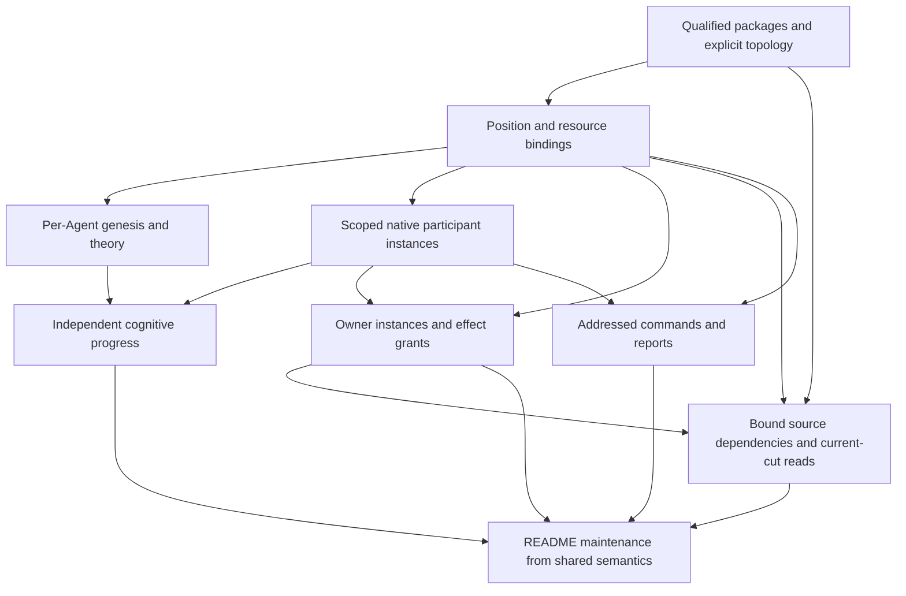
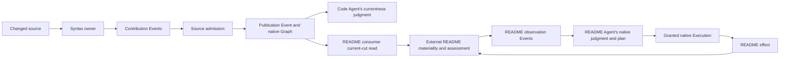

# From one Agent to many

Status: proposed design. The user requested a dependency matrix after the shared-semantics circuit breaker. This document designs the next experiment; it does not activate implementation. Baseline: Meld `29e2b9b7`, code-semantics `9c58413`. The [program ledger](codebase_semantics_experiment.md) owns delivery status.

Meld needs to realize several independently governed Agents over shared knowledge. Multiplicity belongs in prepared bindings and native runtime instances. It must not create another Graph writer, Event authority or coordinating Agent.

The first useful composition is a code-semantics PDS and a README PDS, authored in separate repositories, installed into one product runtime for one repository. Code-semantics owns source interpretation and publication. README owns materiality, document judgment and repair. They share source knowledge, not intentions, progress or effect grants.

## What the evidence establishes

The [boundary probe](../../../../../meld-code-semantics/evidence/multi-agent-boundary/report.json) confirms that public initialization rejects two Agent positions. Source inspection reveals dependencies behind that rejection:

| Evidence | Implemented behavior | Consequence for the design |
| --- | --- | --- |
| [Physical binding](../../../../src/config/stewardship/binding.rs) | One Agent, subject, provider and selected theory bundle; named declarations and position collections exist elsewhere | Resolve explicit position bindings instead of inferring a single Agent from the workspace |
| [Product compilation](../../../../src/theory/product.rs) | Package sets and Agent positions are collections; component selectors are matched by unqualified component ID across receipts | Independently authored packages need package-qualified references, preserving exact receipt provenance |
| [Topology selection](../../../../src/init/world/product.rs) | Exactly one topology is required across the package closure | Select the composition's topology explicitly; imported standalone topologies must not compete for selection |
| [Assignment scope identity](../../../../src/config/stewardship/assignment.rs) | The operational scope hash includes the entire Agent membership set | Adding a consumer changes today's producer/state namespace unless identity migration is addressed |
| [World initialization](../../../../src/init/world/tooling.rs) | Public binding constructs exactly one assigned position | Bind every declared position and reject missing or duplicate bindings |
| [Genesis](../../../../src/init/world/pipeline.rs) | Iterates positions but resolves one Curation rule and maintained condition outside that loop; copies the compilation's revisions into each Agent | Resolve and retain each position's selected theory, rather than giving every Agent the product's union |
| [Theory resolution](../../../../src/runtime/theory.rs) | Several routes require one component in the whole compilation; native Curation requires one assigned template | Route availability cannot substitute for a position's exact component selection |
| [Runtime assembly](../../../../src/runtime/assembly.rs) | One composed binding feeds Agent, Curation and evidence factories; factory selection matches literal runtime IDs | Separate reusable factory identity from scoped participant instance identity |
| [Owner preparation](../../../../src/runtime/owners/catalog.rs) | One seed per owner, with one Agent/provider and one prepared observation scope per assignment and activation | Owner instances and their grants need explicit bindings; the same owner type must not imply shared mutable state |
| [Native Graph read](../../../../src/branches/query.rs) | Current cuts and bounded traversal already exist, including public live reads | Extend access to the existing query authority; do not select current publications inside README |
| [Owner callback API](../../../../src/runtime/owners/contracts.rs) | Event and provider callbacks, no native Graph query | A bounded read callback is a connective API gap, separate from Agent cardinality |
| [Agent commands](../../../../src/cli/parse.rs) | Native show, request and request-status already accept an Agent address | Preserve these commands and remove ambiguous defaults; no parallel command family is needed |

Only the initializer rejection has been demonstrated with two positions through the runtime harness. The later findings are source-backed design constraints. Execution routing, all persistent key families and long provider-call behavior need focused proof during delivery; this assessment is not an exhaustive migration audit.

## The unit of scale

There are three distinct collections: packages, Agent positions and domain-owner instances. They need explicit relationships rather than a permanent one-to-one assumption.

An independently authored package can remain useful by itself and also be selected by a composition. A position binds an intention and the exact components that support it. An owner instance produces observations or performs granted capabilities for a bound scope. Several Agents may read one owner's output. Reading it does not instantiate another producer.

For this experiment, use one product composition, one repository subject, two positions and two external owner instances. This exercises different PDSs without first requiring several independently activated runtime products to share stores. Multiple runtime processes, live membership changes and hot WAD replacement remain outside the first proof. Static cardinality must be data-driven; avoid special behavior for exactly two positions.

### Identity and state matrix

These are conceptual keys, not a frozen serialization format. Existing native identity contracts should be extended where they already represent the responsibility.

| Item | Shared or multiplied | Intended identity and ownership |
| --- | --- | --- |
| Event ledger and Graph projection | Shared per product storage boundary | Existing ledger identity and Graph authority; one projection writer |
| Installed theory and capability catalog | Shared immutable revisions | Package receipt plus component selector resolves to an exact owner revision; availability grants no use permission |
| Product composition and prepared activation | One for the initial composition | Exact selected packages, bound positions, owner instances and participant plan |
| Agent intention and progress | Per bound Agent position | Stable situated position binding plus durable Agent ID; aggregate membership is not part of its durable progress namespace |
| Curation execution | Per selected Agent rule | Exact Agent/rule/source binding; a README rule cannot silently resolve the code Agent's rule |
| Belief and evidence work | Per unique epistemic scope, not blindly per subscriber | Existing subject, dimension/family, perspective and branch identities plus selected mapping/revision; shared subscribers must not create competing assessors |
| External owner state | Per explicitly bound owner instance | Stable situated owner binding independent of consumer membership; observation and capability calls share that instance's existing connection |
| Observation publication | Per producer output scope | Existing owner and publication-scope contract; consumer identity does not rename source facts |
| Runtime participant | Per factory realization | Factory kind is separate from instance identity; include the bound Agent, owner instance or epistemic work scope where applicable |
| Lifecycle incarnation | Per participant activation | Generation and incarnation identify a run; they do not replace durable consumer progress identities |
| Provider and capability grants | Per invoking position and owner binding | Prepared scope and principal authority; the semantics Agent does not inherit README provider or write grants |
| Execution work and outcomes | Per originating Agent and admitted plan | Preserve native authorization, task and result provenance even where queues and stores are shared |

The existing assignment scope is stable across policy revisions but changes when Agent membership changes. Separate immutable composition/assignment revision identity from durable situated Agent and owner-output identity. For the first composition, derive stable position and owner-instance scopes from the project/principal/subject binding and their explicit local identities, excluding sibling membership. Qualify branch and perspective through the existing native contracts. Adding a reader must not make existing producer facts appear to belong to a different source. Changes to a bound source or intention still require explicit revision validation; a stable address alone does not authorize reusing incompatible state.

In particular, do not prepend Agent IDs to every Belief key. Shared knowledge depends on native epistemic identity remaining independent of which Agent consumes it. Do not share Agent cursors merely because two Agents subscribe to the same stream.

## Dependency matrix

Each row is a required behavior, not a proposed new subsystem. Dependencies name what must already be true to prove the row. Several rows will belong to one vertical implementation slice.

| ID | Behavior to establish | Direct dependencies | Runtime change | External package or harness change | Decisive proof |
| --- | --- | --- | --- | --- | --- |
| A | Compose independent package revisions without name collisions | Existing exact package receipts | Package-qualified component resolution and explicit root topology selection | Composition selects imported packages and positions without rewriting their meaning | Two packages can both call a component `belief`; each position resolves its own exact revision |
| B | Bind every position to its resources and selected theory | A | Replace singular physical-to-prepared binding path with position-indexed resolution | Project/XDG data binds Agent IDs, subjects, providers, owners and inputs | Missing or duplicate bindings fail before activation; adding a consumer does not silently rename an existing producer scope |
| C | Produce independent native Agent genesis | A, B | Select maintained condition, Curation, Strategy and relevant families per position; retain exact references | Different CPU-only intentions in the first fixture | Two genesis receipts contain different intended contracts; neither receives an unintended union of grants |
| D | Realize and recover scoped participant instances | B | Separate factory identity from runtime instance identity across registration, handles, lifecycle and durable progress | No domain theory change | Two instances of one Agent factory have distinct progress and lifecycle receipts; restart resumes both |
| E | Run independent native cognitive work over shared authorities | C, D | Construct per-Agent reconciliation/Curation; bind or deduplicate evidence work by its native semantic scope | Harness changes one condition while the other remains stable | Both Agents progress; one request cannot complete the other; no duplicate Graph or same-scope evidence writer |
| F | Prepare owner instances, provider bindings and effect grants correctly | B, D; E for end-to-end effect proof | Scope seeds, instance caches, invocation routing and publication grants; preserve native Task authorization | Bind semantics as read-only and README as the document writer | Distinct owner instances retain separate state; an action/result cannot cross to the wrong Agent |
| G | Expose a producer's current knowledge to a consumer | A, B, F; E for Agent consumption | Resolve named output dependencies to native scopes; provide bounded current-cut read through the owner API | README declares which semantic output it consumes and how it interprets it | Complete source can be consumed; later incomplete source blocks acceptance; restoration becomes usable without reparsing source in README |
| H | Make commands and reports address the composed runtime truthfully | B, D; E, F for full proof | Preserve Agent addresses and expose instance identity, input position and waits in existing surfaces | Extend harness captures for both Agents | Public commands distinguish each request and participant; N equals one retains simple defaults |
| I | Maintain a bounded README section from shared semantics | E, F, G, H | Only demonstrated generic gaps; no README logic in runtime | Materiality, semantic projection, wording, repair and verification in `meld-readme`; Luna-low after CPU proof | Source change produces the right document change, formatting avoids needless model work, uncertainty prevents unsupported acceptance, restart reuses valid work |

A and B unblock the rest. C and D form separate design concerns but must meet in the first two-Agent runtime proof. F and G do not require inventing a new coordinator. H is a proof requirement throughout, not cleanup at the end. I tests whether the extra machinery creates product value.



## Expected experiment shape

The composition is structural project data. Domain authors keep their meaning and standalone package shape in their own repositories. The following tree illustrates relationships, not new required filenames or an implemented configuration schema.

```text
XDG project selection
└── repository composition
    ├── exact packages
    │   ├── code -> meld-code-semantics package receipt
    │   └── docs -> meld-readme package receipt
    ├── positions
    │   ├── code -> code package's selected intention and theory
    │   └── readme -> docs package's selected intention and theory
    ├── bound owner instances
    │   ├── syntax -> code-semantics owner, selected source standard
    │   └── document -> readme owner, selected editorial standard
    ├── resources
    │   ├── repository subject and workspace
    │   └── Luna-low provider for document work
    └── input bindings
        └── document.code -> syntax's current semantic output

One native product runtime
├── shared Event authority and Graph projection
├── bound evidence and Belief work
├── code Agent and its Curation
├── README Agent and its Curation
├── syntax owner instance
├── document owner instance
└── existing native Execution and lifecycle authorities
```

The exact authored component references belong in package/composition data. Machine paths, durable Agent IDs and provider selection belong in physical project bindings. Compiled receipts bind them together. Runtime code validates these references without learning Rust syntax or README meaning.

The first implementation should use an explicitly selected root composition topology. A package imported for domain components can still retain its standalone topology. An imported topology does not automatically become another active topology, and two identical component names in different packages are not a reason to rename either package's domain data.

## Coordination is through knowledge



The README consumer needs supported source data, not a terminal success signal from the code Agent. Therefore the data dependency must not become a lifecycle ordering edge that waits for source satisfaction before the README Agent can start. Start both with valid physical bindings; absence or incompleteness becomes an observable semantic wait. Existing ticks provide the first reconciliation cadence. Event wake optimizations can follow measured latency.

Read the producer's exact native cut and traverse within that cut. Retain producer revision, scope, completeness and provenance alongside derived document work. A historical Belief or cached prose cannot certify a newer source revision. If the source becomes incomplete, keep the existing README bytes if appropriate, but report its relevant acceptance as unresolved and refuse unsupported repair.

Formatting may change source provenance while leaving the consumed semantic projection unchanged. The README domain may reuse a valid wording assessment after verifying that the current complete input projects to the same relevant semantics. This reuse policy is domain logic, not a native rule that every equal digest establishes equivalence.

At repair time, verify that the admitted source basis and expected document revision still apply. A long model call cannot authorize a write based on a superseded source cut. Prefer existing native admission and effect validation seams; any missing generic dependency fence is a measured follow-up, not permission for a second planner. This edge needs direct proof before claiming the README outcome.

## Ownership and affected domains

The domain snapshot is the root source domains plus `meld-events`, `meld-lang`, `meld-world-model` and `meld-execution`, and the three external program repositories. Root facade modules are grouped with their owning crate where they forward that concern. The sweep below records both active relationships and explicit exclusions.

| Domain set | Integration and current completeness | One-level concerns and change posture |
| --- | --- | --- |
| `config` | own, partial | Assignment and physical selection: extend to position bindings; replace singleton resolution on the active path |
| `theory`, `init` | own, partial | Package composition, exact selection, genesis and preparation: extend existing contracts; replace whole-product singleton inference |
| `runtime` | own, partial | Assembly, registration, lifecycle, owner connections and progress: extend scoped instances; retain one supervisor authority |
| `world_state`, `meld-world-model` | own/consume, partial | Agent intention, Curation, evidence, Belief and Graph query: retain native authorities; extend prepared contexts and current-cut access where required |
| `execution`, `task`, `capability`, `meld-execution` | consume/own, partial | Admission, grants, invocation and result routing: retain semantics; inspect and extend scope propagation before effect acceptance |
| `events`, `meld-events` | publish, complete for prior slice | Durable transport and replay: reuse; namespace consumer progress without adding a ledger |
| `cli`, `bin`, `api`, `agent`, `serve`, `branches` | adapter/observe, partial | Addressing, live query and reporting: adapt existing native commands; legacy profile `agent` APIs do not become a second native Agent authority |
| `provider`, `context` | consume, partial | Prepared provider attribution and execution context: retain implementation, bind per position; no model-selection redesign |
| `store`, `session`, `heads` | consume, partial | Existing storage and identity support: retain stores; audit affected keys and restart readers during implementation |
| `harness`, external `meld-eval` | observe, partial | Public command capture: reuse; add multi-Agent journeys as consumer behavior appears |
| External `meld-code-semantics` | publish, complete for one source | Sensing, admission and semantic publication: retain accepted producer; expose declared output binding |
| External `meld-readme` | consume/own, not started for semantic input | Current semantic projection, materiality, judgment and repair: new domain behavior; existing source-based qualification remains supported |
| `workspace`, `tree`, `ignore`, `merkle_traversal` | none, not needed for cardinality | Repository sensing expansion does not unblock per-Agent composition |
| `code_change`, `concurrency`, `error`, `logging`, `metadata`, `nonce`, `prompt_context`, `telemetry`, `types`, `views`, `workflow`, `meld-lang` | none selected for semantic change | No demonstrated need for new language semantics, workflow coordinator, locking system or reporting authority; normal imports and adapters may remain dependencies |
| `lib` | adapter, partial only as exports require it | Export canonical contracts when introduced; no separate semantic owner |

The frozen runtime-path set is larger than the expected write scope. Likely runtime writes center on config, theory/init, runtime composition/owners, native preparation contracts and command adapters. Execution and persistence changes are contingent on the scope audit and harness evidence. WAD writes center on structural package selection and README semantic input. Neither source interpretation nor README policy moves into Meld.

## Recommended delivery dependencies and retirement

Use three observable checkpoints rather than turning every matrix row into a project.

1. Prove two independent CPU Agents in one native product. Deliver A through E with enough F and H for the two read-only domains. Use different maintained conditions and different selected revisions, not merely two names over one rule. Both must progress, remain attributable, restart and pass an N-equals-one regression.
2. Prove shared semantic consumption. Complete G with named output binding and current-cut access. The second domain must evaluate an actual code relationship without reading source bytes. Replace complete source with incomplete source, then restore it. Show that only relevant consumer work changes.
3. Prove useful README maintenance. Complete F's effect path and I under Luna-low. Demonstrate independent grants, stale-basis rejection, formatting reuse, changed-meaning repair and native acceptance. Start with one bounded section and retain the serious README qualification as the broader product bar.

Rows A through E change persistent identity and selection. New collection writers must replace the singleton write path in the same completed change. Existing one-Agent configs may normalize into the collection path through a thin reader; there must not be a separately maintained one-Agent runtime. Old prepared receipts remain historical evidence and must not be silently rebound to a different Agent. Disclose any required re-preparation before committing a breaking change.

Audit membership-derived assignment scopes, producer output IDs, actor registration, current factory selection, consumer cursors, durable step-sequence keys, owner state roots, invocation routing, lifecycle receipts and request defaults as one scope migration. A renamed participant ID with an unscoped cursor or factory match is not a completed migration.

The intended baseline is one scheduler with deterministic bounded turns and identifiable waits. N Agents does not require N threads, peer negotiation or a new meta-Agent. Long provider calls may still delay sensing under current scheduling; measure that during checkpoint three and report it honestly. Do not claim latency isolation from CPU-only proof.

## Readiness and decisions

The dependency design is ready for review. Implementation has not started. The first delivery contract remains assessment-only until its exact identity migration and retirement surface is frozen; the larger outcome stays exploratory.

Recommended decisions are one shared product runtime for the first composition, explicit package-qualified position selections, per-Agent intentions and grants, native shared epistemic authority, and named producer-output dependencies resolved to current cuts. No new store, coordinator or language extension is proposed.

Still open for bounded implementation design: the precise versioned reference shape, normalization and scope migration of existing prepared/config records, reuse or extension of factory-instance identity, and evidence that native execution carries the consumer's source basis through a long repair. These are named dependencies, not assumptions that implementation is already safe.

The prior commit/push authorization covers this design checkpoint. The present request authorizes architecture work; it does not by itself resume implementation across the circuit breaker. No release action is authorized.

If applied, this commit records the ownership, identities and dependency order needed to turn the existing single-Agent proof into native multi-Agent composition without relocating domain theory into Meld.
