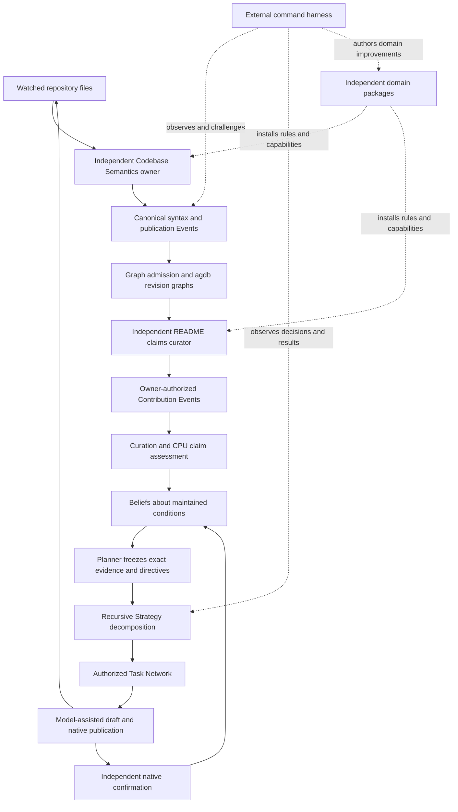

# Meld program status after whole-document README qualification

This account distinguishes product evidence from architecture intent. The desired outcome remains excellent command-line ergonomics that prove a useful, continuously reconciling runtime. The serious Meld-root README production requirement remains open. A complete Gmail Operator README now has bounded native generation and maintenance qualification. A running flywheel or a passing declaration-table check is not a substitute for that outcome.

The evidence supports durable semantic maintenance for bounded domains. The harness has exercised an independent sensor, native knowledge publication, claims curation, CPU assessment, recursive Strategy planning, model-assisted document work and subsequent confirmation. The [whole-document Gmail Operator experiment](../../../../../meld-readme/evidence/whole-document-v6/CLOSEOUT.md) passes 48 journey checks with Luna low, independent CLI and HTTP checks, and eight project unit tests. Broad semantic understanding, general reasoning, production efficiency and the Meld-root corpus remain unproved.

## The product path now exercised

The harness supplies isolated workspaces, source mutations, explicit executables and independent oracles. It does not author native success, decide the runtime plan or open private databases to repair a result. Domain theory lives in independent repositories. External knowledge enters through Events and owner grants, rather than a public graph-writing interface.

## Proven behavior and its boundary

| Area | Direct evidence | Qualification boundary |
| --- | --- | --- |
| Command control | Native preparation, managed start and stop, instance selection, Events, actions, account cursors and retained restart journeys | Full lifecycle hardening remains open; the agdb journey also exposed a normal-stop race |
| External domain packaging | Independent README and Codebase Semantics packages install through native contracts; each Agent has its situated configuration | Continuous replacement of executable capabilities is deferred; explicit rebuild and restart remain valid |
| Continuous sensing | Repository scan coverage, changes, additions, deletions, parse failure and restoration through native observation and Events | Merkle-driven incremental sensing and incremental owner publications are deferred |
| Faithful representation | Retained Tree-sitter observations can become native properties and relations with source support | Representation fidelity does not prove that extraction observed every relevant lexical value |
| Declaration meaning | Gmail Operator accounts for 31 paths, 93 lexical declarations and native cross-file import candidate relations using existing `meld-lang` | Lexical candidates are not general symbol, type or execution semantics |
| Shared knowledge | The producer publishes source-supported Graph products; the README consumer selects from them without rereading arbitrary source to invent truth | The repository producer contract now matches its actual observation; general semantic understanding remains unproved |
| Claims maintenance | A complete Gmail Operator README is generated from absence and maintained through 48 journey checks | This qualifies one fixture and challenge set; arbitrary narrative reliability and the Meld root remain open |
| Native Strategy | Recursive candidate/draft and publication decomposition, ordering, artifact flow, authorization and independent confirmation | The exercised domain methods do not establish open-ended planning or autonomous domain-theory invention |
| Continuous reconciliation | New material evidence causes successor planning and eventual correction; unchanged inputs reuse accepted results without another provider call | Concurrent editing, untracked claims and broad rapid-change cost policies remain open |
| Observability | Native invocation and pass timings, external process capture and OTel across runtime and owner boundaries | Timings are wall time; buffering can lose short-lived owner spans, and durable Event-to-work trace linkage remains deferred |
| Graph engine | The native agdb journey exercises real Event admission, exact records, historical cuts, incompleteness, traversal, offline reads and restart | Engine process-interruption tests are not native interrupted-owner recovery or power-loss qualification |

The main evidence is the [repository meaning closeout](../../../../../meld-code-semantics/evidence/repository-meaning-v1/CLOSEOUT.md), [README claims closeout](../../../../../meld-readme/evidence/repository-claims-v1/CLOSEOUT.md), [Strategy decomposition](../../../../../meld-readme/evidence/strategy-decomposition-v1/CLOSEOUT.md), [continuous reconciliation](../../../../../meld-readme/evidence/continuous-reconciliation-v1/CLOSEOUT.md) and [command harness](../../../../../meld-eval/README.md). Historical success remains bounded by those exact workloads and candidates. The Graph comparison does not rerun all model-dependent README experiments.

## What the agdb change addresses

The incumbent stores intact historical publications and reconstructs them for ordinary cut selection and traversal. The replacement stores independent revision graphs, shared immutable content, exact evidence bindings and revision-local membership. Full publication reconstruction remains available for explanation. Current selection uses indexed headers, exact visibility uses the selected Event position, and traversal reads selected addresses and native directed adjacency. Graph retains ownership of paths, result bounds and frontier.

The canonical runtime and branch-query construction paths use agdb. Sled remains the existing authority for Graph cursor and route metadata and for other domains. There is no second Graph publication writer or old query fallback. A read-only importer handles existing Sled publications, and activated state refuses a missing agdb file. Publication durability precedes cursor advancement. Downgrading to the old runtime would ignore newly admitted publications and is unsupported.

The engine is a pinned upstream revision with an explicit temporary correction. The standalone upstream issue and patch contain no Meld context. The correction has since been submitted as [issue 1930](https://github.com/agnesoft/agdb/issues/1930) and [PR 1931](https://github.com/agnesoft/agdb/pull/1931), held at fork commit `67c264f2` pending upstream review. See [dependency provenance](../../../../vendor/agdb/UPSTREAM.md). Upstream preparation passes 1,371 all-feature tests and doctests, Clippy, formatting and coverage, including 24 process-recovery scenario/backend/sync combinations. The source correction is three engine lines; native integration does not add a recovery log or database transaction engine.

The original native journey passes all 46 checks in each of two agdb and two baseline runs. Narrow traversal after history growth improves from a pooled 58.327 ms to 17.436 ms. Retained world-model storage falls from about 35.9 MiB to 13.3–15.4 MiB. Full unchanged reads remain effectively flat and historical live reads are slightly slower. These are bounded workload results, not universal speedups.

Performance results and final candidate identities are recorded in the [native delivery account](agdb_native_delivery.md). They must be read as native command and retained-state measurements, rather than isolated engine latency or proof of performance at arbitrary scale.

## Deferred work

Whole-document acceptance is now demonstrated for the bounded Gmail Operator experiment, with no original prose protected. The most important domain gaps are broader reliability, material-claim granularity and production cost. Earlier root-README experiments exposed false semantic acceptance of a changed command flag. Persistence correctly retained that wrong judgment. Decomposing source-supported claims and moving correspondence checks to CPU materially improved the bounded exemplar, but has not qualified the serious Meld root README or all active folders. Tone, explanatory judgment, subtle joy and unsupported narrative entailment remain beyond the declaration-table oracle.

The README project also retains 199 authored corpus pairs with structural and reconstruction evidence. That is useful authoring coverage, not evidence that 199 READMEs are maintained correctly by the running product.

Codebase Semantics package compilation now aligns the repository publication kind, representation marker and outcome mapping. Both producer and README Agent conditions confirm in the whole-document journey. This domain correction required no runtime code change.

Graph still carries full completeness lists in serialized cuts. Historical selection can inspect matching revision headers; high-degree adjacency preparation has no independent examined-entry budget. Membership and history remain retained without garbage collection. Metadata colocation, compact receipts, reader contention at larger scales, retention roots and safe rebuild horizons remain future measured work. Sharing payloads does not make indefinite history free.

[Lifecycle hardening](lifecycle_hardening_followup.md) remains a separate workstream: interruption recovery, lease ownership, stale-owner exclusion, descendant processes, partial startup, cancellation and restart. The bounded Linux stop correction waits for the verified process to exit before reporting completion. It does not qualify those other boundaries. Power loss, disk failures, interrupted agdb recovery and caught-panic reuse are also unproved.

Streaming package replacement, broader language extensions, mathematical semantic-density measures, general behavioral inference and recursive self-improvement remain research directions. No result here requires claiming that the CPU has acquired open-ended intelligence. The demonstrated value is retaining source-grounded structure and using explicit domain rules to make repeated maintenance less dependent on model reasoning.

## Release posture

This is a development checkpoint, not Meld 3 release qualification. The runtime, harness and independent domains can continue through the same command-driven loop. The next useful boundary is to account for whole-document evidence size and reuse, improve material-claim granularity and assessor consistency, then consider expanding coverage toward the serious Meld root. The passing journey took 20.2 minutes, 17 model calls and 1.45 million input tokens. Its stopped product state occupied 5.2 GiB, including a 642.2 MiB agdb file. These costs preclude generalizing the earlier smaller-workload performance results into production readiness. Upstream engine review and lifecycle qualification remain release concerns. No crates.io publication, release tag or release-capable workflow is authorized by this work.

## Validation and repository checkpoint

The agdb integration remains the unchanged runtime baseline at `e1ca6528`. The whole-document checkpoint used `feat/readme-whole-document` across Meld, Eval, README and Codebase Semantics. The selected whole-document candidate uses README `cf093c0` and Codebase Semantics `e2af635`; its exact profile is retained as the default after a later policy variation failed. Meld changes in that checkpoint were documentation only. The subsequent Meld 3 cleanup below records the bounded owner and fixture corrections. The standalone upstream issue and fix PR are now submitted; upstream acceptance remains pending.

The original agdb checkpoint runtime library suite passes 563 tests, the binary suite passes four, and ten additional root tests pass. The serial non-root workspace suite passes 982 tests and doctests. Root integration tests pass 328, fail four and ignore three. All four failures reproduced on the original baseline. Their later correction is recorded below. They concern harness evidence presentation and a served live-status fixture. That qualification also retained strict-Clippy items-after-test-module findings; the rest of workspace Clippy passed with warnings rejected. The [retained qualification](../../../../../meld-eval/evidence/agdb-native-v1/README.md) records those limits, rejected attempts and exact candidate identities.

## Meld 3 cleanup continuation

The user authorized an upstream holding fork and submission, then cleanup toward Meld 3 candidacy. Issue 1930 and PR 1931 now hold the existing correction. Vendored Rust sources match the submitted fork commit exactly, so this introduces no new engine behavior or moving dependency.

The four integration failures were stale fixture contracts. Loose historical family installation no longer composes Belief under prepared-product authority. The negative composition test now checks that refusal and the absence of invented Graph anchor evidence. Two presentation tests explicitly publish a historical wait report to test transport, projection and replay; they do not claim a live Belief actor produced it. The live status fixture now mounts the RuntimeControl required by the endpoint and reads an actually started supervisor. Production helper placement is corrected for strict Clippy without changing function bodies.

The reviewed architecture freeze assertion is supported for semantic ownership and composition seams: later README and Board domain changes reused established native owners without new runtime authorities. WAD pins experimental artifacts; PDS holds domain meaning. Neither fact alone qualifies a release. The actual Meld-root README, retained-state cost, observed lifecycle failures and reviewed upstream dependency remain open. Hypothetical Collective features and corpus-wide rollout do not become new release gates through this cleanup.

The first default-parallel cleanup run additionally exposed seven native-owner startup errors, all Linux text-file-busy failures. Source review identified a concrete race candidate: executable retention published the digest path before dropping its writable staging descriptor. The correction closes that descriptor before non-clobbering publication. Digest validation, mismatch rejection and native owner authority remain unchanged. A 16-way same-root startup test exercises protocol calls and retained-byte equality. This is a bounded implementation correction inside the existing owner, not a new lifecycle subsystem. The initial failed run is retained separately from successor qualification.

Close-before-publication alone did not qualify the parallel suite: its retained successor had 546 passing and 18 failing tests, including text-file-busy and owner revision lock errors. Independent OS reproductions show that a forked child can retain a writable CLOEXEC descriptor, and that a duplicated descriptor can retain flock after the original closes. The bounded correction retries only TXTBSY when launching a digest-verified retained image, using the existing owner request timeout as its readiness budget. An initial 250 ms cap was rejected after diagnostics showed a single OS spawn consuming that entire window before any retry. Installation calls acquire their existing connection mutex before the physical lease, so calls sharing one connection serialize instead of falsely reporting cross-registration contention. They explicitly unlock that lease on exit, including early errors. Genuine live contention still fails. These corrections do not change Curation, Event admission, Strategy or domain semantics.

Uncaptured native test output exposed a further fixture gap: JudgeProvider interpreted unsupported drafting and revision frames as assessments, panicking in background workers while parent assertions could still pass. It now dispatches supported canonical frame types and returns an explicit retryable provider failure for unsupported requests. A direct regression covers drafting and revision refusal. Real drafting and repair journeys retain their separate scripted ProviderServer. This corrects fixture behavior without adding domain policy to the runtime.

World-model library tests also exposed Sled's asynchronous physical-close window after durable flush. A standalone reproduction confirmed briefly retained database descriptors. Test-only lifecycle support now waits on the exact physical lock before immediate reopen, with a one-second bound, typed WouldBlock handling, no live-holder takeover, and one fresh database open. This preserves restart identity and replay assertions without claiming that production close is instantaneous. Graph remains backed by agdb; these tests concern the other durable record stores. Production lifecycle qualification remains a separate bracket.

The final default-parallel workspace validation passes formatting, locked all-target build, strict Clippy, and 1,869 tests across 58 suite summaries, with zero failures and three preexisting ignored tests. Rust and Cargo input hashes remained unchanged during the run. Earlier failed candidates remain retained as investigation evidence and do not count toward this result. The passing test command is `cargo test --workspace --all-targets --locked -- --nocapture`; this count does not include workspace doctests.

Fresh public-command qualification passes 22 first-use checks and 46 native Board checks with no provider calls, against the rebuilt runtime and Board owner. The external PDS source is unchanged. The meta project records exact source pins, binary hashes, retained logs and the local WAD. This accepts the cleanup baseline, not the actual Meld-root README, a supported resource envelope, comprehensive production lifecycle behavior or release publication.
