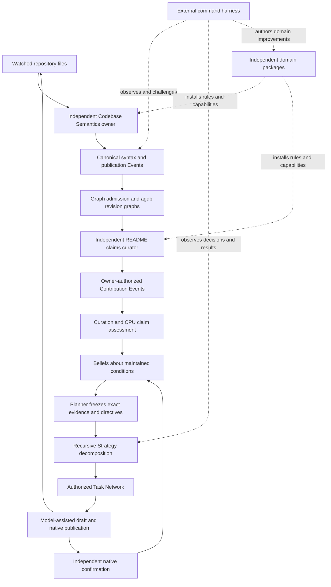

# Meld program status after whole-document README qualification

This account distinguishes product evidence from architecture intent. The desired outcome remains excellent command-line ergonomics that prove a useful, continuously reconciling runtime. The serious Meld-root README production requirement remains open. A complete Gmail Operator README now has bounded native generation and maintenance qualification. A running flywheel or a passing declaration-table check is not a substitute for that outcome.

The evidence supports durable semantic maintenance for bounded domains. The harness has exercised an independent sensor, native knowledge publication, claims curation, CPU assessment, recursive Strategy planning, model-assisted document work and subsequent confirmation. The [whole-document Gmail Operator experiment](../../../../../meld-readme/evidence/whole-document-v6/CLOSEOUT.md) passes 48 journey checks with Luna low, independent CLI and HTTP checks, and eight project unit tests. Broad semantic understanding, general reasoning, production efficiency and the Meld-root corpus remain unproved.

## The product path now exercised

The harness supplies isolated workspaces, source mutations, explicit executables and independent oracles. It does not author native success, decide the runtime plan or open private databases to repair a result. Domain theory lives in independent repositories. External knowledge enters through Events and owner grants, rather than a public graph-writing interface.

## Proven behavior and its boundary

| Area | Direct evidence | Qualification boundary |
| --- | --- | --- |
| Command control | Native preparation, managed start and stop, instance selection, Events, actions, account cursors and retained restart journeys | Full lifecycle hardening remains open; the agdb journey also exposed a normal-stop race |
| External domain packaging | Independent README and Codebase Semantics packages install through native contracts; each Agent has its situated configuration | Continuous replacement of executable capabilities is deferred; explicit rebuild and restart remain valid |
| Continuous sensing | Repository scan coverage, changes, additions, deletions, parse failure and restoration through native observation and Events | Merkle-driven incremental sensing and incremental owner publications are deferred |
| Faithful representation | Retained Tree-sitter observations can become native properties and relations with source support | Representation fidelity does not prove that extraction observed every relevant lexical value |
| Declaration meaning | Gmail Operator accounts for 31 paths, 93 lexical declarations and native cross-file import candidate relations using existing `meld-lang` | Lexical candidates are not general symbol, type or execution semantics |
| Shared knowledge | The producer publishes source-supported Graph products; the README consumer selects from them without rereading arbitrary source to invent truth | The repository producer contract now matches its actual observation; general semantic understanding remains unproved |
| Claims maintenance | A complete Gmail Operator README is generated from absence and maintained through 48 journey checks | This qualifies one fixture and challenge set; arbitrary narrative reliability and the Meld root remain open |
| Native Strategy | Recursive candidate/draft and publication decomposition, ordering, artifact flow, authorization and independent confirmation | The exercised domain methods do not establish open-ended planning or autonomous domain-theory invention |
| Continuous reconciliation | New material evidence causes successor planning and eventual correction; unchanged inputs reuse accepted results without another provider call | Concurrent editing, untracked claims and broad rapid-change cost policies remain open |
| Observability | Native invocation and pass timings, external process capture and OTel across runtime and owner boundaries | Timings are wall time; buffering can lose short-lived owner spans, and durable Event-to-work trace linkage remains deferred |
| Graph engine | The native agdb journey exercises real Event admission, exact records, historical cuts, incompleteness, traversal, offline reads and restart | Engine process-interruption tests are not native interrupted-owner recovery or power-loss qualification |

The main evidence is the [repository meaning closeout](../../../../../meld-code-semantics/evidence/repository-meaning-v1/CLOSEOUT.md), [README claims closeout](../../../../../meld-readme/evidence/repository-claims-v1/CLOSEOUT.md), [Strategy decomposition](../../../../../meld-readme/evidence/strategy-decomposition-v1/CLOSEOUT.md), [continuous reconciliation](../../../../../meld-readme/evidence/continuous-reconciliation-v1/CLOSEOUT.md) and [command harness](../../../../../meld-eval/README.md). Historical success remains bounded by those exact workloads and candidates. The Graph comparison does not rerun all model-dependent README experiments.

## What the agdb change addresses

The incumbent stores intact historical publications and reconstructs them for ordinary cut selection and traversal. The replacement stores independent revision graphs, shared immutable content, exact evidence bindings and revision-local membership. Full publication reconstruction remains available for explanation. Current selection uses indexed headers, exact visibility uses the selected Event position, and traversal reads selected addresses and native directed adjacency. Graph retains ownership of paths, result bounds and frontier.

The canonical runtime and branch-query construction paths use agdb. Sled remains the existing authority for Graph cursor and route metadata and for other domains. There is no second Graph publication writer or old query fallback. A read-only importer handles existing Sled publications, and activated state refuses a missing agdb file. Publication durability precedes cursor advancement. Downgrading to the old runtime would ignore newly admitted publications and is unsupported.

The engine is a pinned upstream revision with an explicit temporary correction. The standalone upstream issue and patch contain no Meld context. Nothing has been submitted upstream. Upstream preparation passes 1,371 all-feature tests and doctests, Clippy, formatting and coverage, including 24 process-recovery scenario/backend/sync combinations. The source correction is three engine lines; native integration does not add a recovery log or database transaction engine.

The original native journey passes all 46 checks in each of two agdb and two baseline runs. Narrow traversal after history growth improves from a pooled 58.327 ms to 17.436 ms. Retained world-model storage falls from about 35.9 MiB to 13.3–15.4 MiB. Full unchanged reads remain effectively flat and historical live reads are slightly slower. These are bounded workload results, not universal speedups.

Performance results and final candidate identities are recorded in the [native delivery account](agdb_native_delivery.md). They must be read as native command and retained-state measurements, rather than isolated engine latency or proof of performance at arbitrary scale.

## Deferred work

Whole-document acceptance is now demonstrated for the bounded Gmail Operator experiment, with no original prose protected. The most important domain gaps are broader reliability, material-claim granularity and production cost. Earlier root-README experiments exposed false semantic acceptance of a changed command flag. Persistence correctly retained that wrong judgment. Decomposing source-supported claims and moving correspondence checks to CPU materially improved the bounded exemplar, but has not qualified the serious Meld root README or all active folders. Tone, explanatory judgment, subtle joy and unsupported narrative entailment remain beyond the declaration-table oracle.

The README project also retains 199 authored corpus pairs with structural and reconstruction evidence. That is useful authoring coverage, not evidence that 199 READMEs are maintained correctly by the running product.

Codebase Semantics package compilation now aligns the repository publication kind, representation marker and outcome mapping. Both producer and README Agent conditions confirm in the whole-document journey. This domain correction required no runtime code change.

Graph still carries full completeness lists in serialized cuts. Historical selection can inspect matching revision headers; high-degree adjacency preparation has no independent examined-entry budget. Membership and history remain retained without garbage collection. Metadata colocation, compact receipts, reader contention at larger scales, retention roots and safe rebuild horizons remain future measured work. Sharing payloads does not make indefinite history free.

[Lifecycle hardening](lifecycle_hardening_followup.md) remains a separate workstream: interruption recovery, lease ownership, stale-owner exclusion, descendant processes, partial startup, cancellation and restart. The bounded Linux stop correction waits for the verified process to exit before reporting completion. It does not qualify those other boundaries. Power loss, disk failures, interrupted agdb recovery and caught-panic reuse are also unproved.

Streaming package replacement, broader language extensions, mathematical semantic-density measures, general behavioral inference and recursive self-improvement remain research directions. No result here requires claiming that the CPU has acquired open-ended intelligence. The demonstrated value is retaining source-grounded structure and using explicit domain rules to make repeated maintenance less dependent on model reasoning.

## Release posture

This is a development checkpoint, not Meld 3 release qualification. The runtime, harness and independent domains can continue through the same command-driven loop. The next useful boundary is to account for whole-document evidence size and reuse, improve material-claim granularity and assessor consistency, then consider expanding coverage toward the serious Meld root. The passing journey took 20.2 minutes, 17 model calls and 1.45 million input tokens. Its stopped product state occupied 5.2 GiB, including a 642.2 MiB agdb file. These costs preclude generalizing the earlier smaller-workload performance results into production readiness. Upstream engine review and lifecycle qualification remain release concerns. No crates.io publication, release tag or release-capable workflow is authorized by this work.

## Validation and repository checkpoint

The agdb integration remains the unchanged runtime baseline at `e1ca6528`. The current checkpoint uses `feat/readme-whole-document` across Meld, Eval, README and Codebase Semantics. The selected whole-document candidate uses README `cf093c0` and Codebase Semantics `e2af635`; its exact profile is retained as the default after a later policy variation failed. Meld changes in this checkpoint are documentation only. The standalone upstream submission remains prepared, not published.

The current runtime library suite passes 563 tests, the binary suite passes four, and ten additional root tests pass. The serial non-root workspace suite passes 982 tests and doctests. Root integration tests pass 328, fail four and ignore three. All four failures reproduce on the original baseline and remain unresolved. They concern harness evidence presentation and a served live-status fixture. Strict Clippy also retains existing items-after-test-module findings; the rest of workspace Clippy passes with warnings rejected. The [retained qualification](../../../../../meld-eval/evidence/agdb-native-v1/README.md) records those limits, rejected attempts and exact candidate identities.
