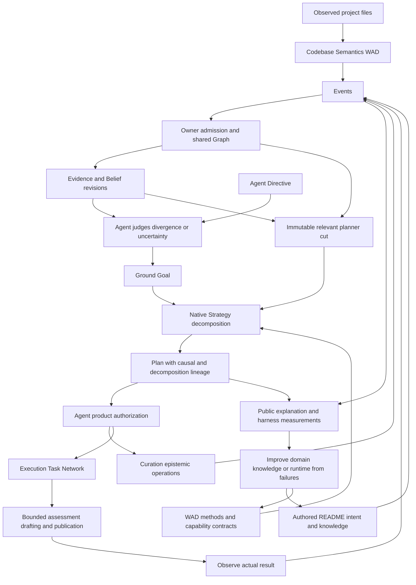

# Native Strategy planning for README excellence

Date: 2026-09-12. Lifecycle: closed by explicit user acceptance. Branch: `feat/strategy-planning` in Meld, Meld README, Codebase Semantics and Meld Eval. The [slice record](strategy_planning_active_slice.md) retains the accepted implementation and continuous-reconciliation proofs.

The user explicitly clarified that executing against an older observed basis is expected. The required behavior is continuous Agent reconciliation after newly admitted material information. The earlier fail-on-stale-output gate was an assistant-authored design-contract error, and its circuit-breaker classification is withdrawn. Historical captures remain unchanged. This correction authorizes measurement of the complete native response before proposing runtime mechanisms. Settling delays and action-cost policy are deferred.

This document owns the successor experiment's objective, assertion assessment, scope and delivery direction. It supersedes the next-work instructions of the [codebase semantics experiment](codebase_semantics_experiment.md) for shared README maintenance. Earlier captures retain their exact observations. The user-corrected acceptance below supersedes the earlier source-drift failure classification. [Cognitive Architecture](../../../cognitive_architecture/README.md) remains evergreen design truth; this document records current evidence and intended delivery.

## Experiment closure and disposition

The user accepts this experiment as closed and directs the next exercise to go wide from Events upward using Gmail Operator. Acceptance covers the demonstrated foundation: bounded Tree-sitter observations reach native knowledge, domain-authored methods undergo recursive Strategy decomposition, and an Agent autonomously constructs successor work when new material evidence contradicts its tracked condition. The 26-check continuous-reconciliation proof uses unchanged binaries and no operator repair request.

Closure does not claim whole-repository sensing, general syntax/semantic coverage, automatic discovery of README claims, complete prose maintenance or full causal search explanation. The untracked obsolete paragraph remains recorded evidence of the current claim boundary. Full serious README qualification through broad shared semantics is transferred to later work rather than declared complete. The former stale-output circuit breaker remains withdrawn.

The [new event-up go-wide ledger](event_up_go_wide_experiment.md) owns the successor. Its sequence is whole-repository Tree-sitter Event ingestion, evaluation of the existing language against the resulting repository relationships, then claims curation and reconsideration of the current README PDS. Domain meaning remains external. The old one-Boolean README obligation is retained as regression evidence, not the target architecture for broad ingestion. This closes the experiment's active delivery authority; the newly requested phase receives its own scope and branch.

## Continuous-reconciliation result

The [corrected command journey](../../../../../meld-readme/evidence/continuous-reconciliation-v1/CLOSEOUT.md) passes 26 checks with unchanged runtime and WAD binaries. The native Agent responds to newly admitted source semantics, requests a successor Plan, authorizes the resulting work and independently confirms the corrected tracked assertion. Two draft calls occur; no operator request, restart or harness-authored README drives correction. The prior freshness stop is withdrawn.

The final document also exposes a narrower domain limitation: a paragraph outside the single tracked assertion retains obsolete guard wording. This is evidence for richer README claim coverage and correspondence, not a failure to perform native successor planning. Full root/leaf quality and the complete causal search account transfer as broader program goals beyond this closed experiment. Cost-sensitive delay for rapidly changing facts remains deferred.

## Implementation checkpoint

Native method refinement now recursively expands abstract Goals, applies hypothetical effects to establish later prerequisites, and retains selected hierarchy and local primitive bindings. The README WAD authors three method levels and separate draft/publication capabilities. Public Agent inspection retains authorized Plan revisions after confirmation. No extension to `meld-lang` was needed.

The [closeout and evidence](../../../../../meld-readme/evidence/strategy-decomposition-v1/CLOSEOUT.md) accept ordinary Luna-low shared maintenance, CPU regression, first-use commands and a normally compiled leaf package. The serious shared-semantic root README, comprehensive causal search account and support-aware reconstruction remain open.

The [earlier drift experiment](../../../../../meld-readme/evidence/strategy-decomposition-v1/DRIFT.md) stopped at stale output. It showed changed-source contribution before the write and semantic admission afterward, but never measured subsequent reconciliation. The completed continuous-reconciliation slice followed that interval and proved that new material evidence autonomously changes the Plan and restores the tracked desired condition. No universal producer freshness gate is selected. Provider latency remains a measured responsiveness limitation.

## Outcome and reason

README excellence must run as an external domain-authored PDS/WAD whose meaningful reconciliation decisions are constructed by native Meld Strategy. Codebase Semantics independently observes code and publishes supported knowledge. A README Agent holds a standing Directive, judges its admitted understanding, and asks Strategy to decompose the desired condition into justified epistemic and executable work. Luna-low supplies bounded semantic assessment and prose where required.

The earlier README capability proved that the flywheel can authorize a useful repair and independently confirm it. It also hides judgment, drafting, candidate checking and retry decisions inside one broad operation. Successful execution therefore does not establish that native planning can choose and decompose a remedy. The next experiment tests that central architectural purpose.

The full serious README remains the product target. One syntax assertion is an initial planning fixture, not a substitute for that target. No claim is made that every possible README claim can be determined from code alone. Editorial standards, intended architecture and declared scope remain necessary authored inputs.

## Assertion verdict

User assertion: given the Agents of README excellence and Codebase Semantics, we have all the physical data required to supply working Agent Strategies.

Verdict: qualified pass as input sufficiency for this experiment. Available inputs include source files, the current document, an exemplar, editorial intent, identified obligations, source evidence, admitted syntax observations, retained assessments, a provider and an authorized write path. The experiment does not require a new kind of physical sensor or an unavailable external knowledge source before native planning development can begin.

The stronger assertion that these inputs already form a complete planner-ready world model is false. Codebase Semantics currently covers a selected Rust syntax shape. Compound task vocabulary, guarded decomposition methods, causal applicability and effects, explicit support relationships and broader coverage are still work to perform. Physical availability does not establish semantic completeness, reliable delivery during long operations, or production qualification.

This qualified verdict satisfies the user's branch-transition condition as a foundation for development. It does not waive any remaining acceptance requirement. The goal is to build and measure the missing representations and planning behavior, not to treat them as already implemented.

### Data inventory

| Required input | Current evidence | Sufficiency and missing expression |
| --- | --- | --- |
| Desired quality and scope | [Full standard](../../../../../meld-readme/theory/full-obligations-standard.json), [nineteen obligations](../../../../../meld-readme/experiments/event-claims/full-root-program.json) | Editorial intent, factual questions and exemplar exist. Broad prose intent still needs executable domain meaning. The obligation set is explicitly bounded. |
| Physical project material | [Full WAD](../../../../../meld-readme/experiments/event-claims/full-root-wad.json), source selectors and authored document bindings | Read-only inventory found all 26 distinct selected checkout files and both authored document files. The target README exists and the standard retains a 15,333-character exemplar. This checks availability, not truth or completeness of each claim. |
| Code observations | [Extractor](../../../../../meld-code-semantics/src/semantics/extract.rs), [scope limits](../../../../../meld-code-semantics/README.md#meaning-and-limits) | Selected function, branch, condition, identifier and return relationships are represented. Symbol resolution, general behavior and whole-repository coverage are not established. |
| Native shared knowledge | [Semantic read](../../../../../meld-readme/owner/src/readme/semantics.rs), [shared repair evidence](../../../../../meld-readme/evidence/semantic-repair-v1/report.json) | Named Graph input, current admitted cut, provenance and complete bounded traversal reach README. Historical evidence proves one Boolean assertion without opening code files. |
| Obligations and assessments | [Event intake](../../../../../meld-readme/owner/src/readme/intake.rs), [assessment](../../../../../meld-readme/owner/src/readme/assessment.rs), [publication](../../../../../meld-readme/owner/src/readme/observation.rs) | Identified obligations, selected fragments, verdicts and citations exist. Several values remain serialized domain payloads rather than native planning predicates and traversable dependencies. |
| Available means | [Capability](../../../../../meld-readme/owner/src/readme/capability.rs), [Strategy package](../../../../../meld-readme/theory/strategy.json) | Provider calls, candidate edits, verification and atomic write exist. They need bounded contracts and authored causal relationships so Strategy can select and compose them. |
| Outcomes and recovery | [Initial README qualification](../../../../../meld-readme/QUALIFICATION.md), [shared repair report](../../../../../meld-readme/evidence/semantic-repair-v1/report.json) | Earlier file-source root and leaf evidence and the two-Agent Boolean journey provide baselines. They do not qualify a new planner or broader semantic cache. |
| Freshness during work | [Source-drift failure](../../../../../meld-readme/evidence/source-drift-v1/ANALYSIS.md) | The physical change exists and its eventual semantic revision is admitted. The old probe stopped before testing the required autonomous successor and convergence. |

The inventory resolves authored document identities through the WAD compiler's manifest bindings rather than treating them as checkout paths. No fresh model qualification was run for this assessment. Retained reports remain tied to their original binaries and packages.

## Research and branch-transition baseline

A Terra research agent inspected Meld's HTN research, historical workflow designs and the local `~/htn` corpus. Root independently traced the current Strategy, Agent and public inspection paths. Historical proposals establish intent, not present runtime behavior.

The [HTN research](../../../ideas/execution_planning_research/htn_goap_research.md#htn-deep-dive) describes recursive refinement using primitive operators and conditional methods. The [preserved-lineage synthesis](../../../ideas/execution_planning_research/htn_turing.md) places planning and dynamic choice above executable capability graphs. It explains why repair needs the abstract task and selected method behind an action. Its proposed program control graph is historical exploration, not an accepted new runtime component for this experiment.

The local [IPyHOP report](../../../../../htn/reports/IPyHOP/README.md) identifies decomposition-tree-aware replanning as a useful reference. Other local clones include SHOP3, T-HTN, PANDA and ChatHTN. Their existence is not evidence of integration. The [SHOP authors' description](https://www.cs.umd.edu/projects/shop/description.html) independently confirms that authored methods and alternative decompositions are fundamental HTN inputs.

The assertion that telling an HTN planner how tasks can decompose invalidates planning is too broad. A domain must declare lawful and useful means. The problem is prescribing the effective whole procedure so the planner has little meaningful choice, or hiding those choices inside one opaque capability. The file name `strategy.json` is not the architectural defect.

At the branch-transition baseline, [Strategy search](../../../../crates/meld-world-model/src/strategy/search.rs) matches settlement rules, selects and instantiates method compositions, matches capability effects, recursively handles conjunctions and alternatives, and closes artifact inputs through available producers. Successor construction preserves completed work. These are useful implemented behaviors.

The inspected method path does not recursively refine abstract task nodes. Complete Task construction requires primitive operators. Preconditions are checked against the starting world-state projection, without general progression of hypothetical effects between actions. A sequence where A establishes P and B requires P therefore exposes a planning gap even when all physical inputs and capabilities exist. This is more than a missing README method library.

The branch-transition README package offers one no-precondition repair operator with a receipt effect. The owner then judges, drafts, checks and retries internally. Its native authorization is real; meaningful hierarchical planning remains unproved.

## Intended ownership and causal flow

Agent owns continuous reconciliation and normative judgment. Strategy owns episodic pure construction and reconstruction of causal Plans. A frozen cut makes one construction reproducible while independent sensors and semantic owners continue advancing. New relevant evidence can require a successor Plan; it does not rewrite the historical Plan.

Strategy decomposes desired conditions and the means to establish them. Facts and Beliefs supply premises. Evidence may show that the world violates the Directive; changing a Belief to a desirable answer is not success. A Plan may seek better evidence, change the world, or combine both. Hypothetical planning effects never become observed Facts merely because search predicted them.



The Goal precedes Strategy construction. Execution receives complete Goal-attributed Tasks after Agent authorization. It does not receive an unresolved Directive or own the full Strategy Plan. Curation receives authorized epistemic operations separately.

## Responsibility and change account

The domain landscape is the root source domains and workspace members in `Cargo.toml`, plus the three independent sibling products. This is a bounded reassessment of the existing loop, not a proposal for new runtime domains.

| Domain group | Integration and completeness | Disposition and boundary |
| --- | --- | --- |
| World-model Agent and Planner | own reconciliation and consume planning context; partial | Extend existing grounding, relevant-cut access and lineage where the experiment demonstrates a missing contract. Retain Agent authorization. |
| World-model Strategy | own decomposition, alternatives, hypothetical effects and verification; partial | Extend canonical search into recursive refinement. Retire replaced entrypoints in the same completed change. |
| World-model Graph, Evidence, Belief and Curation | publish and consume admitted semantic support; partial | Retain authorities. Extend generic relationships or projections where needed; domain meaning remains external. |
| `meld-lang` | supply shared planning values; partial | Retain propositions, methods and operators first. Extend for demonstrated gaps; keep search and domain grammar out of the language. |
| Runtime and concurrency | own participation and dispatch progress; responsiveness constrained during provider work | Preserve one runtime. Measure eventual sensory and Agent progress before selecting a concurrency change. |
| Theory, config and initialization | consume WAD components and realize assignments; partial | Reuse exact package and Agent-position selection. Extend only required method or capability contracts. |
| Events | publish external authorship and outcomes; complete for current intake | Retain one append and replay authority. External data continues through Events. |
| Execution, capability and task | consume authorized work and publish outcomes; partial for new decomposition | Reuse the Task Network and grants. Keep Goal and Strategy decisions outside Execution. |
| Provider, context and prompt context | provide semantic conversion; existing path proved | Reuse Luna-low deployment binding. Hold model strength fixed while measuring domain expression. |
| Harness, CLI, API and serve | observe, explain and adapt public products; partial | Extend native causal reads and capture actual search outcomes. The harness cannot invent decisions. |
| Branches and world-state adapters | observe current owner cuts; existing path proved | Reuse public queries and exact revision identities. |
| External Codebase Semantics | own code meaning and sensory contribution; partial | Extend extraction and explicit coverage as selected README obligations require it. |
| External README | own excellence, materiality, interpretation and available means; partial | Replace the opaque repair decision loop with WAD methods and bounded operations under native Strategy. Retain useful capture, verification and edit mechanics. |
| External Meld Eval | observe and measure the product journey; partial | Extend command scenarios and explanation assertions. Preserve immutable candidate evidence. |
| Workspace, tree, Merkle traversal and ignore | publish or select physical source scope; existing bounded capture | Reuse source boundaries. Repository-wide Merkle sensing is backlog unless required by selected obligations. |
| Store, heads and session | retain durable identities and state; existing dependencies | Reuse established storage outside the target workspace. No new store is presumed necessary. |
| Docs and dependency-security owners; code-change and nonce | regression consumers; no direct behavior change selected | Preserve canonical callers during Strategy replacement. They are not new product targets. |
| Metadata, telemetry, logging, workflow, views, types, error and library composition | no independent semantic change selected | Supporting infrastructure does not become an alternate planner or experiment authority. |

The affected path is broader than likely write scope. The first planning slice should concentrate on Strategy construction and verification, the external README vocabulary and harness evidence. Agent/Planner support, Event-visible dependencies, source coverage and runtime progress must be assessed at their actual handoffs before edits are frozen.

One-level decomposition of changed responsibilities is search and verification in Strategy; grounding, authorization and successor lineage in Agent; evidence selection and cut projection in Planner; extraction and coverage in Codebase Semantics; obligation assessment, draft production and publication in README; and causal query plus capture in the harness. Runtime progress is a separate demonstrated defect. No new scheduler, store or generalized causal-reasoning subsystem is selected by this document.

### Expected WAD shape

This is a semantic inventory, not a frozen file format or requirement to create every named file.

```text
readme-wad/
  intent-and-standard       audience, excellence, editorial constraints, scope
  knowledge-events          obligations, authored references, support relationships
  planning-domain           compound tasks, guarded methods, applicability and effects
  capabilities              bounded assessment, draft, validation and publication
  native-components         existing Agent, Belief, Curation and authority declarations
  project-bindings           target scope and named Codebase Semantics input
  deployment-bindings        explicit provider and compiled owner selection
```

Codebase Semantics retains its own WAD, Agent, extractor and coverage declarations. The composition binds the products to shared Event and Graph authorities. Installed executable and theory changes may use a full restart. Live WAD streaming remains deferred. Project content and external authorship enter through Events; installation does not become direct public Graph authorship.

## Runtime, harness and WAD development loop

Author or revise domain knowledge and available means, compile exact WAD installation material, append authored data through public Events, run ordinary Meld, and inspect its native causal account. Improve the WAD when meaning or methods are missing. Improve the runtime when generic decomposition, currentness or observability cannot carry that meaning. Repeat with explicit candidate identities and the same Luna-low setting.

The harness must explain actual behavior: Directive and condition revision; triggering observation, Evidence and Belief change; evaluated divergence or unknown; planner cut; selected method and subtask hierarchy; relevant rejected alternatives and bounds; predicted dependencies; authorized products; Task Network lineage; actual returns; and confirmation or successor judgment. A bounded structured search account is sufficient. An unbounded dump of every search node is not the outcome.

Current `agent show --json` exposes genesis, condition judgments, Goals, current Plans and authorizations. The [native read](../../../../src/agent/native.rs) does not expose a complete historical search account. The [causal walker](../../../../src/harness/walk.rs) records Goals as out of scope and has no Plan subject. Successful Agent search currently discards rejection grounds and work statistics, while the Plan explanation is generic. These are observation gaps, not permission for the harness to reconstruct an invented rationale.

## Product proof and acceptance

The first useful proof is a README change whose native Plan recursively decomposes at least two abstract levels, chooses between applicable domain methods from different admitted states, and establishes a prerequisite before a dependent operation. This makes recursive refinement and causal state handling observable. Exact method names and operation boundaries remain to be designed from the domain, not hard-coded into the runtime or dictated by the harness.

Compare unchanged supported content, an unsupported or contradicted claim, missing evidence, and changed evidence during work. Show preservation or deliberate replacement of prior work from its support basis. A fixed call sequence inside `readme.repair` cannot satisfy this proof merely by publishing more detailed logs.

Completion requires the serious root README and a representative leaf to retain their declared factual and editorial standard under native decomposition. The shared Codebase Semantics path must cover selected code claims or explicitly report their absence. Unknown coverage must not become a positive judgment. Earlier file-source qualification remains regression evidence, not a silent replacement for the semantic-input target.

Luna-low remains the semantic provider baseline. CPU-representable claims use CPU verification. Editorial qualities may retain attributed model judgments; native planning does not imply that joy or entailment has become an exact CPU predicate. Report calls, reuse, failures and quality separately. The long-call source-change scenario must prove autonomous reassessment and convergence after material evidence is admitted. Stale intermediate output is retained evidence rather than automatic failure. Action-cost conditions and delay for rapidly changing evidence are deferred planning policy.

## Delivery, authority and checkpoint

Maturity is exploratory for native recursive planning and shared semantic README maintenance. The obligation floor includes durable Event lineage, independent Goal satisfaction, replacement completeness, and the known source-drift failure. The original assessment froze no implementation slice. The linked active slice now owns the first recursive construction and bounded-operation change; this section preserves the program-level obligations.

The backlog is outcome-shaped: native hierarchical construction with a public causal account; separation of README decisions into methods and bounded operations; support-aware successor behavior and sensory progress; then serious README qualification. These may combine where one coherent vertical change is smaller. Ordering follows observed dependencies rather than an exhaustive prescribed workflow.

The user explicitly authorizes this assessment, input-sufficiency validation, full commit and push of the working branches if that foundation holds, and transition to `feat/strategy-planning` with the stated product goal. This overrides routine push confirmation in the contribution policy for these checkpoints. It does not authorize release publication, tags, release-capable CI or unrelated architecture expansion.

The transition checkpoints all four repositories on `feat/codebase-semantics`, then creates and publishes `feat/strategy-planning` from those exact tips. Baseline code before this documentation checkpoint: Meld `7f3e78f0`, README `e81e49b`, Codebase Semantics `9150f39`, Eval `a6b948e`. No runtime code changes or new model runs are included in the transition.

The prior `shared-semantic-repair-10` report remains an immutable record of its former gate. The user explicitly superseded that gate: stale intermediate output is expected, and autonomous reconciliation is the required outcome. Its early-stop report establishes no result for that outcome. Do not preserve a competing opaque decision loop after its native replacement is delivered. New independent coordinators, stores, graph writers or broad language redesign trigger reassessment before scope expands.

Checkpoint review: independent Terra assessment and root source review agree on qualified input sufficiency and incomplete native planning. The physical-source inventory has no missing selected inputs. Documentation verification checked nine changed Markdown files and 38 local links, with no missing targets or new prohibited prose parentheses. Diff whitespace checks pass in all four repositories. Existing remote branch tips match local baselines after fetch. This accepts the documentation and branch-transition checkpoint, not an implementation or runtime acceptance gate.

If applied, this commit records the planning research, qualified input-sufficiency verdict and native README Strategy experiment so implementation begins from demonstrated product evidence and explicit architectural gaps.
