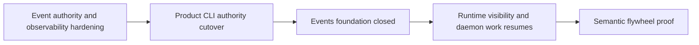

# Event Foundation Closeout Program

Date: 2026-07-10
Status: active; E0 scope correction complete
Scope: close event correctness, authority, observability, compatibility, and direct product routing before runtime hosting resumes
Workflow: complex change workflow active per [Complex Change Workflow Governance](../../../governance/complex_change_workflow.md)
Branch: `event-foundation-closeout`

## Objective

Finish `meld-events` as a correct, observable, identity-bearing product foundation that does not require a supervisor.

Runtime consumes and hosts event capabilities after this program closes.
Runtime scheduling, cache publication, daemon process ownership, and semantic runtime visibility do not define event closure.

## Dependency Direction

The product cutover is part of event foundation closure because it proves that the authority is the product truth rather than an isolated crate abstraction.
Out-of-process access follows event closure because a real remote client needs a process host.

## Predecessors

This program succeeds the completed [Event Spine Overhaul PLAN](event_spine_overhaul_program.md) and [Event Observability PLAN](event_observability_program.md).
Those programs established the ledger mechanics and first observability surfaces.
Their completion evidence remains valid, but their remaining gaps and ownership handoffs are governed here.

The [Product Event Authority Cutover](../integration/product_event_authority_cutover.md) is the detailed E5 migration and root composition plan.
The [Product Event Authority Assessment](../integration/product_event_authority_domain_assessment.md) records the cross-domain integration gaps.

## Ownership Boundary

| Concern | Event closeout owner | Runtime owner |
| --- | --- | --- |
| durable ledger identity | define and validate | consume |
| append, replay, subscription, watermark, and observability capabilities | define and implement | host and route |
| health, flow, trace, session, and paging truth | compute over one authority | publish or display |
| remote access | transport-neutral contract and loopback conformance | process host, IPC framing, reconnects, endpoints, and authentication |
| health promotion | durably append a supplied promoted fact | supply raw health and restart signals |
| promotion policy | no canonical policy | producer-owned runtime-health or sensory concern |
| operator status | stable health report and mapping inputs | status mapping, tick cadence, publisher invocation, cache, staleness, console, and action records |

## Closure Invariants

- One product identity resolves to one persisted `LedgerIdentity` and one `EventAuthority`.
- Every canonical append, including graph-derived and execution events, advances one durable sequence and one notification source.
- Append, replay, subscription, watermark, cursor lag, and observability reject identity mismatch instead of combining sequence spaces.
- Production domains cannot open an alternate writable canonical event store.
- Every bounded read reports the range it covered or that its answer was truncated.
- Provenance follows structural event contracts and never depends on arbitrary payload string inspection.
- Direct `meld event` commands read the configured product authority.
- A real command route proves one ledger identity and one event sequence across CLI and product assembly.

## Orchestration

The root integrator owns shared contracts, module exports, Cargo manifests, plan evidence, staging, commits, and phase gates.
Builder agents receive disjoint file ownership, run focused tests, and do not commit.
Fresh reviewers must not have authored the reviewed package and inspect the staged diff against the phase requirements and repository policies before each checkpoint.

At most three builders run beside the integrator.
Parallel lanes freeze shared contracts before fan-out, and Cargo gates run serially after integration.
The integrator stages only named phase files so unrelated work cannot enter a checkpoint.

Every source checkpoint runs the formatter before build, lint, boundary, focused test, and workspace test evidence.
Behavior-changing phases receive two independent review lenses.
E6 adds an independent verification agent that executes the documented acceptance commands from a clean working tree.

Commits use declarative conventional subjects under [Commit Policy](../../../governance/commit_policy.md).
Breaking changes use a `!` marker and a `BREAKING CHANGE:` footer.
No push occurs without separate user verification.

## Development Phases

### E0 — Scope Correction — complete 2026-07-10

Correct the event and runtime plans so runtime hosting is downstream of event closure.

Tasks:

- Remove `RuntimeStatusPublisher` invocation from event observability closure.
- Keep `EventHealthReport` and stable status mapping inputs on the event side.
- Move supervisor cadence, status cache persistence, staleness, console rendering, action records, and heartbeat mapping to runtime visibility.
- Move daemon lifecycle and real remote transport to runtime.
- Mark threshold, hysteresis, process epoch, retry, outbox, and promotion decisions as producer-owned policy.
- Record `SelfObservationWatcher` as a provisional compatibility implementation.

Exit criteria: no event phase or gate depends on supervisor scheduling, status cache publication, or a daemon host.

Evidence: branch `event-foundation-closeout` created from the local event-observability head with the existing design work preserved. Formatter, Markdown link, Markdown parentheses, and diff checks passed. The pre-closeout benchmark baseline recorded replay at tip at 0.61 microseconds for one hundred thousand events, idle catch-up at 0.72 microseconds, health at 0.66 milliseconds, page at tip at 1.48 microseconds, eight durable writers at 12.64 milliseconds per thousand, flywheel throughput at 37.63 milliseconds per two thousand events, flywheel latency at 54.68 microseconds, and storage at 1153 bytes per event.

### E1 — Correctness Regressions

Repair and pin the remaining correctness defects before authority construction hides them behind a larger surface.

Tasks:

- Enforce exact session partitioning and add delimiter-collision regressions.
- Make consumer cursor advancement atomic and prove it under concurrent writers and reopen.
- Enforce bounded page, flow, and trace limits, including malformed and extreme limits.
- Correct relation-only trace discovery.
- Define trace coverage and truncation semantics explicitly in report contracts.
- Add direct regressions for each repaired behavior.

Exit criteria: focused concurrency, reopen, malformed-limit, session-isolation, and trace suites pass without ignored known defects.

### E2 — Authority Core

Make identity and construction authority structural.

Tasks:

- Persist `LedgerIdentity` in canonical ledger metadata and recover the same identity after reopen.
- Introduce one `EventAuthority` aggregate that owns writable construction.
- Derive identity-bearing append, replay, subscription, watermark, and observability capabilities from that aggregate.
- Reject identity mismatch, duplicate binding, and split-brain writable open attempts.
- Route every canonical append through the authority writer and its notification source.
- Initialize the committed watermark from durable state after reopen.
- Seal production constructors so domains cannot build writable `EventStore` or writer instances directly.
- Keep explicit narrow constructors for tests, migration, and read-only compatibility only.

Exit criteria: capability identity agrees across reopen, alternate writable construction is unavailable to production domains, and every append path advances one sequence and watermark.

### E3 — Observability Hardening And Remote Contract

Make every event read honest about authority, durability, and coverage.

Tasks:

- Run health, flow, trace, session, and paging over one supplied authority.
- Carry `LedgerIdentity` on every report and reject mismatched requests or cursors.
- Report scanned range and truncation state for every bounded result.
- Compute durable consumer lag against durable authority state.
- Add reopen, retention, direct append, notification, and malformed-limit tests.
- Replace payload string provenance inference with explicit object references, relations, and record provenance.
- Define transport-neutral requests, responses, durability outcomes, identity validation, and error semantics.
- Provide one reusable conformance suite for local and remote authority implementations.
- Prove the remote contract with a loopback adapter that does not require a daemon.

Exit criteria: local and loopback implementations pass the same conformance suite, and every report names its ledger and coverage honestly.

### E4 — Domain Port Migration

Move production callers onto authority capabilities without moving domain meaning into events.

Tasks:

- Preserve execution's publication sink contract and satisfy it with a thin root adapter over the authority append capability.
- Preserve world model replay requirements and satisfy them with a thin root adapter over the authority replay capability.
- Route graph-derived appends through the authority capability.
- Remove production domain calls that append directly to `EventStore`.
- Carry ledger identity through replay cursors and append receipts where cross-authority mixing could occur.

Exit criteria: execution and world model retain their domain contracts, all canonical production writes use the authority, and boundary checks find no cross-domain reach into event internals.

### E5 — Product Cutover

Make the configured product authority the single-process product truth.

Tasks:

- Characterize and migrate existing CLI event history under compatibility policy.
- Inject the authority appender into `ProgressRuntime`.
- Stop `CliRuntimeAssembly` from constructing canonical event storage.
- Make `ProductRuntimeAssembly` consume the resolved authority.
- Make legacy event trees read-only after successful cutover.
- Route direct `meld event` commands to the configured product authority.
- Start `meld runtime run` through the real command route and prove one ledger identity and one monotonic sequence.

Exit criteria: the [Product Event Authority Cutover](../integration/product_event_authority_cutover.md) gates pass for direct single-process product routing and no compatibility event tree receives new semantic writes.

### E6 — Closure

Run the complete event gate ladder against the integrated authority and product cutover.

Tasks:

- Run formatter, lint, domain boundary, focused crate, and full workspace gates.
- Repeat concurrency and recovery suites across clean reopen cycles.
- Compare event and observability benchmarks with the overhaul baselines.
- Run the reusable authority conformance suite against local and loopback adapters.
- Obtain a fresh adversarial review focused on identity, split brain, durability, bounded reads, migration parity, and test honesty.
- Reconcile event readiness and cross-domain assessments with the implemented state.

Exit criteria: all E1 through E5 gates pass, no event closure gate names runtime scheduling or real daemon transport, and the events foundation is marked closed.

## Self-Observation Rule

Events owns durable append of a promoted health fact presented through the authority append capability.
Events does not decide when raw runtime health becomes a semantic fact.

A producer-owned runtime-health or sensory concern owns:

- thresholds and hysteresis
- process epochs
- retry and outbox state
- promotion decisions

Runtime supplies raw health and restart signals.
The existing `SelfObservationWatcher` may be hardened as a compatibility bridge, but it remains provisional and is not canonical event behavior or an event closure gate.

## Runtime Resumption

After E6 closes, runtime work resumes in this order:

- R1 — invoke the status publisher and persist the status cache
- R2 — host the authority behind the daemon and implement real IPC
- R3 — publish console frames and runtime action records
- R4 — prove the complete semantic flywheel and operator visibility path

Runtime owns supervisor tick cadence, status staleness, `runtime status`, console frames, `event.append` heartbeat and action mapping, daemon lifecycle, process ownership, reconnect behavior, endpoint lifecycle, authentication, and direct-versus-daemon process tests.

## Non Goals

- Implement supervisor scheduling to satisfy a historical observability phase.
- Persist or render the runtime status cache.
- Build the daemon or select an IPC framing protocol.
- Define threshold or hysteresis policy in `meld-events`.
- Complete sensory implementation or the full semantic flywheel.
- Treat the loopback remote adapter as a process integration test.

## Verification Policy

Compatibility work follows [Compatibility Policy](../../../governance/compatibility_policy.md) and [Compatibility Shim Policy](../../../governance/compatibility_shim_policy.md).
Migration preserves semantic units under [Semantic Unit Preservation Policy](../../../governance/semantic_unit_preservation_policy.md).
Every checkpoint runs the relevant focused tests before the full workspace gate and records exact evidence in this program.

## Read With

- [Events Readiness Assessment](assessment.md)
- [Event Observability Design](event_observability_design.md)
- [Event Runtime Requirements](../integration/event_runtime_requirements.md)
- [Product Runtime Assembly Requirements](../integration/product_runtime_assembly_requirements.md)
- [Runtime Operator Visibility Program Ledger](../integration/runtime_operator_visibility_program_ledger.md)
