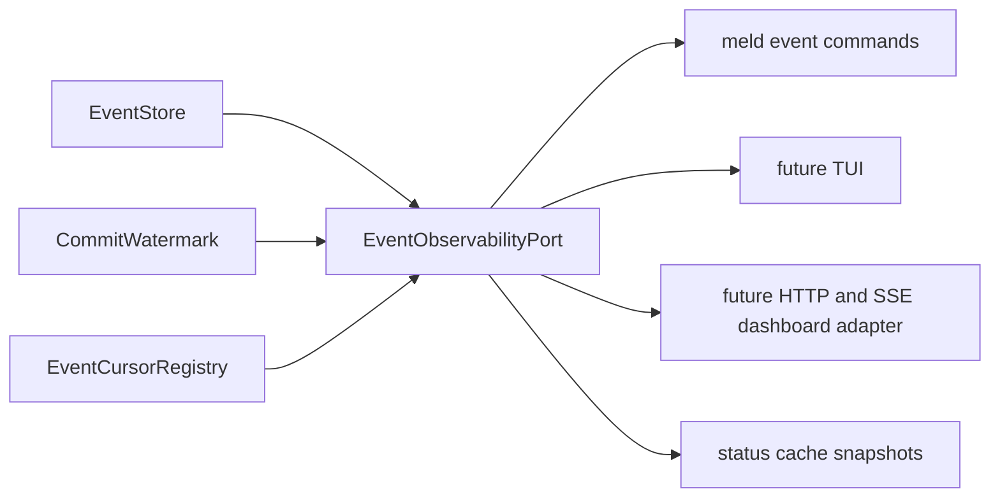

# Event Observability Design

Date: 2026-07-08
Status: active
Scope: observability primitives over the event ledger, one port for every presentation adapter, and the retirement of spine naming from the code

## Intent

The event ledger is the durable, totally ordered record of everything the runtime does, with identity, timestamps, and causal references on every record. Observability of the cognitive layer is therefore mostly a read problem over data that already exists, plus a small number of facts the runtime does not yet emit about itself.

This design defines the read models, the single port they are served through, and the adapter rule that keeps a CLI, a TUI, and a browser dashboard equally thin. It answers three operator questions with different machinery:

- is it alive and flowing — owned by the runtime operator visibility program's status cache and supervisor store; this design feeds it, never replaces it
- is it making progress — owned here: watermark against consumer cursors, flow rates, stall detection
- why did something happen or fail to happen — owned here: causal traces over object references, relations, and record provenance

## Decision: event names, not spine names

Event is a hardened domain; spine was the design metaphor that named it during gestation. The canonical architecture docs already demoted spine to a historical alias. The code follows:

- Public types rename now, while the surface has no consumers: `SpineWriter` becomes `EventWriter`, `SpineSubscription` becomes `EventSubscription`, `SpineCursor` becomes `EventCursor`. Operator surfaces use `meld event ...`, never `meld spine ...`.
- Prose, test and bench file names, and internal identifiers sweep to ledger language in one dedicated commit.
- Persisted names freeze permanently: the `obs_spine_events`, `obs_spine_meta`, and `obs_spine_record_index` tree names and the `spine::{seq}` source fact id format are on-disk and in-store contracts whose rename would buy migrations for zero functional gain. They carry comments marking them historical.
- The `spine_cursor::` key prefix has never been persisted by any production caller, so it renames to `event_cursor::` now, before first use freezes it.
- Design documents that already landed keep their history unrewritten; new documents use event and ledger language.

## Architecture: one port, many adapters



### The port

`EventObservabilityPort` is one trait with point-in-time queries and one streaming primitive:

```rust
pub trait EventObservabilityPort {
    fn health(&self) -> Result<EventHealthReport, StorageError>;
    fn flow(&self, window: FlowWindow) -> Result<EventFlowReport, StorageError>;
    fn trace(&self, subject: TraceSubject) -> Result<EventTraceReport, StorageError>;
    fn session(&self, session_id: &str) -> Result<SessionTimelineReport, StorageError>;
    fn next_page(&self, request: EventPageRequest) -> Result<EventPage, StorageError>;
}
```

`next_page` is the universal stream shape: cursor in, bounded batch plus next cursor out, blocking until the watermark passes the cursor or the timeout elapses. A CLI tail loop, a TUI render loop, and a server-sent-events stream are the same pagination loop with different sinks. `EventSubscription::next_batch` already implements the blocking core.

### The two-backing rule

sled is single process, so the port must be implementable twice and adapters must never know which backing they received:

- In-process backing now: direct store plus watermark plus registry. Serves one-shot CLI commands when no daemon holds the database, and any TUI hosted inside the runtime process.
- Out-of-process backing later: the owning daemon exposes the same port over the IPC or HTTP edge that the process ownership decision already reserves. A browser dashboard server implements the port over that edge; it is adapter work, not redesign.
- Health snapshots additionally publish into the operator visibility status cache, so `meld event status` stays non-blocking against a running daemon per that program's read rule.

### DTO discipline

Every report is a plain serializable struct with stable field names, free of presentation:

| Report | Contents |
| --- | --- |
| `EventHealthReport` | tip sequence, committed watermark, retained lower boundary, dropped event count, per-consumer name plus cursor plus lag, trailing append rate per domain |
| `EventFlowReport` | event counts by domain and type over a window, silent domains with last-seen sequence and age |
| `EventTraceReport` | ordered causal chain for one object, stream, or record id: each hop carries the record summary and the reference that linked it |
| `SessionTimelineReport` | one session's records in order with duration between steps |
| `EventPage` | bounded record batch plus the next cursor |

Every CLI command renders text and `--format json` from day one, so the CLI is already the machine-readable API before any server exists.

### Consumer cursor registry

Consumers register named `EventCursor`s in one well-known registry tree, giving lag enumerability: `lag = committed watermark - consumer cursor` per name. The registry serves observability and is the same consumer registration the compaction design requires for choosing a safe boundary; it is built once for both. Registration is convention for existing consumers — the graph reducer's `last_reduced_seq` gains a registry alias rather than moving.

### Boundaries

- meld-events owns structure-level reads: health, paging, and trace walks over object references, relations, and record ids, all events-owned contracts. It never interprets `event_type` meaning.
- telemetry owns semantic summaries that interpret event meaning, such as flywheel-stage rollups; it stays downstream.
- views, CLI, TUI, and HTTP adapters own presentation only, per the thin adapter rule.
- The status cache remains operational-only and never authoritative, per the operator visibility program.

## Self-observation

Promoted runtime-health facts become first-class ledger events in a `runtime` domain vocabulary: consumer lag exceeding a threshold, drop bursts, retention gaps encountered, restart storms. The world model can then reduce them like any other domain and form beliefs about the runtime's own health. The inclusion rule stays sovereign: gauges, heartbeat chatter, and per-tick samples never enter the ledger; only threshold-crossing summaries are promoted. This layer lands after the read surfaces prove out.

## Non-Goals

- No external metrics stack. A Prometheus or OTLP exporter would be one more named consumer with a cursor whenever a real need appears; it is never a foundation.
- No metrics in the ledger. Counters and gauges are ephemeral port reads or status cache entries; only promoted threshold facts are events.
- No second truth channel. Diagnostics that are semantic facts flow through the ledger; the status cache is the sanctioned non-authoritative exception.
- No new persistence. Observability reads existing trees plus the one registry tree; it never becomes a store of record.

## First Slice

Delivered by the [Event Observability PLAN](event_observability_program.md):

1. Rename sweep landing the event naming decision.
2. `EventCursorRegistry` and the port trait with the in-process backing.
3. `EventHealthReport` and `meld event status`.
4. `EventPage` and `meld event tail`.
5. `EventTraceReport` and `meld event trace`, structure-level only.
6. Status cache health snapshot publication readiness, with the trait call itself coordinated to the runtime wiring workstream's Wave 1.

## Read With

- [Event Spine Overhaul PLAN](event_spine_overhaul_program.md)
- [Spine Compaction Design](spine_compaction_design.md)
- [Runtime Operator Visibility Plan Skeleton](../integration/runtime_operator_visibility_plan_skeleton.md)
- [Events Domain](../../cognitive_architecture/events/README.md)
