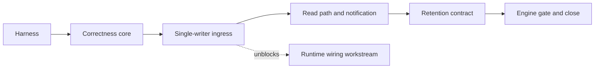

# Event Spine Overhaul PLAN

Date: 2026-07-08
Status: active
Scope: make meld-events durable, fast, observable, and contract-stable without pre-extending past known requirements
Workflow: complex change workflow active per [Complex Change Workflow Governance](../../../governance/complex_change_workflow.md)

## Overview

### Objective

The event spine is the shared clock and durable history for the cognitive flywheel.
The runtime wiring workstream is paused on it.
This program overhauls meld-events so that when the remaining runtimes come online, the spine is the strongest crate they touch.

### Outcome

A spine with proven ordering, durability, idempotency, and replay-determinism contracts, replay cost independent of history size, group-commit ingress through one ordered writer, watermark notification instead of wall-clock polling, a retention contract consumers are written against, and a standing test plus bench harness that locks all of it in.

### Commitments

- Fix the confirmed defects: scan-based cursor reads, non-atomic sequence allocation, cursor-advance race, per-event fsync under a global lock.
- Build the testing and benchmarking harness first, so every fix flips a known-red proof and every regression is caught.
- Preserve the contract layer. The envelope, `DomainObjectRef`, `EventRelation`, idempotency keys, and consumer-owned cursors are correct as designed. Everything below them may change.

### Non-Goals

- No multi-spine, partitioning, or distributed sequencing. The single runtime-wide sequence is the product. The inclusion rule — only promoted semantic facts enter events — is the volume control, not sharding.
- No async core. Tokio stays at the provider and workflow edge. The spine core remains synchronous with one ordered writer.
- No pluggable storage-backend abstraction. The `EventStore` public API is the seam; a second implementation is written only if the engine gate decides to migrate.
- No spine-owned consumer cursors. Cursors remain in consumer domain stores per the event runtime requirements.
- No sensory lane store. That is the sensory domain's work. This program only guarantees the spine absorbs promoted facts at cognition rate with headroom.

## Decisions

### Decision 1: spine shape

Single semantic spine, multi-lane ingest.
Raw high-rate lanes never publish directly; only promoted semantic observations enter events.
Cursor reads must be seek-based.
Synchronous ordered core; async is permitted only at ingress edges.
This codifies the multi-domain ledger design as a recorded decision so the cursor-scan discovery never has to be re-made.

### Decision 2: process ownership

sled is single-process.
The CLI assembly and product assembly currently open different databases, which masks the question of who owns the spine when a runtime daemon and a CLI command run concurrently.
Decision: single-process spine ownership enforced by the supervisor lease; the CLI and product runtime must not race on one spine database.
The ingress writer stays behind a channel so a daemon-plus-IPC edge can be added later without another overhaul.

### Decision 3: durability classes

Two producer classes, explicit in the API.
Durable emits return after the event is fsynced or an ack handle resolves; used for execution outcomes, promoted evidence, and derived world-model facts.
Best-effort emits enqueue and return; group commit flushes within a bounded window; used for telemetry, progress, and watch noise.
Today every emit pays fsync while every caller swallows errors; naming the classes resolves that contradiction honestly.

### Decision 4: storage engine stance

Keep sled through the retention phase.
Fix access patterns, measure, then decide at the engine gate with benchmark data.
sled 0.34 maintenance status makes eventual migration likely; choosing the replacement without this program's benchmarks is the over-optimization trap.

## Development Phases

Decisions above are phase zero and land with this PLAN.

### Phase 1: test and bench harness — complete 2026-07-08

Goal: build the harness against the broken implementation so it fails for the right reasons, and record baselines that indict the current mechanics.

Key seams: public `EventStore`, `EventRuntime`, and `GraphRuntime` APIs only. The harness must not add test hooks inside `store.rs`.

Known-red convention: tests that fail on known defects land marked `#[ignore]` with an explicit reason string naming the defect and the phase that fixes it. The tree stays green at every checkpoint; the red evidence is reproducible through `cargo test -- --ignored`.

Tasks:

- [x] concurrency suite: multi-thread append storms assert distinct sequences and zero lost records across bus, direct, and idempotent paths
- [x] determinism suite: same cursor plus unchanged spine yields identical batches on bounded and unbounded reads; interleaved append and replay never skips or duplicates; property tests against an in-memory oracle
- [x] recovery suite: child-process self-invocation harness kills the writer mid-storm, reopens, asserts no torn records, sequence meta at least max persisted plus one, idempotency index consistent
- [x] bench harness micro: append throughput by producer count and flush policy; replay latency versus history size at 10^3 through 10^6; session reads; idle catch-up cost; bytes per event
- [x] bench harness macro: flywheel bench with realistic producer mix and a reducer-shaped consumer measuring append-to-projection-visible latency
- [x] baselines recorded for the current implementation, including the replay-cost-versus-history curve

Exit criteria: suites compile and run green with known-reds ignored and documented; criterion baselines captured and summarized in this PLAN.

### Phase 2: correctness core — complete 2026-07-08

Goal: flip every known-red proof green with surgical diffs.

Key seams: `crates/meld-events/src/events/store.rs`, `crates/meld-world-model/src/world_state/graph/runtime.rs`, `src/runtime/supervisor/entrypoint.rs`.

Tasks:

- [x] seek-based reads: `read_all_events_after*` range from the encoded cursor key; session and legacy readers seek within their prefix
- [x] atomic sequencing: allocation moves inside the existing multi-tree sled transaction; the two-step allocate-then-append public path collapses
- [x] idempotent append lookup: the full-scan repair fallback in `lookup_record_seq` no longer runs on every novel record id; repair happens once at store open with a compat-shim removal note, removing the quadratic idempotent-append cost found while benching
- [x] cursor advance: `catch_up_with_limit` advances only to the highest processed source sequence, never to derived-event sequences
- [x] supervisor lifecycle key width widened past six digits
- [x] recovery probe migrates off `allocate_next_seq` to an appended probe event when the allocate-then-append path collapses, honoring the review waiver noted below
- [x] read-contract documentation matches actual guarantees

Exit criteria: formerly ignored tests un-ignored and green; replay-latency bench flat with respect to history size; full workspace tests green.

### Phase 3: single-writer ingress

Goal: one ordered writer, honest bus, real backpressure, durable acks.

Key seams: `crates/meld-events/src/events/ingress.rs` and `runtime.rs` internals; `EventAppendSink` and emit signatures preserved for producers.

Tasks:

- [ ] writer thread owns sequencing and sled writes behind a bounded channel; seq races become structurally impossible
- [ ] group commit with size and time bounds; durable-class emits ack on flush; best-effort emits return on enqueue
- [ ] direct idempotent path and bus path converge on the writer
- [ ] backpressure policy: bounded blocking for durable, counted drops for best-effort surfaced through worker diagnostics; silent drops end
- [ ] commit watermark published by the writer through a watch-style primitive
- [ ] flush-and-drain on shutdown and drop; CLI one-shot processes never lose acked events

Exit criteria: multi-producer bench shows group-commit gain over the per-event-fsync baseline; kill-recovery proves acked events always survive; drop counters visible in diagnostics; runtime wiring workstream may resume.

### Phase 4: read path and notification

Goal: consumers wake instead of poll; reads stop paying legacy and duplication taxes.

Key seams: new subscription surface in meld-events; `TREE_SESSION_EVENT_INDEX` layout; legacy tree readers; `src/runtime/tooling.rs` tick loop.

Tasks:

- [ ] `SpineSubscription`: watermark notification plus bounded replay plus an optional cursor helper consumers embed in their own stores; the spine never persists a consumer position
- [ ] supervisor tick wakes on watermark advance with the configured interval as fallback heartbeat
- [ ] session index stores eight-byte sequence references resolved through the spine tree
- [ ] legacy sunset: one-time backfill migrates `obs_events` rows, then the merge-on-read path is deleted per [Compatibility Shim Policy](../../../governance/compatibility_shim_policy.md); characterization tests precede, parity tests prove, removal notes mark any surviving seam
- [ ] encoding decision from bench data: binary value encoding behind the store boundary only if serde_json cost is material; decision recorded either way

Exit criteria: consumers block until new events; no session read touches the legacy tree; storage-per-event bench improved or the encoding decision recorded as not worth it.

### Phase 5: retention contract

Goal: land the contract consumers are written against; defer the compactor until data warrants it.

Key seams: spine meta, replay error surface, graph reducer error handling.

Tasks:

- [ ] retained lower boundary tracked in spine meta; replay below it returns a typed retention-gap error instead of silently skipping
- [ ] graph reducer handles the gap error explicitly
- [ ] genesis and snapshot hook: the contract by which a projection records rebuilt-from-snapshot at a sequence, so replay from zero is never required
- [ ] compaction design doc with an explicit activation trigger; no compactor implementation

Exit criteria: gap contract tested; consumers handle it; compaction doc exists with a named threshold.

### Phase 6: engine gate and close

Goal: decide the storage engine with data and close the program.

Tasks:

- [ ] rerun the full bench suite; compare fixed sled against one candidate only if sled numbers or maintenance risk justify the spike; record the decision
- [ ] unify the CLI and product database topology or document the divergence as intentional with behavioral differences named
- [ ] update `CRATE.md`, events README, and `assessment.md` to post-overhaul reality
- [ ] mark this PLAN complete with gate evidence links

Exit criteria: final PLAN state shows gate pass status for all phases.

## Verification Strategy And Gates

Every checkpoint commit passes the same gate ladder, in order:

1. formatter gate: `cargo fmt --all -- --check` before any test gate, per workflow governance
2. lint gate: `cargo clippy --workspace --all-targets` with no new warnings
3. boundary gate: `scripts/check_domain_boundaries.sh`
4. test gate: `cargo test -p meld-events` plus affected crates; full `cargo test --workspace` at phase exits
5. contract gate: the four contract suites green; known-reds only under the documented ignore convention
6. bench gate at phase exits: criterion run compared against recorded baselines; regressions block the phase close
7. policy gate: docs style scan on changed Markdown; shim removal notes present; breaking changes called out before commit per [Compatibility Policy](../../../governance/compatibility_policy.md); changed record shapes reviewed against [Semantic Unit Preservation Policy](../../../governance/semantic_unit_preservation_policy.md)
8. fresh review gate: every checkpoint commit is reviewed by a fresh-context review agent that did not produce the change; the reviewer receives the staged diff and the relevant PLAN phase, and checks correctness, test honesty, commenting policy, semantic unit preservation, shim notes, and domain boundaries; confirmed findings are fixed or explicitly waived with a recorded reason before the commit lands; behavior-changing phases additionally get an adversarial multi-lens review

Evidence for each gate is recorded in the phase completion notes below as work lands.

## Branch And Commit Model

One feature branch `event-spine-overhaul` carries the full plan scope, branched from `runtime-operator-visibility`.
Parallel execution uses disjoint-file agent assignments or short-lived working copies merged back by the integrator.
Each phase task lands as one atomic conventional commit; subjects describe concrete behavior changes, never phase names.
No push without explicit user verification per commit policy.

## Implementation Order Summary

Decisions and this PLAN land first as one design commit.
Harness suites and benches build in parallel, integrate, and record baselines.
Correctness fixes flip the known-reds.
The ingress writer lands as one reviewed unit and unblocks the runtime wiring workstream.
Read path tracks parallelize after the writer exists.
Retention contract lands, then the engine gate closes the program.

## Exceptions

- `cargo test -- --ignored` is the sanctioned way to reproduce known-red defect proofs before their fixing phase; ignored tests carry the defect and fixing phase in their reason string.
- Kill-based recovery tests spawn child processes from the test binary; they are skipped under environments that forbid subprocess spawning by honoring `MELD_SPINE_RECOVERY_SKIP`.
- Criterion runs are not part of the default `cargo test` path; bench gates run explicitly at phase exits.

## Phase Completion Notes

### Phase 0

- PLAN and decisions recorded 2026-07-08.
- Domain assessment: [Event Spine Overhaul Assessment By Domain](event_spine_overhaul_domain_assessment.md).
- Baseline evidence: recorded below at the Phase 1 checkpoint.

### Phase 1 — complete 2026-07-08

Gate evidence, in ladder order: `cargo fmt --all -- --check` clean; `cargo clippy -p meld-events --all-targets` zero warnings after fixes; boundary script passed; full `cargo test -p meld-events` green at 58 tests with 3 known-reds ignored; full `cargo test --workspace` green; fresh review agent returned no blockers, one should-fix, three nits; baselines below. Commits `c80e073`, `ae4cf62`, `193297e`.

Known-red inventory, all verified failing on current code via the ignored set: three storm tests in `spine_concurrency.rs`, all attributed to non-atomic sequence allocation. Observed loss: roughly two thirds of 2000 plain concurrent appends, roughly two percent of 2000 idempotent appends, and 20 of 1600 mixed-path events.

Findings discovered by the harness beyond the review's defect list:

- Idempotent appends are quadratic in history: `lookup_record_seq` falls back to a full event-tree scan on every novel record id and the append path performs the lookup twice. A 10000-event flywheel iteration took 45 seconds. Added as a Phase 2 task.
- Crash durability is sound: roughly two hundred kill-reopen cycles produced zero torn records, zero duplicate sequences, and sequence meta never lagged persisted records; the allocator meta write reaches the sled log before its event transaction, so crashes only leave benign gaps. The predicted crash-side red did not materialize; the allocation defect is concurrency-only.
- Concurrent duplicate record ids are already safe through the transactional index re-check and stay green.

Review gate outcome: should-fix applied before baselines — the flywheel latency fixture grew during measurement, inflating the recorded median from 11.7 ms to a corrected 7.16 ms on a stationary copy-per-iteration fixture. Nits applied: bench teardown moved outside timed routines; vacuous-pass caveat documented on no-flush recovery tests. Waived with reason: the recovery probe's use of `allocate_next_seq` stays until Phase 2 collapses that API, where the probe migrates to an appended event; tracked as a Phase 2 task.

Baselines, criterion medians on the development machine, defaults without `MELD_SPINE_BENCH_LARGE`:

| Measurement | Value |
| --- | --- |
| append, flush per event | 15.8 µs per event |
| append, flush per 100 batch | 11.8 µs per event |
| emit_domain_event producer path | 15.9 µs per event |
| multi-producer 2, 4, 8 threads, 1000 events | 11.0, 11.9, 11.9 ms — throughput degrades with threads |
| replay at tip, zero events returned | 1.04 ms at 1k history, 10.9 ms at 10k, 128 ms at 100k — linear in total history |
| replay last ten percent | within ten percent of tip cost; decode dominates |
| idle catch-up, limit 256 at tip | 0.93 ms at 1k, 9.6 ms at 10k, 104 ms at 100k |
| session read after tip, 1k-event session | 0.96 ms |
| bytes per event on disk at 10k events | 1520 |
| flywheel sustained produce-plus-consume, 2000 events | 1.76 s, roughly 1.1 Kelem per second |
| flywheel append-to-projection-visible | 7.16 ms median at 5k history |

The replay-at-tip curve is the headline indictment: reading zero new events costs 128 ms at 100k history, and every supervisor idle tick pays it.

### Phase 2 — complete 2026-07-08

Gate evidence, in ladder order: formatter clean; clippy zero warnings on changed crates; boundary script passed; full crate suites green at 61 tests with the three storm reds un-ignored and passing; full `cargo test --workspace` green at 33 suites; adversarial two-lens fresh review returned no blockers across both lenses; bench comparison below.

What changed: sequence allocation moved inside the multi-tree sled transaction, making concurrent collisions structurally impossible; all cursor reads seek from the encoded key instead of scanning history; the per-lookup index-repair scan became a one-time open repair with sequence-meta self-healing; `allocate_next_seq` left the public API; the traversal cursor pins to the highest processed source sequence; supervisor lifecycle keys widened to sequence width.

Breaking change: `EventStore::allocate_next_seq` is removed. No production caller existed; appends are the only allocation path. Recorded per compatibility policy in the store commit footer.

Review findings and dispositions: both reviewers confirmed the storm reds were genuine and the fix sound. Applied during review: repair derives the maximum sequence from the key so one undecodable record cannot fail store open; backfill skips undecodable records with a warning; the backfill flag is flushed after its repairs so lost repairs cannot strand a durable flag; stale bench comments refreshed per commenting policy; the session cursor filter is restored inside the seek range so prefix-colliding session ids cannot leak stale records to polling consumers. Accepted as nits without change: the cursor at `u64::MAX` boundary is unreachable through allocation; open-time repair is non-transactional but production opens precede workers and sled's file lock prevents cross-process sharing; torn index states created by external writers after open no longer lazily self-heal, which the reworked contract test documents. Pre-existing observation for the ingress phase: pre-sequenced `append_event` remains caller-responsibility semantics and debug builds panic on sequence overflow at `u64::MAX`.

Bench comparison against the recorded baselines, criterion medians:

| Measurement | Baseline | After | Change |
| --- | --- | --- | --- |
| replay at tip, 100k history | 128 ms | 0.47 µs | flat across history sizes |
| idle catch-up limit 256 at tip, 100k | 104 ms | 0.56 µs | flat across history sizes |
| session read after tip | 963 µs | 0.86 µs | seek plus filter |
| flywheel append-to-projection-visible | 7.16 ms | 54 µs | one tick no longer scans history |
| flywheel produce-plus-consume, 2000 events | 1.76 s | 34 ms | quadratic idempotent lookup removed |
| append flush per event | 15.8 µs | 15.0 µs | unchanged, fsync-bound, ingress phase target |
| multi-producer contended appends | 11.0 to 11.9 ms per 1000 | 11.7 to 12.3 ms per 1000 | three to seven percent transactional-allocation cost, accepted for correctness |
| bytes per event on disk | 1520 | 1625 | seven percent, reclaimed by the read path phase seq-ref index |

## Related Documentation

- [Events Assessment](assessment.md)
- [Multi-Domain Event Ledger](../../cognitive_architecture/events/multi_domain_spine.md)
- [Events Crate Boundary](../../cognitive_architecture/events/CRATE.md)
- [Event Runtime Requirements](../integration/event_runtime_requirements.md)
- [World Model Runtime Requirements](../integration/world_model_runtime_requirements.md)
- [Flywheel Runtime Code Assessment](../integration/flywheel_runtime_code_assessment.md)
- [Commit Policy](../../../governance/commit_policy.md)
- [Complex Change Workflow Governance](../../../governance/complex_change_workflow.md)
