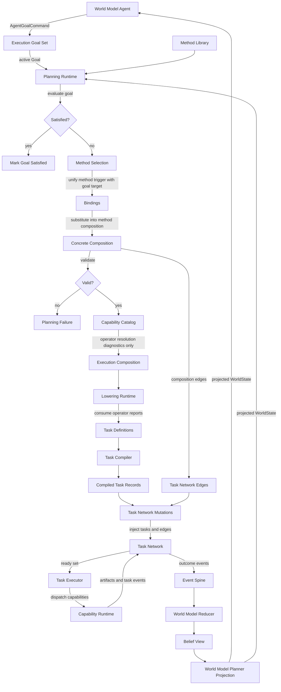

```mermaid
flowchart TD
    AG[World Model Agent] -->|AgentGoalCommand| GS[Execution Goal Set]
    GS -->|active Goal| PL[Planning Runtime]

    BV[Belief View] --> WMP[World Model Planner Projection]
    WMP -->|projected WorldState| AG
    WMP -->|projected WorldState| PL
    ML[Method Library] --> PL

    PL -->|evaluate goal| EV{Satisfied?}
    EV -->|yes| SAT[Mark Goal Satisfied]
    EV -->|no| MS[Method Selection]

    MS -->|unify method trigger with goal target| B[Bindings]
    B -->|substitute into method composition| C[Concrete Composition]
    C -->|validate| VC{Valid?}

    VC -->|no| FAIL[Planning Failure]
    VC -->|yes| CC[Capability Catalog]
    CC -->|operator resolution diagnostics only| CV[Execution Composition]

    CV --> LR[Lowering Runtime]
    LR -->|consume operator reports| TD[Task Definitions]

    TD --> TC[Task Compiler]
    TC --> CTR[Compiled Task Records]

    C -->|composition edges| TNE[Task Network Edges]
    CTR --> TNM[Task Network Mutations]
    TNE --> TNM

    TNM -->|inject tasks and edges| TN[Task Network]
    TN -->|ready set| TE[Task Executor]
    TE -->|dispatch capabilities| CAP[Capability Runtime]
    CAP -->|artifacts and task events| TN
    TN -->|outcome events| SP[Event Spine]
    SP --> WMR[World Model Reducer]
    WMR --> BV

```
