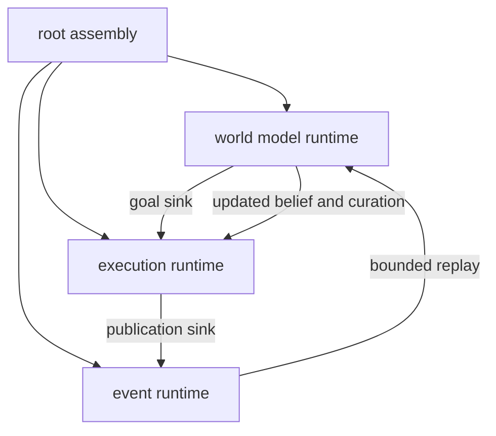

# Durable Flywheel Runtime Phase Design

Date: 2026-06-16
Status: proposed
Scope: phased implementation design for domain embedded flywheel runtimes and root assembly

## Purpose

This document defines the implementation phases for the first durable flywheel runtime.

The first proof still targets one `docs_freshness` flywheel turn. The architecture is different from a root driven convergence loop. Runtime behavior belongs inside the owning crates. Root `meld` opens stores, wires ports, starts runtimes, supervises lifecycle, flushes product checkpoints, and reports diagnostics.

The product flywheel is:

```text
root assembly
-> world model runtime
-> execution runtime
-> event spine
-> world model runtime
```

Root `meld` is the initiator and supervisor of the flywheel. It is not the flywheel center.

## Design Commitments

- `meld-world-model` owns graph, belief, planner projection, agent curation, and satisfaction judgment runtimes.
- `meld-execution` owns goal set, planning, task network, task, capability, artifact, and publication runtimes.
- `meld-events` owns append, idempotency, sequence, subscription, and replay runtime.
- Root `meld` owns product assembly, concrete store opening, adapter wiring, process lifecycle, health, shutdown, and operator diagnostics.
- Cross domain momentum passes through explicit ports and durable stores.
- Root does not stand between every transition once ports are wired.
- The first proof may use a deterministic driver, but that driver is test scaffolding and not the product runtime architecture.

## Architecture Position

The cognitive architecture defines Meld as an open world loop:

```text
observe -> event ledger -> world model -> execution -> event ledger
```

The durable runtime must preserve that loop. A root ordered turn such as `root -> world model -> root -> execution -> root -> events` is not the target architecture. It makes root a single semantic scheduler and weakens the flywheel.

The target is direct handoff:

```text
world model agent -> execution goal API
execution publication -> event append API
world model replay -> event subscription API
```

Root creates the API implementations and passes them into the domain runtimes.

## Target Module Shape

Root runtime remains an assembly module, not the owner of domain loop semantics.

```text
src/runtime.rs
src/runtime/contracts.rs
src/runtime/storage.rs
src/runtime/assembly.rs
src/runtime/supervisor.rs
src/runtime/supervisor/contracts.rs
src/runtime/supervisor/health.rs
src/runtime/supervisor/leases.rs
src/runtime/supervisor/restart.rs
src/runtime/supervisor/shutdown.rs
src/runtime/supervisor/store.rs
src/runtime/ports.rs
src/runtime/error.rs
```

Avoid production modules whose names imply a global root scheduler. A deterministic proof harness may live under tests or under a clearly named test support module.

Domain runtime additions belong in the owning crates:

```text
crates/meld-world-model/src/agent/runtime.rs
crates/meld-world-model/src/belief/runtime.rs
crates/meld-execution/src/goals/runtime.rs
crates/meld-execution/src/planning/runtime.rs
crates/meld-execution/src/task_network/runtime.rs
crates/meld-events/src/events/runtime.rs
```

Existing runtime modules should be extended where they already exist.

## Direct Handoff Ports

Detailed runtime requirements are indexed in [Runtime Requirements Index](runtime_requirements.md).

Root assembly wires these ports. Domain runtimes call them directly.

### World Model To Execution

World model agents submit curated goals through an execution owned goal sink.

```rust
pub trait GoalCommandSink {
    fn accept_goal_command(
        &self,
        command: AgentGoalCommand,
    ) -> Result<GoalCommandOutcome, GoalCommandSinkError>;
}
```

Execution owns the sink implementation. The adapter may live in root `meld` while the stable request contract lives in `meld-execution`.

### Execution To Events

Execution publishes task outcomes and other promoted execution facts through an event append sink.

```rust
pub trait EventAppendSink {
    fn append_envelope_idempotent(
        &self,
        envelope: EventEnvelope,
    ) -> Result<u64, String>;
}
```

This contract already exists for task network publication. It should remain execution callable, not root mediated.

### Events To World Model

World model runtimes consume event records through event subscription or bounded replay.

```rust
pub trait EventReplaySource {
    fn read_after_limit(
        &self,
        after_seq: u64,
        limit: usize,
    ) -> Result<Vec<EventRecord>, EventReplayError>;
}
```

Events owns the source implementation. World model owns its replay cursors and reduction semantics.

## Runtime Flow



The arrows between domains are durable handoffs. Root wires those arrows and supervises process lifecycle.

## Supervisor Rule

Detailed supervisor design lives in [Runtime Supervisor Domain Plan](runtime_supervisor_domain_plan.md).

Allowed root supervisor state:

- opened product stores
- port implementations
- runtime handles
- config values
- cancellation tokens
- diagnostic reports
- health state

Forbidden root supervisor state:

- active goals as progress memory
- belief views as progress memory
- pending publications as progress memory
- promoted evidence as progress memory
- satisfaction mutation commands as progress memory
- supervisor-held source cursors
- task network state clones that replace execution store reads

## Phase 0 - Document Realignment

### Goal

Remove root orchestration language that conflicts with the flywheel architecture.

### Work

- Update durable runtime planning docs to distinguish root assembly from domain runtimes.
- Mark any root ordered driver as deterministic proof harness only.
- Replace old root loop language with embedded runtime and direct handoff language.
- Preserve product storage and worker report contracts as assembly support.

### Verification

```sh
rg -n "centralized semantic loop|convergence loop" design/plan/integration
```

### Exit Criteria

- Design docs no longer describe root as the center of the flywheel.
- Design docs still require durable checkpoint and reopen proof.

## Phase 1 - Product Runtime Assembly

### Goal

Create root assembly that opens stores and builds concrete port implementations without running a semantic loop.

Detailed requirements: [Product Runtime Assembly Requirements](product_runtime_assembly_requirements.md).

### Work

- Add `src/runtime/assembly.rs`.
- Add `ProductRuntimeAssembly`.
- Open stores through `ProductStorageLayout` and `OpenProductStores`.
- Construct event append sink.
- Construct event replay source.
- Construct execution goal sink.
- Construct context, provider, prompt artifact, and workspace adapters.
- Expose runtime handles for world model and execution startup.

### Exit Criteria

- Assembly can open product stores and build all first proof ports.
- Assembly does not query active goals or pending publications.
- Assembly does not contain ordered semantic loop code.

## Phase 2 - Supervisor Diagnostics

### Goal

Keep bounded worker reports as diagnostics without making them a root scheduler contract.

### Work

- Rename comments from old root loop language to supervisor facing language where needed.
- Keep `WorkerTickReport` in root `runtime::contracts`.
- Require reports to copy checkpoints from domain stores.
- Keep reports out of correctness assertions.

### Verification

```sh
cargo test runtime::contracts
```

### Exit Criteria

- Reports describe worker observations.
- Reports do not become source cursors.
- Domain crates can keep native report types.

## Phase 3 - World Model Embedded Runtime

### Goal

Let world model runtime drive goal production directly through an injected execution goal sink.

Detailed requirements: [World Model Runtime Requirements](world_model_runtime_requirements.md).

### Work

- Add or extend world model agent runtime surface.
- Let agent curation read durable belief delivery state.
- Persist `AgentCurationDecision`.
- Submit `AgentGoalCommand` through `GoalCommandSink`.
- Advance subscription cursor only after decision persistence and goal sink result handling meet the domain contract.
- Persist enough sink result identity for idempotent recovery.

### Exit Criteria

- Root does not map each curated goal in the main product path.
- World model agent runtime owns the goal handoff sequence.
- Execution still owns goal validation and lifecycle storage.

## Phase 4 - Execution Embedded Runtime

### Goal

Let execution runtime drive planning, task network mutation, task execution, artifact persistence, and publication through injected ports.

Detailed requirements: [Execution Runtime Requirements](execution_runtime_requirements.md).

### Work

- Add or extend execution planning runtime to read active goals and planner projection.
- Submit task network mutation commands through execution owned command boundary.
- Dispatch ready tasks through execution task runtime.
- Persist artifacts through `TaskArtifactRepoFactory`.
- Record task outcomes through task network commands.
- Publish pending publications through `EventAppendSink`.

### Exit Criteria

- Root does not route each planning or publication step in the product path.
- Execution runtime owns goal to task network to publication flow.
- Publication still appends through event owned API.

## Phase 5 - Event Led Feedback

### Goal

Let world model runtime consume event history and update graph, belief, and satisfaction without root mediation.

Detailed requirements: [Durable Flywheel Vertical Proof Requirements](durable_flywheel_vertical_proof_requirements.md).

### Work

- Use bounded event replay from `meld-events`.
- Let graph runtime advance from its traversal cursor.
- Let belief runtime ingest promoted execution facts based on configured mappings.
- Let agent satisfaction curation run after updated projection exists.
- Submit satisfaction mutation through execution goal sink.

### Exit Criteria

- Execution outcome facts feed world model through the event spine.
- Root does not hand an execution outcome directly to world model in the product path.
- Satisfaction remains agent owned and execution persisted.

## Phase 6 - Deterministic Proof Harness

### Goal

Prove the flywheel in one process without encoding the proof harness as the product runtime.

Detailed requirements: [Durable Flywheel Vertical Proof Requirements](durable_flywheel_vertical_proof_requirements.md).

### Work

- Add a test support driver that starts or calls domain runtimes in deterministic order.
- Use product assembly to build stores and ports.
- Drive the same direct handoff APIs used by production.
- Stop at required checkpoint labels for reopen proof.
- Drop all runtime handles between checkpoints.

### Test Name

```text
minimal_runtime_flywheel_turn_persists_and_satisfies_goal
```

### Required Reopen Points

- after goal acceptance
- after pending publication
- after publication append before satisfaction

### Exit Criteria

- The proof uses direct domain handoffs.
- The proof reopens from product stores.
- The proof does not require a production centralized semantic loop.

## Phase 7 - Failure Path Proof

### Goal

Prove durable failure progress does not become false goal satisfaction.

Detailed requirements: [Durable Flywheel Vertical Proof Requirements](durable_flywheel_vertical_proof_requirements.md).

### Work

- Publish failed task outcome through execution publication runtime.
- Confirm the failure fact reaches events.
- Confirm world model evidence mapping creates no support evidence for docs freshness.
- Confirm satisfaction curation emits no mutation.
- Confirm execution goal remains active.

### Verification

```sh
cargo test --test integration_tests failure_outcome_does_not_satisfy_goal
```

### Exit Criteria

- Failure moves through the flywheel.
- Failure does not satisfy the goal.

## Phase 8 - Runtime Supervisor Entrypoint

### Goal

Expose a product entrypoint that starts and supervises domain runtimes as a focused root domain.

Detailed requirements: [Supervisor Runtime Requirements](supervisor_runtime_requirements.md).

### Work

- Add `src/runtime/supervisor.rs`.
- Add supervisor contracts for runtime ids, desired state, leases, heartbeats, health snapshots, and restart policy.
- Add supervisor storage under the product root.
- Define lifecycle controls for start, stop, flush, health, and restart.
- Acquire a lease before starting each runtime handle.
- Renew heartbeats while runtime handles are healthy.
- Recover expired leases during startup.
- Start domain runtimes with wired ports.
- Prevent duplicate active runtime ownership for each runtime id.
- Keep scheduling policy local to each domain runtime.
- Surface reports and health without owning semantic state.

### Exit Criteria

- Supervisor starts the flywheel.
- Domain runtimes carry the momentum.
- Root can shut down cleanly and flush stores.
- Duplicate runtime handles cannot run under the same runtime id.
- Supervisor status explains process health without reading domain internals.

## Phase 9 - CLI Adapter

### Goal

Expose runtime start or step commands as thin calls into the supervisor and assembly.

### Work

- Add CLI only after the library proof is green.
- Load product root through config.
- Build `ProductRuntimeAssembly`.
- Start supervisor or run deterministic proof mode when explicitly requested.
- Print bounded diagnostic summary.

### Exit Criteria

- CLI does not duplicate runtime logic.
- CLI does not become an orchestrator.

## Required Code Assessment

Before implementation, assess current code for:

- comments or modules that imply root owns the event loop
- root adapters that should become explicit ports
- tests that wire every handoff manually and should become proof harness only
- duplicated mappings that should move into a domain runtime or stable adapter
- legacy workflow paths that could bypass execution goal and task network authority

## Final Acceptance

The implementation is complete when:

- root assembly opens stores and wires ports
- world model agent runtime submits goals through execution goal API
- execution runtime publishes outcomes through event append API
- world model runtime consumes events through replay API
- deterministic proof reopens from stores at required checkpoints
- failure path leaves the goal active
- no production centralized semantic loop is required for flywheel correctness

## Verification Suite

```sh
cargo test --test integration_tests
cargo test -p meld-execution --test task_artifact_repo_persistence
cargo test -p meld-execution --test task_network_publication_bridge
cargo test runtime::contracts
cargo test minimal_runtime_flywheel_turn_persists_and_satisfies_goal
```
