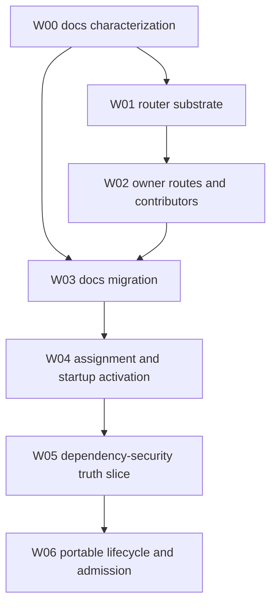

# PDS Authorized Implementation Workstreams

Date: 2026-08-16
Status: closed — superseded at compatibility checkpoint
Scope: implement generic PDS package attachment, docs migration, assignment-local activation, a bounded dependency-security truth slice, and portable lifecycle and result admission

Closure authority: [PDS Authorized Implementation Closeout](pds_authorized_implementation_closeout.md)

This ledger is frozen as historical authorization and task intent. The implementation stopped before all exit criteria passed because the accepted cognition boundary superseded the package semantics used by this plan. Unchecked task boxes remain historical and must not be interpreted as active work. The successor is the [PDS Boundary Program](pds_boundary_program.md).

## Objective

Move Meld from one exact but docs-shaped stewardship image to generic package attachment and assignment-local activation, then exercise those contracts with a bounded read-only dependency-security truth slice and portable lifecycle behavior.

The implementation must preserve current docs behavior, keep semantic authority in owning domains, avoid expression dispatch in root, and produce exact historical lineage across package installation, assignment, activation, runtime judgment, execution, and outcome admission.

## Target Outcome

The authorized program is complete when:

- documentation freshness installs and activates through generic package and owner contracts with parity
- a bounded dependency-security truth slice installs and activates through the same common contracts
- neither docs nor the bounded security slice adds application fields or branches to root, Meld Lang, or shared receipts
- several assignments retain isolated grants, bindings, catalogs, invokers, beliefs, Goals, tasks, and operations
- local and serialized external adapters preserve one package identity and owner-domain result contract

Remediation, cross-steward security completion, Strategy replay changes, canonical customer declaration, profile authoring, stewardship projection, and package upgrade are outside this authorization.

## Authorization Boundary

Authorization for `W00` through `W06` is exhausted and closed.

Authorization is inclusive of `W06` and bounded by the tasks and exit criteria in this document. It does not authorize:

- dependency-security remediation or repository mutation
- a production dependency-security integration beyond the bounded truth slice and lifecycle contract
- `W07` second-expression completion
- `W08` settled Strategy replay
- `W09` canonical declaration and profile work
- `W10` stewardship projection and upgrade

The non-authorized continuation is isolated in [PDS Design-Gated Continuations](pds_design_gated_continuations.md). Moving any of that scope back into this plan requires a new explicit authorization decision.

Implementation-facing design is delivered under [PDS Authorized Design Delivery Program](pds_authorized_design_delivery_program.md). That program must complete and reconcile its accepted packet set against this plan before `W00` implementation begins.

Implementation review and live-verification findings are recorded in [PDS Authorized Implementation Findings](pds_authorized_implementation_findings.md). The register preserves confirmed failures and unresolved evidence without expanding the authorization boundary in this plan.

The [PDS Semantic Interface Review](pds_semantic_interface_review.md) records a cross-cutting interface gap discovered during that verification. [Canonical Persistent Domain Stewardship](../../cognitive_architecture/persistent_domain_stewardship.md) now fixes the architecture boundary. Current routed bodies remain valid characterization and migration inputs, but parity does not establish their composition as the final public interface between PDS and Meld cognition.

## Review Reconciliation

The semantic-interface review distinguishes stable domain meaning from situated cognitive products.

- PDS may supply domain vocabulary, evidence and proof meaning, maintained propositions, and settlement criteria.
- Meld runtime owners produce current facts, admitted evidence, belief revisions, Goals, Strategy candidates, authorizations, tasks, and reassessment.
- Capability providers publish exact activation-local affordances independently of domain correctness theory.
- State-free owner bodies remain required, but state-free validation alone does not prevent an exact workflow or precomputed conclusion from crossing the boundary.

This review changes how completion evidence is interpreted without silently expanding implementation authorization:

- `W00` and `W03` preserve current docs behavior as a parity oracle, not as endorsement of its semantic decomposition.
- `W02` keeps theory routing and capability contribution separate. Its current exact docs compatibility shape must not be promoted as a universal PDS semantic contract.
- `W04` remains the source of the exact active capability catalog and physical bindings.
- `W05` tests evidence sufficiency and non-substitution across a second domain. Its current scalar belief inputs remain review evidence rather than a generic pattern.
- `W06` owns the confirmed supervisor and durable-operation corrections already expressed by its lifecycle tasks and exit criteria.
- Strategy or belief-interface implementation beyond those tasks requires explicit scope authorization. The architecture disposition is settled.

## Delivered Prerequisites

Theory Elevation Steps 1 through 4 are delivered:

- exact durable owner theory revisions
- complete current-expression receipts
- named declaration lowering
- no root expression dispatch
- Agent-owned maintained conditions causing transient Goals
- effective authority distinct from capability availability
- independent enforcement at Agent judgment, admission, planning, and dispatch
- Strategy construction and evidence-driven settlement

Evidence is recorded in the [fresh review through Step 4](theory_elevation_steps_1_through_4_fresh_review.md).

## Governing Constraints

- Each domain owns its theory body, validation, storage, exact resolution, runtime behavior, and result admission.
- `theory::router` owns structural package closure and dispatch only.
- Package installation is inert and never activates runtime authority.
- Package, assignment, activation, activation generation, participant incarnation, operation, and attempt identities remain distinct.
- Capability availability never grants authority.
- Owner partial installation is invisible until a complete package receipt commits.
- Prepared activation is invisible until readiness closes and the generation becomes current.
- External transport success is never canonical domain evidence.
- Compatibility wrappers require characterization, parity, and explicit removal gates.
- Parity with a compatibility body preserves behavior but does not settle the final PDS semantic interface.
- No package installation result may itself constitute a belief, Goal, Strategy candidate, authorization, task, or successful settlement.
- Exact capability availability comes from activation-local contribution and never grants authority or domain truth.
- No new `mod.rs` files are introduced.

## Delivery Graph



## Workstream Summary

| ID | Workstream | Status | Primary owners | Depends on | Gate product |
| --- | --- | --- | --- | --- | --- |
| `W00` | docs characterization | partial | docs, runtime, world model, execution | delivered baseline | parity oracle |
| `W01` | router substrate | delivered substrate | theory, init, runtime | `W00` | inert generic package receipt |
| `W02` | owner routes and capability contributors | delivered isolation substrate | world model, execution, docs, capability | `W01` | domain-published attachment contracts |
| `W03` | docs routed migration | partial | docs, compat, config, init, runtime | `W00`, `W02` | routed docs parity |
| `W04` | assignment and startup activation | bounded proof | config, runtime, capability, Agent, execution | `W03` | isolated startup activation |
| `W05` | dependency-security truth slice | bounded proof | dependency security, events, world model, execution | `W04` | second domain read-only loop |
| `W06` | portable lifecycle and admission | bounded proof | runtime, supervisor, execution, owner adapters | `W05` | external lifecycle safety |

There is no next action in this ledger. Exact task and finding dispositions are recorded in the closeout authority.

## W00 — Docs Characterization

Goal: freeze the current docs package, activation, flywheel, lifecycle, and reopen behavior before changing canonical attachment paths.

Design authority: [PDS W00 Docs Characterization Protocol](pds_w00_docs_characterization_protocol.md)

Primary code regions:

```text
src/docs
src/config/stewardship
src/init/world
src/runtime
crates/meld-world-model
crates/meld-execution
```

Tasks:

- [ ] `W00-T01` Capture the exact fixed theory selection and installation receipt produced by current docs initialization.
- [ ] `W00-T02` Capture selected capability type, version, and content identities.
- [ ] `W00-T03` Characterize provider-required and deterministic provider-free activation behavior.
- [ ] `W00-T04` Characterize event, evidence, belief, maintained-condition, Goal, task, outcome, and quiescence products.
- [ ] `W00-T05` Prove reopen and historical fixed-receipt resolution.
- [ ] `W00-T06` Add removal conditions beside every docs attachment compatibility entry point.
- [ ] `W00-T07` Record live provider evidence required by the existing parity workstream.

Exit criteria:

- `W00-E01` deterministic fixtures reproduce current semantic products and exact identities
- `W00-E02` live evidence covers behavior that deterministic fixtures cannot establish
- `W00-E03` later routed output can be compared without interpreting incidental serialization or timing
- `W00-E04` every compatibility seam has a local owner and deletion gate

Design trace:

| Implementation ids | Accepted design sections |
| --- | --- |
| `W00-T01` through `W00-T04` | Current Oracle, Semantic Snapshot Contract, Normalization Rules, Required Scenarios |
| `W00-T05` | Required Scenarios and Existing Evidence Reused |
| `W00-T06` | Compatibility Seam Register |
| `W00-T07` | Required Scenarios and Verification Design |
| `W00-E01` through `W00-E04` | Acceptance Criteria |

Verification gate:

```sh
cargo fmt --all -- --check
cargo test --workspace
```

Add focused parity commands as fixtures are identified.

## W01 — Router Substrate

Goal: install one bounded PDS package through structural routing and commit one exact generic receipt without changing live activation.

Design authority: [PDS W01 Router Substrate Design](pds_w01_router_substrate_design.md)

Primary owners and seams:

- candidate `theory` owns manifest, package identity, route catalog, structural closure, receipt, and exact resolution
- init calls one package attachment service
- runtime may resolve a generic receipt but continues using characterized activation until `W03`

Primary code regions:

```text
src/theory.rs
src/theory/contracts.rs
src/theory/package.rs
src/theory/router.rs
src/theory/receipt.rs
src/theory/registry.rs
src/theory/resolution.rs
src/init/world
src/runtime/theory.rs
```

Tasks:

- [ ] `W01-T01` Define bounded manifest, component envelope, route identity, structural requirement, and exact owner ref contracts.
- [ ] `W01-T02` Implement deterministic package canonicalization and content identity.
- [ ] `W01-T03` Build an immutable route catalog that rejects duplicate route publication.
- [ ] `W01-T04` Validate route availability, schema compatibility, component identity, cardinality, and structural closure before owner writes.
- [ ] `W01-T05` Dispatch intact owner bodies without importing owner body types.
- [ ] `W01-T06` Commit the generic package receipt only after every owner ref verifies exactly.
- [ ] `W01-T07` Make exact reinstall idempotent and historical receipt resolution fail closed.
- [ ] `W01-T08` Keep package source, receipts, and owner state outside the target workspace.
- [ ] `W01-T09` Enforce input size, path containment, duplicate-key, content-hash, and no-code-execution rules.

Exit criteria:

- `W01-E01` one docs package manifest routes to at least three owner domains
- `W01-E02` missing or duplicate routes fail before package receipt commit
- `W01-E03` owner partial installs remain unselectable
- `W01-E04` receipt identity is stable across source file order
- `W01-E05` root and router contain no docs body types
- `W01-E06` no package installation starts an actor, opens a credential, or registers an invoker

Design trace:

| Implementation ids | Accepted design sections |
| --- | --- |
| `W01-T01` through `W01-T03` | Package Source Contract, Identity Rules, Route Contract, Immutable Route Catalog |
| `W01-T04` through `W01-T06` | Structural Validation Order, Installation Saga, Installed Component And Receipt Contracts |
| `W01-T07` | Persistence and Exact Resolution |
| `W01-T08` | Persistence |
| `W01-T09` | Structural Validation Order and Error Contract |
| `W01-E01` through `W01-E06` | Acceptance Criteria |

Requirement sources:

- `PDS-R01` through `PDS-R15`
- `PDS-AC01` through `PDS-AC13`
- router input-safety criteria

## W02 — Owner Routes And Capability Contributors

Goal: make domains publish their own theory installation and executable contribution contracts so root no longer assembles a docs-only inventory.

Design authority: [PDS W02 Owner Routes And Contributors Design](pds_w02_owner_routes_and_contributors_design.md)

Primary owners:

- world-model belief owns belief-family and outcome-mapping routes
- world-model Agent owns curation-rule and maintained-condition routes
- world-model Strategy owns Strategy-theory routes
- execution owns capability-contract and authority-policy routes
- docs owns the claim-policy route
- capability aggregates product contributors without owning their contracts
- docs, context, provider, traversal, and workspace publish capability contributions

Primary code regions:

```text
src/capability.rs
src/docs/theory.rs
src/docs/capability.rs
src/context/capability.rs
src/provider/capability.rs
src/merkle_traversal
src/workspace/capability.rs
crates/meld-world-model/src/belief
crates/meld-world-model/src/agent
crates/meld-world-model/src/strategy
crates/meld-execution/src/capability
crates/meld-execution/src/authority
```

Tasks:

- [ ] `W02-T01` Define the narrow owner route-handler contract over owner command and query ports.
- [ ] `W02-T02` Publish route contracts for every current docs theory kind.
- [ ] `W02-T03` Reuse existing owner validators and append-only registries.
- [ ] `W02-T04` Return route-addressed exact refs without copying owner bodies into theory storage.
- [ ] `W02-T05` Validate semantic links through owner public queries after structural installation closes.
- [ ] `W02-T06` Define the product capability-contributor contract.
- [ ] `W02-T07` Aggregate contributors deterministically and reject exact identity conflicts.
- [ ] `W02-T08` Remove docs-only assumptions from product capability publication.
- [ ] `W02-T09` Keep provider contributions optional until a selected capability requires them.

Exit criteria:

- `W02-E01` each current docs body installs through its owner route
- `W02-E02` the router receives no unrestricted store collection
- `W02-E03` capability aggregation contains no expression dispatch
- `W02-E04` exact selected contracts retain current content identities
- `W02-E05` an unselected capability is absent from an activation draft

Design trace:

| Implementation ids | Accepted design sections |
| --- | --- |
| `W02-T01` through `W02-T04` | Initial Route Catalog, Owner Handler Shape, Common Revision Conversion, Route Publication |
| `W02-T05` | Semantic Link Validation |
| `W02-T06` through `W02-T08` | Capability Publication Contracts, Deterministic Product Inventory, Initial Contributors |
| `W02-T09` | Provider Optionality |
| `W02-E01` through `W02-E05` | Acceptance Criteria |

Requirement sources:

- `PDS-R11` through `PDS-R22`
- `DF-AC01` through `DF-AC12`
- `DF-AC21` through `DF-AC26`

## W03 — Docs Routed Migration

Goal: make routed package installation and owner capability contribution canonical for docs freshness while preserving behavior and historical reads.

Design authority: [PDS W03 Docs Routed Migration Design](pds_w03_docs_routed_migration_design.md)

Primary owners and seams:

- docs owns claim-policy installation and exact invokers
- compat owns legacy declaration lowering and historical fixed-receipt decoding
- config selects a package receipt instead of fixed component slots
- init invokes the router rather than owner loaders
- runtime resolves owner-scoped package views without docs types

Tasks:

- [ ] `W03-T01` Add the compatibility docs package manifest over all current owner theory bodies and exact capability contracts for parity.
- [ ] `W03-T02` Lower the legacy docs declaration into the canonical package entry.
- [ ] `W03-T03` Resolve routed docs owner refs into the same runtime image characterized by `W00`.
- [ ] `W03-T04` Bind docs invokers through the common contributor contract.
- [ ] `W03-T05` Compare semantic artifact, policy, event, evidence, Goal, outcome, lifecycle, and reopen parity.
- [ ] `W03-T06` Stop writing new fixed receipts after the routed path passes parity.
- [ ] `W03-T07` Preserve historical fixed-receipt reads through a versioned decoder.
- [ ] `W03-T08` Remove direct root docs installation and registration only after parity passes.

Exit criteria:

- `W03-E01` routed and legacy inputs produce equivalent docs package and activation meaning
- `W03-E02` root config and runtime contain no canonical docs component slots
- `W03-E03` root contains no direct docs capability registration
- `W03-E04` provider-free deterministic docs activation is representable
- `W03-E05` existing flywheel convergence and claim-validation behavior remain intact
- `W03-E06` compatibility shims have no new callers

Design trace:

| Implementation ids | Accepted design sections |
| --- | --- |
| `W03-T01` | Canonical Package and Exact Component Index |
| `W03-T02` | Legacy Input Lowering |
| `W03-T03`, `W03-T04` | Runtime Owner Resolution and Capability Cutover |
| `W03-T05` | Parity Matrix |
| `W03-T06`, `W03-T08` | Generic Receipt Write Cutover and Compatibility Removal Gates |
| `W03-T07` | Historical Fixed Receipt Decoder |
| `W03-E01` through `W03-E06` | Acceptance Criteria |

Requirement sources:

- `PDS-R23` through `PDS-R35`
- `DF-AC13` through `DF-AC36`
- [Docs Router Refactor](docs_freshness_pds_router_refactor_design_spec.md)

## W04 — Assignment And Startup Activation

Goal: separate standing assignment from physical activation and prove several isolated assignments at normal process startup.

Design authority: [PDS W04 Assignment And Startup Activation Design](pds_w04_assignment_startup_activation_design.md)

Primary owners:

- config owns selection and non-secret binding references
- runtime composition owns prepared closure and current-generation publication
- owner contributors prepare domain-local activation state
- capability builds immutable assignment-local catalogs and executor registries
- Agent and execution retain authority judgment and enforcement

Primary code regions:

```text
src/config/stewardship/assignment.rs
src/config/stewardship/activation.rs
src/config/stewardship/binding.rs
src/theory/activation.rs
src/runtime
src/capability.rs
crates/meld-world-model/src/agent
crates/meld-execution/src
```

Tasks:

- [ ] `W04-T01` Define exact assignment identity over package receipt, principal, subject, scope, and authority refs.
- [ ] `W04-T02` Define physical activation identity over bindings, selected implementations, placement, and operational limits.
- [ ] `W04-T03` Keep credentials behind owner-scoped binding handles.
- [ ] `W04-T04` Collect owner activation requirements without exposing foreign package views.
- [ ] `W04-T05` Build a prepared activation closure with exact required contributions and admission closed.
- [ ] `W04-T06` Build immutable activation-local capability and executor catalogs.
- [ ] `W04-T07` Create and publish one startup activation generation after required readiness.
- [ ] `W04-T08` Resolve several assignments deterministically without declaration-order priority.
- [ ] `W04-T09` Prove overlapping assignments do not share grants, bindings, invokers, belief state, Goals, tasks, or operations.

Exit criteria:

- `W04-E01` one package may support several assignments without recompilation
- `W04-E02` the same exact capability contract may bind distinct implementations per activation
- `W04-E03` failure of one activation leaves an unrelated assignment healthy
- `W04-E04` package identity excludes workspace, provider, credential, endpoint, and placement data
- `W04-E05` prepared closure exposes no active invoker

Design trace:

| Implementation ids | Accepted design sections |
| --- | --- |
| `W04-T01` through `W04-T03` | Assignment Contract and Physical Activation Contract |
| `W04-T04`, `W04-T05` | Owner Requirement Contract and Prepared Activation Closure |
| `W04-T06` | Assignment-Local Runtime View |
| `W04-T07` | Startup Generation and Startup Protocol |
| `W04-T08`, `W04-T09` | Assignment-Local Runtime View and Startup Failure Matrix |
| `W04-E01` through `W04-E05` | Acceptance Criteria |

Requirement sources:

- `PDS-R24`, `PDS-R25`, `PDS-R27`, `PDS-R29`, `PDS-R30`
- `PDS-R36` through `PDS-R39`
- `PDS-AC24`, `PDS-AC25`, `PDS-AC31` through `PDS-AC35`

## W05 — Dependency-Security Truth Slice

Goal: prove a dissimilar domain through truthful inventory, advisory, coverage, assessment, and verification semantics before adding risky intervention or persistent external lifecycle.

Design authority: [PDS W05 Dependency-Security Truth-Slice Design](pds_w05_dependency_security_truth_slice_design.md)

Authorization note: this workstream covers only the bounded truth contract listed here. It does not authorize production security source selection, a complete scanner or monitor product, remediation, repository mutation, or broader cross-steward behavior.

Primary owners:

- new `dependency_security` domain owns policy, canonical products, result admission, and domain capabilities
- workspace publishes source facts without interpreting dependency security
- events carry admitted products unchanged
- world model owns belief, maintained conditions, Agent judgment, and Strategy
- execution owns exact capabilities, Goals, tasks, and dispatch

Primary code regions:

```text
src/dependency_security.rs
src/dependency_security/contracts.rs
src/dependency_security/theory.rs
src/dependency_security/inventory.rs
src/dependency_security/advisory.rs
src/dependency_security/assessment.rs
src/dependency_security/verification.rs
src/dependency_security/capability.rs
src/dependency_security/adapter.rs
src/dependency_security/events.rs
src/dependency_security/persistence.rs
```

Tasks:

- [ ] `W05-T01` Implement exact `dependency-security.policy.v1` owner installation.
- [ ] `W05-T02` Define inventory, advisory snapshot, coverage, assessment, and calculation-verification products.
- [ ] `W05-T03` Represent unknown, insufficient, clean within coverage, violated, stale, and conflicted states distinctly.
- [ ] `W05-T04` Implement one bounded local and one fake serialized adapter over the same inventory and advisory result contract.
- [ ] `W05-T05` Admit adapter results through dependency-security validation before canonical append.
- [ ] `W05-T06` Preserve inventory, advisory-source, adapter, package, assignment, activation, and operation lineage.
- [ ] `W05-T07` Install separate coverage and posture belief families.
- [ ] `W05-T08` Install the security semantic theory through the router and supply four read-only capability contracts through activation contribution. Preserve authority-policy routing only as a compatibility input until assignment-owned requests replace it.
- [ ] `W05-T09` Publish source advance as an observation opportunity rather than a direct belief mutation.

Exit criteria:

- `W05-E01` one dependency-security package installs through dependency-security, world-model, and execution routes
- `W05-E02` clean posture requires explicit bounded coverage and currency evidence
- `W05-E03` a commit or transport success cannot prove vulnerability resolution
- `W05-E04` no provider binding is required for the deterministic local path
- `W05-E05` root, Meld Lang, events, belief, Agent, and planner types contain no dependency-security application branches
- `W05-E06` no code mutation or pull-request effect is included in this slice

Design trace:

| Implementation ids | Accepted design sections |
| --- | --- |
| `W05-T01` | Policy Component and Package Composition |
| `W05-T02`, `W05-T03` | Canonical Inventory, Canonical Advisory Knowledge, Assessment Contract, Calculation Verification |
| `W05-T04` through `W05-T06` | Adapter Contract and Owner Admission |
| `W05-T07`, `W05-T08` | Belief And Maintained Condition, Capability Effects, Package Composition |
| `W05-T09` | Canonical Events |
| `W05-E01` through `W05-E06` | Acceptance Criteria |

Requirement sources:

- `DS-R01` through `DS-R24`
- `DS-R29`, `DS-R30`, `DS-R32`
- dependency-security acceptance criteria for routing, truth, evidence, and provider-free behavior

## W06 — Portable Lifecycle And External Admission

Goal: safely run long-lived or external adapters with generation, incarnation, operation, delivery, readiness, wake, quiescence, and recovery fencing.

Design authority: [PDS W06 Portable Lifecycle And External Admission Design](pds_w06_portable_lifecycle_admission_design.md)

Authorization note: the serialized dependency-security adapter is a contract proof for generic lifecycle and admission behavior. It is not authorization for a production dependency-security service integration.

Primary owners:

- runtime owns structural activation coordination and current-generation publication
- supervisor owns stable service lifecycle and leases
- execution owns durable operations, attempts, claims, and ambiguous-effect reconciliation
- source and destination owners own passive delivery and result admission meaning
- telemetry and harness observe but do not establish lifecycle truth

Primary code regions:

```text
src/runtime
src/runtime/supervisor
src/theory/activation.rs
src/telemetry
src/harness
crates/meld-execution/src
src/dependency_security/adapter.rs
```

Tasks:

- [ ] `W06-T01` Add one stable supervised activation-lifecycle service beneath the root supervisor.
- [ ] `W06-T02` Persist idempotent activation intent and expected-prior generation before fanout.
- [ ] `W06-T03` Define exact participant plans with readiness, wake, safe-point, stop, dependency, and required-status refs.
- [ ] `W06-T04` Separate activation generation, participant incarnation, stable operation, attempt, subscription, and delivery identity.
- [ ] `W06-T05` Persist long-running operations before bounded dispatch.
- [ ] `W06-T06` Admit completion through a later bounded owner transition.
- [ ] `W06-T07` Add passive-source ingress without fabricating execution attempts.
- [ ] `W06-T08` Keep admission closed until every required participant proves readiness.
- [ ] `W06-T09` Distinguish active idle, quiescent, stalled, fenced quiescent, stopped, and interrupted projections.
- [ ] `W06-T10` Implement assignment-local hot activation, replacement, graceful retirement, and interrupted recovery.
- [ ] `W06-T11` Reject or classify late results from retired generations and incarnations.
- [ ] `W06-T12` Exercise one local and one fake serialized adapter realization against the same dependency-security contract.

Exit criteria:

- `W06-E01` placement does not change package identity or canonical domain result shape
- `W06-E02` credential or implementation change creates a new activation generation
- `W06-E03` equivalent participant restart creates a new incarnation only after recovery readiness
- `W06-E04` ambiguous effects reconcile under one stable operation before retry
- `W06-E05` a zero-work tick without complete participation and wake closure is not quiescent
- `W06-E06` recovery reopens no admission until owner state and unresolved work reconcile

Design trace:

| Implementation ids | Accepted design sections |
| --- | --- |
| `W06-T01` through `W06-T04` | Stable Service Boundary, Lifecycle Intent, Identity Model, Owner Lifecycle Ports |
| `W06-T05` through `W06-T07` | Durable External Operation and Passive Source Ingress |
| `W06-T08`, `W06-T09` | Activation Generation States, Waiting And Wake, Liveness Projection |
| `W06-T10` | Activation And Replacement Protocol, Fenced Quiescence, Interrupted Recovery |
| `W06-T11` | Late Result Policy |
| `W06-T12` | Local And Fake Serialized Proof |
| `W06-E01` through `W06-E06` | Acceptance Criteria |

Requirement sources:

- `PDS-R36` through `PDS-R56`
- `DS-R33` through `DS-R46`
- `DF-AC45` through `DF-AC57`
- [PDS Activation Lifecycle Fanout](pds_activation_lifecycle_fanout_exercise.md)

## Historical Authorized Completion Condition

The original completion condition required `W06` to pass. It did not pass. Authorization was instead exhausted by explicit supersession and closeout.

At that point Meld has generic package attachment, routed owner contracts, docs parity migration, isolated startup assignments, a bounded dependency-security truth slice, and portable activation lifecycle and result-admission mechanics.

Passing `W06` does not automatically initiate another workstream. The implementation must stop and report completion evidence. Any continuation requires an explicit authorization decision against [PDS Design-Gated Continuations](pds_design_gated_continuations.md).

## Verification Strategy

Each workstream gate runs verification in this order:

1. `cargo fmt --all -- --check`
2. focused owner unit tests
3. focused cross-domain integration tests
4. reopen and historical-resolution tests when persistence changes
5. `cargo test --workspace`
6. static boundary searches

Static boundary searches include:

```sh
rg -n "docs_freshness|dependency_security" src/runtime src/theory crates/meld-lang/src
rg -n "DocsClaimPolicy|DocsClaimPolicyRevisionRef" src/runtime src/init/world src/config
rg -n "crate::docs::capability::register_exact_contracts" src/runtime src/init src/capability.rs
rg --files src crates | rg '/mod\.rs$'
```

Expected boundary result changes by workstream. Compatibility locations remain allowed until `W03` passes; canonical root, router, runtime, and Meld Lang application branches never become allowed.

## Historical Implementation Order

1. Land `W00` alone as characterization evidence.
2. Land `W01` without changing live activation.
3. Land `W02` owner by owner behind the inert router.
4. Land `W03` through compatibility lowering, parity, then direct-path deletion.
5. Land `W04` with startup-only activation and multi-assignment isolation.
6. Land `W05` as a read-only dependency-security truth loop.
7. Land `W06` as portable lifecycle and external admission infrastructure exercised by the bounded dependency-security contract proof.
8. Stop implementation and present `W00` through `W06` completion evidence.

## Explicit Deferrals

- every continuation recorded in [PDS Design-Gated Continuations](pds_design_gated_continuations.md)
- generic context-projection theory
- universal perspective and disclosure theory
- generic graph projection routes
- shared observation deduplication
- universal scenario language
- extracted stewardship crate
- workflow migration beyond measured compatibility value
- package marketplace, signing, or remote distribution
- dynamic native extension loading
- wider roleplay, lore, learner, portfolio, service, faction, and physical-maintenance packages

Promote a deferred mechanism only when a delivery consumer needs it and an owner-neutral contract can be stated without application vocabulary.

## Read With

- [PDS Authorized Design Delivery Program](pds_authorized_design_delivery_program.md)
- [PDS Design-Gated Continuations](pds_design_gated_continuations.md)
- [Theory Elevation Program](theory_elevation_program.md)
- [PDS Router Design](pds_router_design_spec.md)
- [Docs Router Refactor](docs_freshness_pds_router_refactor_design_spec.md)
- [Dependency Security Consumer Design](dependency_security_pds_consumer_design_spec.md)
- [PDS Activation Lifecycle Fanout](pds_activation_lifecycle_fanout_exercise.md)
- [Canonical PDS Layer](../../cognitive_architecture/persistent_domain_stewardship.md)
- [PDS Semantic Interface Review](pds_semantic_interface_review.md)
