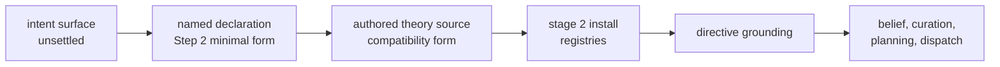

# PDS Theory Runtime Layer Map

Date: 2026-07-30
Status: active
Scope: the implementation-readiness map of the settled PDS layer — operational domain theory against the written Meld runtime — including the scaffolding matrix, the current seams, and the layer-settlement rule for the next layer up

Note 2026-08-13: Theory Elevation Step 1 installed every live docs semantic body through exact owner registries and complete receipts. Step 2 replaced expression-shaped production composition with named declaration lowering. Step 3 installed Agent-owned maintained conditions as exact revisions that cause transient Goals. The direct docs PDS composer is now test-only, belief-context family selection flows from the physical binding, and the stale Method-era source artifacts are retired.

## Purpose

[Persistent Domain Stewardship](../../cognitive_architecture/persistent_domain_stewardship.md) canonicalizes the theory-to-runtime layer as intent. This document maps that layer onto the written runtime: which coupling consumes which theory kind through which seam, what artifact form each kind takes today, and where the compatibility forms sit that the next layer's compiler will replace. It is the reality check the declaration-to-theory layer must canonicalize against.

## Scaffolding Matrix

Each Meld coupling consumes operational domain theory through one seam. The matrix rows are domain contracts, never runtime role identities, per the recorded rule that the role registry must not become a stewardship schema.

| Theory kind | Artifact form | Selection identity | Seam | Durability |
|---|---|---|---|---|
| Belief family | `belief_family.<id>.json` | `theory.belief_family_id` | world-model belief registry selected by complete receipt | durable exact owner revision |
| Evidence mapping set | `outcome_interpretation.<id>.json` | `theory.evidence_mapping_id` | world-model belief mapping registry selected by complete receipt | durable exact owner revision |
| Curation rule | `curation_rule.<id>.json` | `theory.curation_rule_id` | world-model Agent registry selected by complete receipt | durable exact owner revision |
| Maintained condition | `maintained_condition.<id>.json` | `theory.maintained_condition_id` | world-model Agent registry selected by complete receipt | durable exact owner revision |
| Strategy theory | `strategy_theory.<id>.json` | `theory.strategy_theory_id` | world-model Strategy registry selected by complete receipt | durable exact owner revision |
| Executable contract | capability implementation publication | derived from Strategy capability selectors | execution capability registry selected by complete receipt | durable exact owner revision |
| Claim policy | `claim_policy.<id>.json` | `theory.claim_policy_id` | docs claim-policy registry selected by complete receipt | durable exact owner revision |
| Maintained scope | named stewardship declaration | `stewardship.declarations.<id>` config table | generic stage 0 physical binding resolution | canonical config selection for Step 2 |
| Authority | package requested actions plus selected principal and policy | execution-owned exact policy revision | Agent judgment plus admission, planning, and dispatch revalidation | compact decision in existing Strategy authorization and task lineage |

Family-declared semantics travel inside the belief family body and never in runtime code: observationality and anchor coupling are the two declared so far, and the family owns any future assessment semantics the same way.

## Current Seams

- Authored compatibility packages live as `theory/<expression>/` directories. `meld world init --theory-source` provisions all selected bodies into the XDG theory root after full identity validation and before any write.
- World initialization is the only production reader of authored XDG bodies. It installs owner revisions and commits a complete receipt last.
- Runtime assembly resolves one active receipt and freezes every exact owner revision for the composition lifetime.
- Canonical configuration uses named tables under `stewardship.declarations`. The older `stewardship.docs_freshness` table is a temporary compatibility reader that lowers into the same value.
- Strategy activation is owned by meld world model. Capability implementations bind by exact type, version, and content identity. Neither path selects by expression name.
- Belief-context hydration consumes the family identity carried by the selected physical binding. Context does not choose an application family.
- The declaration remains a minimal selection. It names maintained-condition and authority owner bodies plus the principal identity but does not infer their semantics.

## Pipeline Authority

Authority at each stage: the named declaration selects identity, principal, and physical scope but does not interpret standing conditions or policy. The authored package supplies requested actions and owner semantics for installation. Installed revisions are the only theory the runtime cites. Agent judgment computes effective authority and execution independently revalidates it. Grounding decides application and the runtime settles answers. The final user intent surface remains unsettled.

## Layer Settlement Rule

Declaration lowering canonicalizes against this map: its target is the theory-kind table above, its identity discipline is the selection-by-identity rule, and it never creates missing owner meaning. Later declaration features may depend only on runtime seams already present here. Any missing seam lands first through its owning runtime domain.

## Related Documentation

- [Persistent Domain Stewardship](../../cognitive_architecture/persistent_domain_stewardship.md) — the canonical layer definition
- [Directive Grounding](../../cognitive_architecture/world_model/agent/directive_grounding.md) — the consumer contract
- [Runtime Initialization](runtime_initialization.md) — the staged install pipeline stage 2 owns
- [Runtime Completion Implementation Workstreams](runtime_completion_implementation_workstreams.md) — the flywheel-ignition lane that made the seams real
- [Persistent Domain Stewardship Proposals](../../persistent_domain_stewardship/README.md) — the unsettled upper layers
