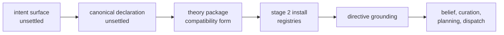

# PDS Theory Runtime Layer Map

Date: 2026-07-30
Status: active
Scope: the implementation-readiness map of the settled PDS layer — operational domain theory against the written Meld runtime — including the scaffolding matrix, the current seams, and the layer-settlement rule for the next layer up

Note 2026-08-12: commit 4894b73 deleted the authored planning-theory provisioning from `src/init/world/source.rs`, and the live path now composes the docs stewardship image in code. Elevation of that hand-lowered image into durable theory registries and declaration lowering proceeds under [Theory Elevation Program](theory_elevation_program.md).

## Purpose

[Persistent Domain Stewardship](../../cognitive_architecture/persistent_domain_stewardship.md) canonicalizes the theory-to-runtime layer as intent. This document maps that layer onto the written runtime: which coupling consumes which theory kind through which seam, what artifact form each kind takes today, and where the compatibility forms sit that the next layer's compiler will replace. It is the reality check the declaration-to-theory layer must canonicalize against.

## Scaffolding Matrix

Each Meld coupling consumes operational domain theory through one seam. The matrix rows are domain contracts, never runtime role identities, per the recorded rule that the role registry must not become a stewardship schema.

| Theory kind | Artifact form | Selection identity | Seam | Durability |
|---|---|---|---|---|
| Belief family | `belief_family.<id>.json` | `theory.belief_family_id` | stage 2 install into the belief family registry; actors resolve per tick | durable registry, content-hash revisions |
| Evidence mapping set | `outcome_interpretation.<id>.json` | `theory.evidence_mapping_id` | composed at CLI assembly load into the ingestion actor; rules may discriminate on outcome payload content, first exercised by the completed interpretation splitting on the package-declared semantic yield class | composition injection until the durable mapping registry lands |
| Curation rule | `curation_rule.<id>.json` | `theory.curation_rule_id` | stage 3 binds the rule to the agent record by content hash | durable on the agent record |
| Planning methods | `methods/*.json` | keyed by expression | composed at CLI assembly load into the planning theory binding | composition injection, no durable registry |
| Available actions | `available_actions.<expression>.json` | keyed by expression | composed at CLI assembly load into the planning theory binding | composition injection |
| Method realizations | `method_realizations.<expression>.json` | keyed by expression | composed at CLI assembly load into the planning theory binding | composition injection |
| Task package | built-in package document | package id fixed by expression | loaded from the binary's built-in registry | shipped, not yet selectable theory |
| Maintained scope and authority | stewardship selection | `stewardship.<expression>` config table | stage 0 physical binding resolution | hand-authored XDG configuration |

Family-declared semantics travel inside the belief family body and never in runtime code: observationality and anchor coupling are the two declared so far, and the family owns any future assessment semantics the same way.

## Current Seams

- Theory packages live as `theory/<expression>/` directories in the shipped layout. `meld world init --theory-source` provisions a package into the XDG theory root, identity-checked against the selection before any write and byte-idempotent.
- The XDG theory root is the only load root. Loaders reject a body whose content identity differs from its selected identity.
- The stewardship selection is the compatibility form of a canonical PDS declaration: a human-authored table naming the expression, physical target, agent, provider, and three theory identities.
- Stage 2 installation is the compatibility form of consuming a compiled stewardship image, as the initialization contract records. The provisioned theory package is the image's hand-authored antecedent.

## Pipeline Authority

Authority at each stage: the declaration layer, once settled, is what a user approves and diffs; the theory package is the lowered object form the runtime installs; installed revisions are the only theory the runtime cites; grounding decides application; the runtime settles answers. Today the two left stages are a human writing configuration and JSON, and this document says so rather than pretending otherwise.

## Layer Settlement Rule

The declaration-to-theory layer canonicalizes against this map: its lowering target is the theory-kind table above, its identity discipline is the selection-by-identity rule, and its authority handoff is the approval boundary before provisioning. Nothing in that layer may require a runtime seam this map does not already carry, and any new seam lands here first as runtime work before the upper layer may depend on it.

## Related Documentation

- [Persistent Domain Stewardship](../../cognitive_architecture/persistent_domain_stewardship.md) — the canonical layer definition
- [Directive Grounding](../../cognitive_architecture/world_model/agent/directive_grounding.md) — the consumer contract
- [Runtime Initialization](runtime_initialization.md) — the staged install pipeline stage 2 owns
- [Runtime Completion Implementation Workstreams](runtime_completion_implementation_workstreams.md) — the flywheel-ignition lane that made the seams real
- [Persistent Domain Stewardship Proposals](../../persistent_domain_stewardship/README.md) — the unsettled upper layers
