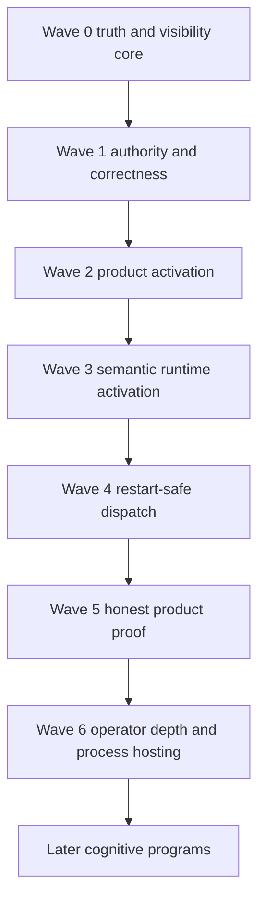

# Production Cognitive Runtime Closure Program

Date: 2026-07-12
Status: design ready for phased delivery
Scope: turn the completed event foundation and library-level cognitive flywheel into one honest, restart-safe, operator-visible product runtime
Base branch: `event-foundation-closeout`
Recommended program branch: `production-cognitive-runtime-closure`
Complex workflow: inactive unless separately requested

## Objective

Deliver one product-visible `docs_freshness` flywheel that starts from validated activation configuration, runs through supervised domain actors, executes real task work, publishes through the event authority, revises belief, satisfies the goal, survives reopen at every durable handoff, and reports truthful operator state.

This program coordinates implementation across root runtime, supervisor, config, CLI, events, world model, execution, workspace capability adapters, compatibility paths, and integration proof.

It does not reopen the completed event foundation, rebuild `meld-lang`, replace the workflow compatibility path before parity proof, or pull later cognitive expansion into runtime closure.

## Source Truth

Canonical intent:

- [Cognitive Architecture](../../cognitive_architecture/README.md)
- [Events Domain](../../cognitive_architecture/events/README.md)
- [World Model Domain](../../cognitive_architecture/world_model/README.md)
- [Execution Domain](../../cognitive_architecture/execution/README.md)
- [Sensory Domain](../../cognitive_architecture/sensory/README.md)

Implementation requirements:

- [Runtime Requirements Index](runtime_requirements.md)
- [Supervisor Runtime Requirements](supervisor_runtime_requirements.md)
- [World Model Runtime Requirements](world_model_runtime_requirements.md)
- [Execution Runtime Requirements](execution_runtime_requirements.md)
- [Event Runtime Requirements](event_runtime_requirements.md)
- [Docs Freshness Physical Configuration Requirements](docs_freshness_physical_configuration_requirements.md)
- [Runtime Operator Visibility Program Ledger](runtime_operator_visibility_program_ledger.md)
- [Runtime Assembly Program Ledger](runtime_assembly_program_ledger.md)
- [Executable Delivery Ledger](production_cognitive_runtime_closure_delivery_ledger.md)

Current implementation evidence:

- `src/runtime`
- `crates/meld-events`
- `crates/meld-world-model`
- `crates/meld-execution`
- `crates/meld-lang`
- `tests/integration/docs_freshness_reopen_contract.rs`
- `tests/integration/runtime_cli.rs`
- `tests/integration/workspace_scan_capability.rs`

When an older assessment conflicts with current code, this program requires reconciliation before implementation uses the old claim.

## Program Boundary

In scope:

- truthful runtime classification and status
- passive status cache and lock-free status routing
- one product belief authority
- correctness and crash-recovery fixes required before semantic activation
- validated activation configuration and owner-scoped runtime inputs
- seed directive and agent bootstrap
- world-model-owned replay and selection cursors
- supervised world model and execution actors
- restart-safe provider-backed task dispatch
- production planning to task package binding
- supervisor-driven product proof
- domain action reporting, console output, process control, daemon hosting, and real IPC
- current plan and evidence maintenance throughout the program

Out of scope:

- full sensory extraction
- Git sensory modality
- causal effect estimation
- regime inference
- recursive sub-goal lowering
- broad conditional graph execution
- shared task reuse
- plan diffing and switching cost
- general workflow migration beyond the exact docs writer bridge
- synthesized capability growth
- multi-agent coordination
- replacing the existing provider or context domains

## Completion Definition

The program is complete only when all of these statements are true:

- `meld runtime status` does not open product databases and works while the runtime owns them.
- Every enabled runtime role is concrete, passive, disabled, unavailable, or explicitly inert.
- No inert role is reported as semantically healthy.
- One product belief authority serves runtime, context hydration, and planner reads.
- One activation document deterministically creates or confirms directive, agent, belief configuration, subscription, method binding, and publication mapping.
- Every semantic actor resumes from domain-owned durable state.
- Provider-backed task dispatch cannot silently repeat an interrupted external effect.
- The product proof uses real planning lowering and real dispatch rather than pinned task mutation or manually constructed success outcomes.
- Reopen proof passes at every named durable handoff.
- Operator output distinguishes idle, stalled, retrying, progressing, and stopped state.
- Daemon shutdown fences ingress, reaches actor safe points, flushes durable state, and releases leases in that order.
- Active plan documents describe current truth and canonical documents contain declarative intent only.
- Every completed vertical and wave is represented by reviewed commits with a clean integrated worktree.

## Dependency Graph



Wave 0 may begin immediately.
Wave 1 contract design may proceed beside Wave 0 implementation, but Wave 1 integration waits for the Wave 0 shared runtime classification contract.
No semantic actor becomes enabled before its correctness and recovery dependencies pass.

## Orchestration Model

### Thread Ceiling

Keep `max_threads` at eight.
No increase is needed for this program.

The root integrator reserves one thread and schedules at most seven subagents concurrently.
Most waves should use five builders or fewer because contract overlap, Cargo contention, and review quality become the limiting factors before thread count.
One remaining thread should serve as a test or documentation lane and one should remain available for dependency repair or fresh review.

| Thread | Normal Assignment | Strength |
| --- | --- | --- |
| 0 | root integration, contracts, staging, gates, plan truth | highest available |
| 1 | first authoritative domain lane | strong or highest available |
| 2 | second authoritative domain lane | strong or highest available |
| 3 | third authoritative domain lane | strong or highest available |
| 4 | fourth isolated domain lane | strong |
| 5 | fifth isolated lane or fault harness | strong |
| 6 | test harness or documentation steward | standard or strong |
| 7 | dependency repair, then fresh review | highest available |

Recommended active subagent counts:

| Wave | Maximum Subagents | Reason |
| --- | ---: | --- |
| Wave 0 | 4 | truth, cache, route helper, and process proof separate after contract freeze |
| Wave 1 | 5 | correctness lanes are domain-separated after contract freeze |
| Wave 2 | 4 | config, world model, execution, and integration lanes are separable |
| Wave 3 | 5 | world model and execution actors can fan out after runtime contracts freeze |
| Wave 4 | 5 | persistence lanes separate before a narrower dispatch integration batch |
| Wave 5 | 3 | proof, adversarial review, and documentation are the main lanes |
| Wave 6 | 5 | cache, console, lifecycle bridge, process control, and IPC can separate after topology freeze |

### Model Strength Allocation

When model selection is available, assign strength by reasoning risk rather than file volume.

| Task Class | Model Strength | Uses |
| --- | --- | --- |
| shared contracts and dependency direction | highest available | runtime role taxonomy, activation packages, cursor ownership, process topology |
| durability and recovery | highest available | belief reconciliation, goal transactions, invocation journal, shutdown fencing |
| cross-domain integration | highest available | semantic handle wiring, product proof, compatibility cutover |
| domain implementation | strong | event, world model, execution, runtime, config, CLI lanes |
| adversarial review | highest available with fresh context | architecture, durability, boundary, test-honesty reviews |
| focused tests and fixtures | strong | crash windows, concurrency, reopen, separate-process tests |
| documentation reconciliation | standard or strong | status updates, link checks, evidence recording, stale claim removal |
| mechanical scans | fastest reliable | formatting, static scans, manifest inventory, link inventory |

If the execution surface exposes one model only, preserve this task allocation and add review depth to the highest-risk lanes.

### Root Integrator Responsibilities

The root integrator owns:

- shared contract freeze
- runtime id and role taxonomy
- cross-domain DTO approval
- Cargo manifest and public export integration
- active program state and evidence
- integration fixture ownership
- staging and commit integration
- serial Cargo gates
- cross-wave dependency decisions
- final reconciliation and closeout

Subagents must not independently change shared DTOs, public runtime ids, manifests, top-level exports, program status, or integration fixture identities without integrator approval.

### Worktree And File Ownership

Use isolated worktrees for parallel source verticals.
Each worker receives explicit file ownership and a named integration base.

Workers:

- do not commit unrelated user changes
- do not edit another worker's files
- do not change shared contracts after freeze
- run focused tests before handoff
- end each completed vertical in at least one reviewed commit
- report dirty files and generated artifacts

The integrator cherry-picks or merges committed verticals in dependency order, resolves conflicts centrally, and reruns integrated gates.

Central-only files and surfaces include:

- root `Cargo.toml` and crate manifests
- `src/runtime/contracts.rs`
- `src/runtime/assembly.rs`
- `src/runtime/ports.rs`
- `src/runtime/storage.rs`
- `src/runtime.rs`
- `src/cli/parse.rs`
- `src/bin/meld.rs`
- crate public export files
- integration test module registries
- shared activation, process, IPC, and wire schemas
- compatibility and migration wrappers
- this active program

A worker that needs a central change stops and submits an amendment to the integrator.
The integrator lands and tests the amendment, then rebases or recreates every affected worktree before fan-out resumes.
No worker creates a duplicate DTO or local compatibility field to bypass a contract disagreement.

### Shared Contract Freeze

Each wave begins with a central contract packet.
Parallel work starts only after that packet is reviewed and committed.

Shared contract changes after fan-out require:

1. Stop affected workers.
2. Update the central contract.
3. Run contract tests and boundary scans.
4. Commit the revision.
5. Rebase or recreate affected worktrees.
6. Resume domain work.

### Wave Evidence Record

The integrator maintains one record for every accepted vertical and updates it immediately after integration.

| Field | Required Value |
| --- | --- |
| owner | domain and assigned worker |
| scope | exact allowed files and explicit exclusions |
| dependencies | accepted contract and prior-wave commit ids |
| implementation | reviewed vertical commit ids in integration order |
| focused evidence | exact commands and results |
| integrated evidence | serial gate commands and results |
| review | reviewer lenses, findings, fixes, and accepted risks |
| documentation | plans, assessments, Rustdoc, compatibility notes, and indexes updated |
| residual risk | owner, impact, evidence, and target wave |
| next ready set | lanes now unblocked and lanes still blocked |

Only the integrator changes completion state.
No vertical or wave is complete while required source or documentation remains uncommitted.

## Global Quality Gates

Every source-changing vertical runs focused tests and formatter checks before review.
Every integrated wave runs this ladder in order:

```sh
cargo fmt --all --check
git diff --check
cargo build --workspace --all-targets
cargo clippy --workspace --all-targets -- -D warnings
bash scripts/check_domain_boundaries.sh
cargo test --workspace --all-targets
```

When `Cargo.lock` exists, the integrated gate uses the same conditional `--locked` behavior as CI.

Additional gate rules:

- Changed public contracts require Rustdoc review under the commenting policy.
- Changed Markdown requires link and parentheses policy review.
- Durability changes require reopen or crash-window tests.
- Concurrency changes require repeated normal and serial runs.
- Compatibility migrations require characterization and parity tests before cutover.
- External-effect changes require interruption and duplicate-delivery tests.
- Runtime status changes require separate-process tests.
- No wave completes on focused tests alone.
- No wave completes with unreviewed warnings, ignored failures, or unexplained flaky tests.

### Test Harness Quality Model

Every behavior change receives the narrowest useful test and the highest applicable product-level proof.

| Test Layer | Required Evidence |
| --- | --- |
| contract | serialization, validation, conflict, and compatibility behavior |
| domain | owned state transitions, idempotency, cursor order, and reopen |
| bridge | explicit cross-domain contract translation without internal imports |
| product route | real CLI and assembly behavior with passive targeting where required |
| process | separate process, deadline, cleanup guard, contention, and reopen |
| proof honesty | static shortcut scans plus a fresh reviewer unfamiliar with the fixture |

Fault harnesses name every durable boundary and assert both sides of the interruption.
Subprocess fixtures have absolute deadlines and cleanup guards so failure cannot leave a daemon, lock, or endpoint behind.
Concurrency suites run repeatedly in ordinary and serial modes.
Property tests are required when replay and crash ordering create a state space that examples cannot cover credibly.

## Review Model

Every wave receives fresh review after integration.

Required review lenses:

- source specification coverage
- domain architecture and forbidden dependency direction
- durability and idempotency
- concurrency and crash recovery
- test sufficiency and test honesty
- documentation freshness
- orchestration readiness for the next wave

Behavior-changing waves require at least two independent review agents.
Waves 1, 4, 5, and 6 require at least three review lenses because they change authority, external effects, proof validity, or process ownership.

Reviewers report findings only.
The integrator fixes each finding, records a supported accepted risk, or defers it with owner and reason.
Shared-contract changes trigger another focused review.

## Commit And Documentation Discipline

Commit subjects follow repository policy and describe behavior, not wave numbers.

Examples of expected scope:

- `fix(runtime): classify inert handles without semantic health`
- `feat(runtime): persist passive status cache snapshots`
- `fix(belief): reconcile current views after interrupted commit`
- `feat(agent): bootstrap configured seed directives`
- `feat(execution): journal provider invocation attempts`
- `test(integration): prove supervised docs freshness recovery`

Each vertical ends in a reviewed commit.
Each wave integrates only committed verticals.
Final wave state requires a clean committed worktree or an explicit no-commit exception naming files, reason, owner, and next action.

Plan maintenance is part of the same vertical:

- update current state only after gates pass
- record exact test evidence and commit ids
- update open risks when they change
- mark superseded claims instead of silently leaving contradictions
- keep historical ledgers as history
- keep canonical architecture free of implementation status
- never mark a wave complete before integrated review passes

## Central Shared Contracts

These contracts land before dependent fan-out.

| Contract | Owner | Required Before |
| --- | --- | --- |
| runtime role classification and one `RuntimeId` grammar | root runtime | Waves 0, 3, 6 |
| status cache layout, bounds, schema, and truncation | root runtime | Wave 0 |
| activation document DTO and owner-scoped input packages | root config and assembly | Wave 2 |
| durable directive identity and bootstrap conflict rules | world model agent | Wave 2 |
| evidence ingestion cursor identity | world model belief | Wave 1, consumed by Wave 3 |
| agent delivery and satisfaction selection cursors | world model agent | Wave 3 |
| planning projection frame identity and adapter | world model and execution | Wave 3 |
| goal request hash and transaction boundary | execution goals | Wave 1 |
| full object and outcome lineage | execution and events | Waves 1, 4 |
| invocation journal and interrupted-call states | execution task | Wave 4 |
| execution-owned task-network authority and cloneable command and query ports | execution task network | Wave 3 |
| capability recovery policy and provider idempotency behavior | execution and provider | Wave 4 |
| lifecycle handle safe-point and flush contract | root runtime | Waves 3, 6 |
| lifecycle event bridge checkpoint and recursion guard | root runtime | Wave 6 |
| daemon process, endpoint, authentication, and reconnect contracts | root runtime | Wave 6 |

## Wave 0 — Truth And Visibility Core

### Outcome

Make runtime status passive and truthful before activating more semantic work.
Reconcile active planning records so later workers do not implement stale gaps.

### Scope

- runtime role classification
- runtime implementation state for every registered role
- one runtime id validator
- one canonical runtime id registry with ingress-only legacy aliases
- characterized migration for desired state, leases, status history, and operator targeting
- status cache filesystem layout
- bounded cache persistence and tolerant reads
- startup, tick, restart, and shutdown publication hooks
- early CLI routing for `runtime status`
- explicit inert, passive, concrete, unavailable, and disabled presentation
- default-disable every role without a concrete hosted implementation
- supervisor contender status that cannot obscure the active lease owner
- direct plan reconciliation for the active program
- canonical architecture hygiene where implementation status has leaked into declarative intent

The Wave 0 contract freeze sets concrete cache limits for snapshot bytes, recent action count, issue count, and issue bytes.
The initial recommended limits are one MiB for the latest snapshot, four MiB for the bounded action file, 256 recent actions, 16 issues per action, and 1024 UTF-8 bytes per issue message.
Changing these limits after fan-out requires a contract amendment.

### Non Goals

- semantic actor activation
- daemon hosting
- broad domain action publishers
- belief migration
- task dispatch

### Lanes

| Lane | Owner | Strength | File Scope | Parallel Rule |
| --- | --- | --- | --- | --- |
| central runtime contracts | root integrator | highest | `src/runtime/contracts.rs`, `src/runtime/assembly.rs`, active plan | lands first |
| cache persistence | runtime worker | strong | new runtime cache behavior under `src/runtime` | parallel after freeze |
| CLI route isolation | CLI worker | strong | new passive route helper and focused tests | parallel after freeze, central route edit by root |
| status and process tests | test worker | strong | runtime CLI and cache integration tests | follows contract commit |
| plan reconciliation | docs worker | standard | affected `design/plan` files only | parallel with tests |

### Integration Order

1. Complete W0A source classification and reconcile the plan index before source fanout.
2. Freeze runtime id registry, alias migration, role classification, and implementation state.
3. Land cache layout and bounded schema behavior.
4. Land early status routing and passive config resolution.
5. Invoke publisher across supervisor lifecycle.
6. Integrate separate-process and lock-isolation tests.
7. Record accepted evidence and current implementation truth.
8. Run full gates and fresh reviews.

### Completion Gates

- Missing, stale, partial, older, and unsupported future cache data has specified behavior.
- Cache actions and issue messages enforce bounds and expose truncation.
- `runtime status` runs without `RunContext`, graph catch-up, or product-store opens.
- Status works while another process owns all product databases.
- An inert role is never represented as concrete or semantically healthy.
- A passive service does not acquire a worker lease unless its hosted lifecycle requires one.
- Every inert or port-only descriptor is disabled by default until its hosted role is explicit.
- A lease-losing supervisor cannot obscure the actual owner in status.
- Existing runtime CLI behavior remains compatible where explicitly retained.
- Legacy runtime ids are accepted only at ingress, resolve to one canonical persisted identity, and fail on alias collision.
- Supervisor record characterization and parity tests pass before canonical id cutover.
- The runtime visibility ledger records Wave 0 integration evidence.
- Canonical architecture states target contracts only, while current readiness and implementation evidence remain under `design/plan`.

### Focused Verification

```sh
cargo test runtime::contracts --lib
cargo test runtime::supervisor --lib
cargo test --test integration_tests runtime_cli
```

## Wave 1 — Authority And Correctness

### Outcome

Close correctness and recovery defects that would become dangerous when live semantic actors and provider work are enabled.

### Scope

- one product belief authority with compatibility migration
- belief commit reconciliation
- world-model-owned evidence ingestion cursor
- atomic subscription and assessment lease updates required for planned concurrency
- goal command request hashes and transactional mutations
- durable flush semantics at root goal ports
- planning projection frame adapter and deterministic frame identity
- urgency-first bounded goal selection
- planning request identity with goal update, method library, and capability catalog inputs
- full `DomainObjectRef` preservation in lowering
- self-contained outcome attribution
- event envelope and idempotent append validation
- supervisor backoff enforcement, contender state, safe stop, and flush behavior
- event ingress fence and final barrier contract

### Non Goals

- product activation document
- semantic actor enablement
- provider dispatch
- process daemon

### Lanes

| Lane | Owner | Strength | File Scope | Parallel Rule |
| --- | --- | --- | --- | --- |
| belief authority and compatibility | world model plus root | highest | world model storage, CLI assembly, context belief reads | isolated worktree |
| belief and agent recovery | world model | highest | belief and agent stores, evidence cursor, and runtimes | starts after authority contract |
| goal durability | execution | highest | goal stores, APIs, root goal ports | parallel with world model |
| object and outcome lineage | execution | highest | lowering, task network outcome, publication | parallel after contract freeze |
| event validation and fence | events | strong | authority, contracts, writer lifecycle | parallel with execution |
| supervisor restart and shutdown | runtime | highest | supervisor entrypoint and lifecycle contracts | consumes event fence contract |
| crash and compatibility proof | integration | strong | focused migration, crash, and concurrency tests | follows domain commits |

### Integration Order

1. Freeze belief authority migration and compatibility rules.
2. Freeze goal request identity, outcome lineage, event validation, and lifecycle fence contracts.
3. Land independent domain corrections.
4. Integrate root adapters and supervisor behavior.
5. Run characterization and parity gates.
6. Run crash-window, concurrency, and repeated reopen tests.
7. Run full gates and three fresh review lenses.

### Completion Gates

- Runtime, planner, context hydration, and generation read one product belief authority.
- Compatibility reads pass characterization and parity before cutover.
- Interrupted belief commit rebuilds or resumes without stale public view.
- Evidence replay resumes from a world-model-owned identity-bearing cursor.
- Reused goal command id with divergent intent fails as a conflict.
- Goal modification and lifecycle updates are atomic with request and outcome identity.
- Root goal ports do not report committed progress before the required flush.
- Product planning consumes the real planner projection port with deterministic frame identity.
- Bounded planning selects urgency before stable goal identity.
- Planning request identity includes goal update, projection frame, method library, and capability catalog inputs.
- Lowering preserves domain, object kind, and object id.
- Published outcomes carry sufficient goal, method, projection, subject, and artifact lineage.
- Idempotent append rejects missing record identity.
- Append rejects malformed structural identifiers and relations.
- Restart backoff is enforced.
- Old handles stop and flush before replacement.
- Shutdown fences append ingress and reports the final durable watermark before lease release.

### Focused Verification

```sh
cargo test -p meld-world-model
cargo test -p meld-execution --test goals
cargo test -p meld-execution --test composition_lowering
cargo test -p meld-execution --test task_network_publication_bridge
cargo test -p meld-events --test event_authority
cargo test runtime::supervisor --lib
```

## Wave 2 — Product Activation

### Outcome

Create one deterministic product configuration path that supplies owner-scoped inputs without moving semantic authority into root assembly or the supervisor.

### Scope

- one versioned activation document format
- TOML as the first and only source format for this slice
- explicit `--activation` path with no implicit default
- relative activation paths resolved against the workspace root and canonicalized before stores open
- strict unknown-field rejection and a one MiB source limit
- canonical activation hash derived from normalized typed content
- passive root loader and validator
- owner-scoped world model, execution, publication, and runtime input packages
- durable directive record
- seed agent reference by `directive_id`
- characterization and world-model-owned migration for legacy embedded directive text
- belief configuration loading and snapshot persistence
- idempotent bootstrap actor
- exactly one supervisor-hosted one-shot bootstrap runtime named `world_model.agent.bootstrap.docs_freshness`
- deterministic belief key and subscription binding
- docs freshness method binding to the real docs writer task package
- execution-owned pure validation of method, task package, network, artifact, and publication mapping inputs
- CLI activation adapter where needed

### Non Goals

- dynamic agent spawning
- multi-agent directives
- general method synthesis
- recurring semantic supervisor scheduling
- provider execution

### Lanes

| Lane | Owner | Strength | File Scope | Parallel Rule |
| --- | --- | --- | --- | --- |
| activation DTO and package split | root integrator | highest | config and runtime input contracts | central first |
| world model activation | world model | highest | directive, agent, subscription, belief config, stores, one-shot bootstrap runtime | one worktree after DTO freeze |
| method and package binding | execution | strong | method loading, package registry, runtime input | parallel with world model |
| CLI and assembly adapter | root | strong | config load, assembly, CLI surface | follows domain inputs |
| activation proof | integration | strong | config fixtures and reopen tests | follows all lanes |

TOML is selected because it matches the existing root product configuration surface and is already a root dependency.
The downstream packages remain source-format neutral, and the YAML-backed docs writer package remains unchanged.

The world model one-shot bootstrap is the only Wave 2 actor that writes semantic state.
Execution owns a pure activation validator that checks its typed package and returns a deterministic validation receipt without opening or mutating execution semantic stores.
The receipt binds activation hash, method library, task package, configured network, artifact contract, and publication mapping.
Root may correlate typed world model and execution receipts for startup reporting but cannot author either result.

### Integration Order

1. Freeze activation schema and owner input packages.
2. Land directive, agent, belief, and execution consumers in parallel.
3. Land root loader and adapter wiring.
4. Land the one concrete supervisor-hosted bootstrap runtime and divergent-config rejection.
5. Bind real docs writer package and workspace scan capability.
6. Add reopen and compatibility tests.
7. Run full gates and fresh reviews.

### Completion Gates

- One checked-in test activation document parses into one typed DTO.
- The first source format is TOML and the first path is supplied explicitly.
- Unknown fields and oversized sources fail before semantic stores open.
- Formatting-only source changes do not alter the normalized activation hash.
- Relative activation paths resolve against the workspace root before any product store opens.
- Root splits the DTO without writing semantic state.
- Root supplies the world model input package but the one-shot world model bootstrap runtime owns every semantic write.
- Runtimes do not parse the source file format.
- Repeated activation returns the same directive, agent, belief key, subscription, method binding, and publication identity.
- Same identity with divergent content fails closed.
- Seed agent stores `directive_id` rather than embedded directive authority.
- Legacy embedded directive records pass characterization and migration parity before the old field stops being authoritative.
- Bootstrap result is recovered from world model state, not supervisor state.
- The bootstrap runtime becomes a durable no-work actor after its receipt exists.
- No recurring belief, curation, planning, publication, or dispatch actor is enabled in this wave.
- The authored docs freshness method resolves the real workspace scan and docs writer package contracts.
- Execution activation validation is deterministic and source-format neutral, does not read or mutate execution semantic state, and no execution actor performs semantic work before Wave 3.
- No fixture-only constant is required by production activation.

### Focused Verification

```sh
cargo test -p meld-world-model --test agent
cargo test -p meld-world-model --test belief
cargo test -p meld-execution --test method_library
cargo test --test integration_tests workspace_scan_capability
cargo test --test integration_tests docs_freshness_fixture_contract
```

## Wave 3 — Semantic Runtime Activation

### Outcome

Replace inert runtime descriptors with bounded domain actors while keeping every semantic cursor, decision, and recovery rule inside the owning domain.

### Scope

- actor versus passive service classification
- one execution-owned task-network authority opened once per configured network
- cloneable task-network command and query ports
- one bounded serialized command loop per configured task network
- domain-owned stale-writer fences on every semantic mutation
- world model evidence ingestion cursor and selector
- preserved graph replay actor under the canonical runtime id
- belief assessment tick
- world-model planner projection actor with deterministic durable frame identity
- agent goal delivery selector and curation tick
- satisfaction review selector and tick
- execution goal intake service
- planning actor with real projection adapter
- task network command service
- publication actor
- root lifecycle wrappers and bounded diagnostic mapping
- safe stop, flush, and restart from domain state

### Non Goals

- provider-backed task dispatch
- full domain action event vocabulary
- daemon hosting
- conditional task graphs
- multiple independently opened task-network authorities for one network

### Lanes

| Lane | Owner | Strength | File Scope | Parallel Rule |
| --- | --- | --- | --- | --- |
| lifecycle and actor contracts | root integrator | highest | runtime role and lifecycle contracts | central first |
| task-network authority | execution plus root integrator | highest | execution authority, command and query ports, central exports | lands before execution actors |
| world model selectors and actors | world model | highest | graph replay, belief, agent, planner projection runtime surfaces | one worktree |
| execution actors | execution | highest | goals, planning, command, publication runtimes | one worktree |
| root factory wiring | runtime | strong | assembly, ports, supervisor adapter | follows domain contracts |
| bounded action mapping | runtime plus domains | strong | worker report adapters only | parallel after report freeze |
| actor recovery proof | integration | highest | order independence, stop, restart, reopen | follows wiring |

### Integration Order

1. Freeze runtime role classification, lifecycle interface, and task-network authority contracts.
2. Land and review the execution-owned task-network authority.
3. Freeze cursor and selector contracts.
4. Land world model and execution domain actors in parallel.
5. Integrate public report conversions.
6. Wire root factories without importing domain internals.
7. Prove order-independent bounded convergence.
8. Run restart, safe-stop, and full gates.

### Completion Gates

- Every enabled worker has a concrete actor.
- Each configured task network is opened once and mutated through one execution-owned authority.
- Planning and publication use cloneable command and query ports rather than separate mutable stores.
- Task-network command admission is bounded and ordered, and queries observe only durably acknowledged revisions.
- A persistence-indeterminate task-network command poisons the live projection and requires reopen before further commands or queries.
- Task-network shutdown fences new admission, drains accepted commands through durable acknowledgement, rejects unaccepted callers with typed unavailable state, flushes, and then closes queries and commands.
- Queue-saturation tests interrupt shutdown and prove accepted work reopens without loss or duplicate commit.
- Passive APIs are not presented as ticking workers.
- A concrete no-work tick is distinct from an inert handle.
- Evidence, delivery, satisfaction, planning, command, and publication progress live in domain stores.
- Graph replay remains concrete under its canonical id and passes compatibility parity with the prior role.
- Planner projection is an explicit world-model actor whose durable frames feed the execution planning port without direct fixture queries.
- The supervisor cannot resume an actor from status cache or heartbeat data.
- Actor start validates configuration and durable identity.
- Actor stop reaches a domain safe point and flushes owned resources.
- Replacement actors recover through domain stores after a new lease.
- Supervisor leases gate handle start, replacement, heartbeat, and shutdown only.
- Every mutating actor revalidates its owning domain fence immediately before its final durable commit, and stale writers fail closed.
- Domain fences include assessment epochs, task-network lifecycle epochs, claim revisions, stable command identities, and owned cursors as appropriate.
- Curation and satisfaction crash tests cover decision persistence, sink submission, sink receipt persistence, and cursor advancement.
- Different actor iteration orders converge to the same durable state.
- Root does not sequence semantic handoffs as product policy.
- Root evidence adapters expose replay only and contain no docs freshness mapping policy.

### Focused Verification

```sh
cargo test -p meld-world-model
cargo test -p meld-execution --test planning_runtime
cargo test -p meld-execution --test task_network_command
cargo test -p meld-execution --test task_network_publication_bridge
cargo test runtime::assembly --lib
cargo test runtime::supervisor --lib
```

## Wave 4 — Restart-Safe Task Dispatch

### Outcome

Run real provider-backed tasks through one execution-owned actor without silently repeating interrupted external effects.

### Scope

- durable invocation journal
- durable task-run journal and executor rehydration
- explicit cross-store recovery protocol across task journal, artifact repository, and task-network authority
- claim acquisition time, expiry, lifecycle epoch, and attempt identity
- prepared, started, succeeded, failed, cancelled, and unknown invocation states
- provider result captured, artifacts flushed, and outcome accepted recovery states
- task claim acquisition and recovery authority
- initialization materialization
- task artifact durability before outcome acceptance
- provider idempotency or unknown-outcome policy
- explicit recovery policy for every capability
- canonical provider request hash bound to every idempotency key
- exact artifact replay with divergent-content rejection
- fenced outcome submission
- docs writer execution through the shared task path
- runtime handle and bounded report

### Non Goals

- general workflow migration
- provider capacity scheduling
- shared task reuse
- synthesized capabilities

### Lanes

| Lane | Owner | Strength | File Scope | Parallel Rule |
| --- | --- | --- | --- | --- |
| invocation and claim contracts | execution integrator | highest | task and task network contracts | central first |
| cross-store recovery protocol | execution integrator | highest | recovery checkpoints, idempotent reconciliation, ownership rules | central first |
| invocation journal storage | execution | highest | new execution-owned durable store | parallel after freeze |
| artifact exact replay | execution | strong | task artifact repository and persistence tests | parallel after freeze |
| recovery policy and provider keys | execution plus provider | highest | capability contracts and provider adapters | parallel after freeze |
| dispatch actor | execution | highest | task runtime and dispatch orchestration | follows journal interface |
| provider and context adapters | root | strong | execution port implementations | parallel with actor core |
| workflow package bridge | execution plus root | strong | docs writer package path only | follows actor core |
| interruption proof | integration | highest | crash matrix and duplicate-effect tests | follows integration |

### Integration Order

1. Freeze invocation states, claim recovery, artifact replay, provider effect classes, and the cross-store recovery protocol.
2. Land journal and recovery queries.
3. Land task dispatch actor.
4. Integrate root provider, context, workspace, and artifact ports.
5. Route the docs writer package through the actor.
6. Add interruption tests at every durable boundary.
7. Enable dispatch only after review and full gates.

### Completion Gates

- Invocation intent is durable before the external call starts.
- Reopen rebuilds attempt indexes, completed capability instances, in-flight recovery state, expansions, artifacts, and outcome identity.
- External completion is reconciled before a second attempt.
- Unknown external outcome is never treated as safe retry by default.
- Task claims have an explicit expiry or replacement policy.
- A stale actor cannot submit an accepted outcome after losing its fence.
- Artifacts and links flush before the outcome references them.
- Restart after every journal state has deterministic behavior.
- Provider calls with no idempotency support receive an explicit unknown-state path.
- The complete provider response is durable before artifact materialization begins.
- Same idempotency key with a divergent provider profile, model, capability version, normalized input, or relevant option fails closed.
- Every capability declares replayable, idempotency-keyed, queryable, or manual-reconciliation recovery behavior.
- A legacy claim without lease fields never auto-expires automatically, enters explicit migration classification, and blocks dispatch until an operator reconciliation command resolves it.
- Exact artifact replay converges while same identity with changed bytes fails.
- No implementation assumes an atomic transaction across task journal, artifact repository, and task-network store.
- Recovery replays each cross-store edge through stable identities and records a durable receipt before advancing.
- The real docs writer package completes through the shared dispatch actor.

### Focused Verification

```sh
cargo test -p meld-execution --test task_network_dispatch
cargo test -p meld-execution --test task_network_execution_bridge
cargo test -p meld-execution --test task_artifact_repo_persistence
cargo test --test integration_tests docs_writer_task
```

### Required Crash Matrix

The fault harness interrupts and reopens at each boundary:

- claim accepted before task-run record
- task-run record before initialization artifact flush
- invocation prepared before external call
- external call started before terminal record
- terminal record before artifact append
- artifact append before artifact flush
- artifact flush before outcome command
- outcome command before publication tick
- shutdown while an invocation is active

The matrix proves that stale outcomes cannot cross lifecycle epochs, completed calls do not rerun, manual-reconciliation calls remain fenced, unflushed artifacts are never referenced, and exact replay converges.
Command replay, claim fencing, artifact replay, and journal recovery also receive state-machine property tests.

The task journal is authoritative for invocation progress, the artifact repository is authoritative for artifact bytes, and the task-network authority is authoritative for claim and outcome acceptance.
The dispatch recovery coordinator reads those authorities and repairs only through idempotent public commands.
It records stable reconciliation receipts for artifact visibility and outcome submission so a second crash repeats the same operation rather than inferring completion from process memory.

An in-flight provider call has a bounded cancellation and safe-point protocol.
Shutdown requests cancellation, waits only to the shared deadline, and records any unresolved call as unknown.
An unresolved call cannot retry automatically or submit an outcome under an expired actor fence.

Dedicated focused suites cover invocation journal recovery, claim recovery, provider interruption, legacy claim reconciliation, canonical provider request hashes, and cross-store reconciliation.
The interruption matrix runs in subprocesses where process loss is part of the failure mode.

## Wave 5 — Honest Product Proof

### Outcome

Prove the complete product flywheel through actual supervisor ticks and domain actors with no fixture driver performing semantic handoffs.

### Scope

- real activation document
- real bootstrap
- real planning projection and lowering
- real task network command acceptance
- real dispatch
- real publication
- real evidence ingestion
- real belief assessment
- real satisfaction mutation
- minimal typed cache classifications sufficient to diagnose the proof
- reopen and negative-path matrix
- a supervisor test driver that carries paths, activation identities, provider observations, and synthetic time only
- abrupt subprocess loss and competing-supervisor fencing proof

### Non Goals

- detached daemon as the default
- full action vocabulary
- sensory extraction
- later planner deepening

### Lanes

| Lane | Owner | Strength | File Scope | Parallel Rule |
| --- | --- | --- | --- | --- |
| proof fixture and driver | root integrator | highest | integration fixture identities and product test | central only |
| provider test double and external-effect assertions | test worker | strong | deterministic provider harness | parallel |
| operator state assertions | runtime test worker | strong | typed cache and status integration tests | parallel |
| reopen and failure matrix | durability worker | highest | checkpoint and crash tests | parallel after path works |
| documentation and evidence | docs worker | standard | active plans and proof record | follows gates |

### Integration Order

1. Freeze proof identities and forbidden shortcuts.
2. Build one success path using only product startup and supervisor ticks.
3. Add operator state assertions.
4. Add failure, retry, stall, and idle cases.
5. Add checkpoint reopen matrix.
6. Remove or clearly retain older fixture driver tests as lower-level characterization.
7. Run full gates and three fresh adversarial reviews.

### Forbidden Proof Shortcuts

The product proof must not:

- call domain facades directly from the test driver
- inject a pinned task mutation unrelated to planner output
- manually write task artifacts to simulate dispatch success
- manually construct the success outcome under test
- supply evidence cursor from fixture knowledge
- mark satisfaction outside the satisfaction actor
- inspect status cache as semantic recovery state

Deterministic provider responses and a checked-in activation document remain valid test fixtures.

Across reopen, the harness must not carry a belief view, event cursor, goal, planning result, task-network state, claim, invocation result, publication, or satisfaction command.

Abrupt-loss checkpoints terminate a child process without running destructors or graceful shutdown.
An external provider observer preserves invocation counts across child death.
Required abrupt points include provider response capture, publication append before mark, and cursor write before flush.
The product proof also starts two supervisors against one product identity and proves that lifecycle leases plus independent domain-owned fences permit one semantic committer per actor.

The authoritative product-level reopen matrix is:

| Boundary | Loss Mode | Durable Owner And Reopen Query | Expected Recovery Identity |
| --- | --- | --- | --- |
| bootstrap stage before receipt | graceful and abrupt | world model bootstrap outcome query | activation hash and bootstrap id |
| belief revision before current view | graceful and abrupt | belief revision and current-view query | belief key and revision |
| curation decision before goal sink result | abrupt | agent decision and execution command outcome queries | delivery and goal command ids |
| goal sink result before curation cursor | abrupt | execution command outcome and agent cursor queries | delivery and goal command ids |
| planning command accepted before planning receipt | abrupt | task-network command outcome and planning attempt queries | planning request and command ids |
| task-network commit before ready-set observation | graceful and abrupt | task-network revision query | network revision and state hash |
| claim accepted before task-run record | abrupt | task-network claim and task journal queries | claim attempt and lifecycle epoch |
| provider result captured before artifacts | abrupt | invocation journal query | invocation id and request hash |
| artifacts flushed before outcome acceptance | abrupt | artifact receipt and task-network outcome queries | artifact hashes and outcome command id |
| outcome accepted before publication selection | graceful and abrupt | task-network outcome and publication query | outcome and publication ids |
| event append before publication mark | abrupt | event idempotency and publication state queries | event record and publication ids |
| evidence writes before evidence cursor | abrupt | belief evidence receipt and cursor queries | event record and evidence receipt ids |
| revised belief before satisfaction decision | graceful and abrupt | belief view and satisfaction selector queries | belief revision and review id |
| satisfaction decision before goal sink result | abrupt | agent decision and execution goal outcome queries | review and goal command ids |
| goal sink result before satisfaction cursor | abrupt | execution goal outcome and satisfaction cursor queries | review and goal command ids |

Every row names a duplicate-prevention identity, and recovery uses only the owning domain query and idempotent public command.

The proof gate runs static scans for direct belief writes, agent registration, goal acceptance, planning invocation, task-network mutation, manual claim, manual outcome, direct publication, caller-supplied evidence cursor, and direct curation calls.
It also scans root runtime for docs freshness policy and verifies that every enabled actor role has a concrete factory.

### Completion Gates

- One user-facing command starts from a folder and activation document.
- The supervisor alone requests actor ticks.
- Planner output determines the accepted task network mutation.
- Dispatch creates the published outcome.
- Published lineage identifies the subject without fixture-supplied attribution.
- Evidence cursor advances only after owned writes are durable.
- Belief revision changes the planner projection.
- Satisfaction closes the exact active goal.
- Failure outcome does not satisfy the goal.
- Reopen passes after activation, goal acceptance, planning, claim, invocation start, artifact flush, outcome acceptance, event append, evidence commit, belief view, and satisfaction mutation.
- Typed status cache state distinguishes idle, progressing, retrying, stalled, failed, and stopped runs.
- Static scans reject direct semantic mutation helpers in the product proof and docs freshness policy in root runtime.

### Focused Verification

```sh
cargo test --test integration_tests docs_freshness_runtime_success
cargo test --test integration_tests docs_freshness_runtime_failure
cargo test --test integration_tests runtime_dispatch_recovery
cargo test --test integration_tests docs_freshness_runtime_process_loss
cargo test --test integration_tests runtime_competing_supervisors
cargo test --test integration_tests runtime_cli
```

The older fixture-driven flywheel and reopen tests remain lower-level characterization only and cannot satisfy this wave.
The shortcut scan is a named executable gate in the product-proof suite.

## Wave 6 — Operator Depth And Process Hosting

### Outcome

Make the proven foreground runtime observable and safe as a hosted process, then add daemon control and real IPC without changing domain authority.
This wave deepens the minimal typed proof state from Waves 0 through 5 into full console frames and broad action detail.

### Scope

- complete domain action publishers
- live startup, tick, change, issue, idle, and shutdown console frames
- lifecycle event bridge with durable checkpoint
- recursion guard for runtime observation events
- process record and readiness handshake
- foreground and detached process modes
- explicit `runtime start` for detached launch while `runtime run` remains foreground
- `runtime stop`
- endpoint lifecycle and authentication
- reconnect behavior
- real remote authority transport
- store ownership topology for daemon and CLI clients
- ingress fence, safe points, flush, and shutdown reporting

### Non Goals

- moving semantic progress into supervisor or cache
- direct CLI access to daemon-owned sled stores
- making detached mode default before readiness proof
- full TUI or HTTP product surfaces
- TCP, remote-network identity, TLS, and cross-user hosting
- force termination and service-manager installation

### Lanes

| Lane | Owner | Strength | File Scope | Parallel Rule |
| --- | --- | --- | --- | --- |
| process topology and contracts | root integrator | highest | process, endpoint, ownership, IPC contracts | central first |
| action publishers and console | runtime | strong | presentation, action mapping, cache hooks | parallel after topology freeze |
| lifecycle bridge | runtime plus events adapter | highest | supervisor outbox and event mapping | parallel with console |
| process control | runtime plus CLI | highest | readiness, stop, process records, launch | parallel with bridge |
| remote authority transport | events adapter | highest | transport implementation and conformance | parallel after endpoint contract |
| process and shutdown proof | integration | highest | separate-process, reconnect, auth, shutdown tests | follows integration |

### Ordered Slices

| Slice | Outcome | Parallelization | Gate |
| --- | --- | --- | --- |
| W6A | freeze process and wire contracts | root only with highest review | serialization, compatibility, security review |
| W6B | publish domain and supervisor actions | up to five owner-scoped lanes | deterministic ids, bounded reports, redaction |
| W6C | render live console and bridge lifecycle events | two lanes after report freeze | lifecycle truth precedes idempotent bridge attempt |
| W6D | enforce shutdown and ingress barrier | central highest-strength lane | deadline, drain, flush, lease, and cache order proof |
| W6E | prove foreground process control and control IPC | process host, CLI client, transport, and process-test lanes | exclusive host, authenticated status and stop |
| W6F | add explicit detached launch | narrow host and launcher lanes | bounded readiness and failed-launch cleanup |
| W6G | host event authority IPC | event transport, conformance, reconnect, and security lanes | shared conformance, malformed input, process loss |

### Store Ownership Topology

Foreground and detached modes use the same single-host topology.

| Resource | Writable Owner | Other Access |
| --- | --- | --- |
| supervisor store and leases | runtime host process | status projection and authenticated control only |
| event ledger and authority state | event authority hosted inside runtime process | local callers use in-process contract, external callers use IPC |
| world model stores and cursors | world model authorities hosted inside runtime process | other domains use explicit ports |
| execution goals, task network, journals, and artifacts | execution authorities hosted inside runtime process | other domains use explicit ports |
| status cache | runtime host status publisher | CLI reads bounded files without opening a database |
| process record, host lock, endpoint, and secret | runtime process host | launcher and CLI use the defined process contract only |
| target workspace | no runtime-state owner | source and checked-in configuration reads only |

Once a host owns the product lock, no ordinary CLI route opens a product sled store.
Status uses the passive cache, stop uses authenticated control IPC, and event commands use the hosted event authority transport.
Stale endpoint cleanup is permitted only while holding the exclusive host lock and after authenticated liveness has failed.

W6A inventories every existing CLI route that can open a product store and freezes its daemon-present behavior before any route constructs assembly.
Each route either uses a named hosted service, remains provably configuration-only, or returns a typed daemon-present unsupported result.
Detached hosting cannot close while any existing route can race the daemon for a product database.
The route matrix names every existing workflow that would become unsupported.
Loss of an existing command requires compatibility review and explicit breaking-change approval before implementation.

W6A freezes the process record, endpoint descriptor, readiness handshake, server epoch, wire frame, shutdown request, authentication result, endpoint lifecycle, and typed error contracts.
The process record includes schema version, product identity, supervisor instance, process ids, process start fingerprint, run mode, launch state, endpoint, logs, and lifecycle times.
`process.json` is a locator and projection, never liveness proof.
Liveness requires an authenticated handshake over product identity, supervisor instance, server epoch, and process start fingerprint.
The endpoint descriptor and handshake advertise minimum and maximum protocol versions.
Unsupported versions fail before payload decoding, and field evolution follows additive unknown-field rules within a supported version.

W6B keeps native action meaning and publishers inside their owning domains.
Each domain emits a bounded public native action contract and never depends on root runtime types.
Root adapters map those public contracts into `RuntimeActionRecord` for cache and console without recomputing semantic meaning.
The shared-contract freeze names this placement and boundary scans reject domain-to-root dependencies.
Publishers never inspect another domain store or create recovery state.
Action identity is deterministic wherever replay is possible.
Provider and workflow publishers redact sensitive content before it reaches status, logs, diagnostics, or events.

W6C preserves this ordering:

```text
supervisor lifecycle commit
-> status cache update
-> idempotent event bridge attempt
```

Event append failure never rolls back or suppresses supervisor truth.
Bridge identity derives from product identity, supervisor instance, and lifecycle event identity.
A recursion guard prevents the bridge append observation from publishing itself again.
Supervisor storage tracks pending, appended, and checkpointed bridge states.
Startup and shutdown drain pending bridge entries, and append acknowledgement before checkpoint loss replays with the same event record identity.

W6D implements this shutdown sequence under one absolute deadline:

```text
requested
-> external mutation admission fenced
-> signaling
-> waiting for safe points
-> authorized internal outboxes drained
-> internal event ingress fenced and drained
-> resource stores flushed
-> product stores flushed
-> final heartbeats written
-> non-event leases released
-> terminal lifecycle state written
-> privileged lifecycle bridge drained
-> event authority flushed and event lease released
-> completed supervisor and process state written
-> supervisor store flushed
-> final cache written
-> endpoint closed
-> process exited
```

Timed-out and failed shutdown states remain durable and visible.
Leases are not reported cleanly released before required flush attempts complete.
Accepted event work drains before the event lease is released.

The ingress barrier is one host-owned lifecycle contract with separate external-admission and authorized-internal-drain phases.
It is shared by process control, event authority, goal and task command services, and provider dispatch.
Each admitted request receives a generation and increments a counted in-flight guard.
External fencing rejects new user mutations, permits status and duplicate shutdown, signals producer actors, and prevents new semantic work from originating.
Already-authorized actor outboxes may finish their accepted publication work before ordinary internal event ingress closes.
One privileged lifecycle bridge path remains available only for terminal supervisor records until terminal state is appended or durably left pending.
The event authority lease releases last, after that privileged drain and event flush.
The barrier then waits for all admitted generations to leave their owned safe points.
No store closes and no lease releases while its admitted request count remains nonzero.
On deadline, the host records timed out, preserves unresolved leases for natural expiry, flushes supervisor state and cache best effort, closes admission, and exits without claiming clean release.
A second signal requests the same fail-stop path and never fabricates completed shutdown.

W6E adds a product-scoped exclusive host lock, the `runtime.control` local IPC service, and a lightweight `runtime stop` route that never constructs `RunContext`.
Two concurrent starts produce one host, and the losing contender cannot become the latest running instance.
The first stop slice is graceful and idempotent with no unconditional kill.
Stop is asynchronous acceptance with a stable request id and durable shutdown id.
A retry returns the same shutdown identity and current state, while the CLI polls passive cache and process state after endpoint closure.

W6F keeps `runtime run` foreground and adds `runtime start` as explicit detached launch.
The launcher re-executes the current binary without a shell, prepares log destinations, and waits for bounded authenticated readiness.
Readiness requires the lock, process record, secure endpoint, supervisor registration, lease reconciliation, startup cache, and successful ping.
On readiness timeout, the launcher attempts authenticated graceful stop, records launch failure, and never removes a descriptor owned by a live process fingerprint.
Delayed readiness and launcher death are required process-test cases.

W6G extends the already-proven control transport to the event authority and uses local Unix IPC only.
The endpoint descriptor lives under the external product root, while the socket uses a short owner-only XDG runtime path keyed by product identity to avoid platform path limits.
Use peer credentials where supported and a per-launch capability secret that never appears in status, logs, diagnostics, or event records.
The secret file is atomically created with mode `0600`, bound to the server epoch, rotated on every launch, and removed only after authenticated liveness fails while the host lock is held.
Insecure ownership or permissions fail closed.
Frames are versioned, length-delimited, bounded, deadline-aware, and carry request identity, service name, expected product identity, expected server epoch, and payload.
The service names are `runtime.control` from W6E and `event.authority` from W6G.
Event IPC reuses the existing event authority requests, responses, and conformance harness.

Reconnect rules are operation-specific:

- read operations may retry under the original deadline after identity validation
- idempotent durable append may retry only with a stable record identity
- plain durable append returns an indeterminate result after connection loss
- best-effort append is never silently replayed
- every reconnect rereads the endpoint descriptor and revalidates product, epoch, and ledger identity
- control mutations retry only with a stable request identity and return the original durable shutdown identity

### Integration Order

1. Freeze daemon store ownership and client routing topology.
2. Complete W6A process, endpoint, authentication, reconnect, and shutdown contracts.
3. Run W6B and contract-compatible W6C work in parallel.
4. Complete the central W6D shutdown barrier.
5. Prove W6E foreground behavior.
6. Add W6F detached launch only after readiness and stop work pass.
7. Complete W6G local IPC and event authority hosting.
8. Run conformance, separate-process, reconnect, security, and shutdown tests.
9. Run full gates and three fresh adversarial reviews.

### Completion Gates

- Cache and console derive from the same typed status and action data.
- Action ids are deterministic and duplicate bridge drains emit one event.
- Runtime observation events cannot recursively generate unbounded append observations.
- Lifecycle truth commits before best-effort event bridging.
- Process readiness is explicit and queryable.
- `runtime stop` targets the owning process and is idempotent.
- CLI clients never open daemon-owned stores.
- The store ownership table has one writable owner for every product database, cache, endpoint, and process record.
- Authentication rejects unauthorized local clients according to the chosen endpoint contract.
- Reconnect preserves authority identity and does not repeat semantic commands.
- Remote authority passes the reusable conformance suite.
- Shutdown fences external admission, drains authorized internal work, stops actors, reaches safe points, flushes product state, releases non-event leases, writes terminal lifecycle state, drains the privileged bridge, flushes and releases event authority, persists completed supervisor and process state, flushes supervisor state, writes final cache, closes the endpoint, and exits in that order.
- Detached mode remains opt-in until all gates pass.
- PID reuse and stale endpoint data cannot create false liveness.
- Unauthorized, wrong-product, stale-epoch, malformed, oversized, and expired requests return typed failures.
- Old-client, new-client, unknown-field, and unsupported-version cases follow the frozen compatibility rules.
- Plain durable append disconnect reports an indeterminate outcome rather than unsafe replay.
- Ctrl-C and `runtime stop` use the same shutdown state machine.
- The counted ingress barrier proves that no admitted mutation remains when its store closes or lease releases.
- Subprocess tests enforce deadlines and cleanup guards.

### Focused Verification

```sh
cargo test runtime::contracts --lib
cargo test runtime::presentation --lib
cargo test runtime::supervisor --lib
cargo test --test integration_tests runtime_cli
cargo test --test integration_tests runtime_process_control
cargo test --test integration_tests runtime_ipc
cargo test --test integration_tests runtime_ipc_protocol_compatibility
cargo test --test integration_tests runtime_process_shutdown_stress
cargo test --test integration_tests runtime_detached_launch_failure
cargo test -p meld-events --features test-support --test event_remote_conformance
```

Process stress covers partial frames, slow clients, queue saturation, repeated reconnect, concurrent stop, launcher death, deadline expiry, stale credentials, long socket paths, and protocol-version mismatch.
These suites run repeatedly in ordinary and serial modes with hard cleanup guards.

## Cross-Wave Integration Rules

### CLI Targeting Decisions

Runtime process commands use the global workspace target as product identity rather than a command-local generic `--path` target.
This deliberate targeting behavior applies to `runtime run`, `runtime start`, `runtime status`, and `runtime stop`.
The activation source is supplied through explicit `--activation` and has no implicit default in the first slice.
Relative activation paths resolve against the workspace root and are canonicalized before product stores open.
These exceptions must remain explicit in command help, route tests, and this plan under the CLI targeting policy.

### Parallel-Safe Areas

After shared contract freeze, these lanes can run in parallel:

- status cache persistence and CLI route isolation
- belief authority migration and execution goal durability
- event validation and execution lineage
- world model actors and execution actors
- invocation journal storage and root adapter preparation
- provider test harness and operator proof assertions
- console rendering and remote transport after Wave 6 topology freeze

### Sequential Gates

These edges remain sequential:

- runtime classification before status persistence and semantic handles
- belief authority migration before product activation
- activation packages before bootstrap actors
- cursor contracts before semantic actor enablement
- goal durability before planning actor enablement
- planning projection adapter before real lowering proof
- invocation journal before provider dispatch enablement
- semantic path before product proof
- product proof before detached daemon default
- process topology before IPC implementation

### Stop Conditions

Pause wave integration when any of these occurs:

- a shared contract changes after fan-out
- a domain actor requires another domain internal module
- a compatibility parity test fails
- a crash window can lose authoritative state or repeat an external effect
- a test fixture performs semantic work attributed to production code
- an inert role appears healthy
- status or cache state is proposed as a recovery cursor
- a daemon client would open a daemon-owned database directly
- a repeated gate exposes an unexplained flake

The wave resumes only after the responsible contract or implementation is corrected and reviewed.

## Documentation Gates

Each wave updates:

- this program status and evidence
- its child program or domain plan
- affected readiness assessments
- compatibility and migration notes where applicable
- canonical architecture only when target intent changes
- public Rustdoc for changed contracts

| Wave | Required Plan And Assessment Reconciliation |
| --- | --- |
| 0 | runtime visibility ledger, runtime assessments, current plan index, canonical status hygiene |
| 1 | belief, agent, goals, planning, events, supervisor, compatibility notes |
| 2 | physical configuration, agent, belief, planning, activation schema documentation |
| 3 | world model runtime, execution runtime, assembly ledger, flywheel guide |
| 4 | execution task, task network, provider recovery, compatibility notes |
| 5 | proof ledger, fixture retirement record, readiness assessments, residual risks |
| 6 | visibility ledger, supervisor and event requirements, process and IPC contracts, operator commands |

Documentation reviewers verify:

- no stale active dependency remains
- no current implementation claim lives under `design/cognitive_architecture`
- no completed program is reopened by implication
- every deferral has owner and reason
- every completion claim names test and review evidence
- links resolve
- Markdown follows the repository parentheses rule

## Buildout Handoff

Implementation orchestration should use `phased-program-delivery` over this program.

Source plan:

- `design/plan/integration/production_cognitive_runtime_closure_program.md`

Executable delivery ledger:

- `design/plan/integration/production_cognitive_runtime_closure_delivery_ledger.md`

Child plans:

- `design/plan/integration/runtime_operator_visibility_program_ledger.md`
- `design/plan/integration/docs_freshness_physical_configuration_requirements.md`
- `design/plan/integration/world_model_runtime_requirements.md`
- `design/plan/integration/execution_runtime_requirements.md`
- `design/plan/integration/event_runtime_requirements.md`
- `design/plan/integration/supervisor_runtime_requirements.md`

Shared contracts land first in every wave.
Parallel work uses isolated worktrees and committed verticals.
The integrator owns cross-domain wiring, serial gates, evidence, and closeout.
Rollback, roll-forward, worktree, packet state, thread slot, review transition, and final reconciliation rules live in the delivery ledger.

Blocked until Wave 6 closeout:

- sensory extraction
- workflow migration beyond the docs writer bridge
- execution graph deepening
- capability synthesis
- causation
- regime inference

Residual risks at program start:

- dual belief-store compatibility may require a larger migration than the first characterization reveals
- provider APIs may not offer idempotency or completion lookup
- event action observation may self-amplify without an explicit recursion guard
- daemon topology may require more remote contracts than event authority alone
- current plans contain stale status claims that can misdirect workers until Wave 0 reconciliation lands
