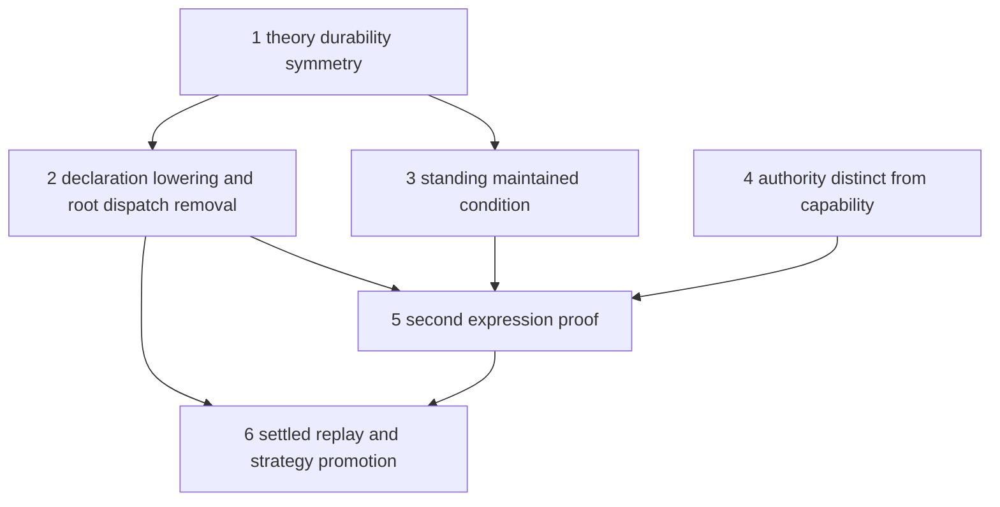

# Theory Elevation Program

Date: 2026-08-12
Status: active
Scope: elevate the hand-lowered docs stewardship image into durable installed theory, remove root expression dispatch, and prove runtime agnosticism through a second dissimilar expression

## Purpose

The strategy landing closed the docs freshness loop dynamically: belief divergence curates a Goal, bounded search constructs a candidate from capability contracts, the Agent authorizes it, Execution realizes it exactly with no Method and no workflow route, claim-validated publication produces assessment evidence, and belief settles to quiescence. The generic strategy, agent, and execution machinery carries no domain vocabulary.

The remaining defect is locational, not structural. The complete docs theory package — settlement rule, prospective evidence route, claim policy, goal template, cost model, and search bounds — is hand-lowered Rust in `src/docs/pds.rs`, composed unconditionally from root assembly. In the stewardship layering recorded by the [PDS proposal corpus](../../persistent_domain_stewardship/proposal_index.md), that module is a compatibility antecedent of a compiled stewardship image: it shows exactly what a declaration compiler must eventually emit, and it must not become the extension model. This program elevates that content into durable installed theory and proves the elevation with a dissimilar second expression.

This program is the active forward authority after the runtime completion program closed. It succeeds the [Runtime Completion Ground Map](runtime_completion_ground_map.md) as the current objective.

## Ground

What holds on the strategy branch:

- Generic candidate construction, independent verification, and Agent authorization live in the world-model crate with no domain names in types or match arms.
- Execution admits Goals only with matching authorization and realizes the authorized composition exactly or fails without task-network mutation.
- Claim validation gates publication behind deterministic extraction, evidence-cited entailment verdicts, deterministic guards, bounded revision, and hash-fenced re-verification.
- Belief family and outcome interpretation for docs freshness are authored data under `theory/docs_freshness/`, and the belief-family registry provides durable content-hashed revisions.

What does not hold:

- Settlement rules, evidence routes, claim policies, outcome contract bindings, and the goal template exist only as compiled constants with string identities that no registry resolves.
- Root assembly composes the docs stewardship image unconditionally; adding a second expression today would require a new root branch, which the stewardship invariants forbid as an extension model.
- Standing responsibility exists only as a hardcoded goal template rather than a first-class maintained condition.
- Authority is not represented separately from capability availability.

## Program Sequence

Sequencing rule, carried from the stewardship reviews: runtime seams land before upper layers depend on them. Each step that changes runtime behavior takes an affected-domain assessment under the [Assessment By Domain Policy](../../../governance/assessment_by_domain_policy.md) before build.

### Step 1 — Theory durability symmetry

Apply the belief-family registry pattern — stable identity, content hash, append-only revisions, historical resolution — to every theory kind the docs image hand-lowers: settlement rules, prospective evidence routes, claim policies, outcome contract bindings, and capability strategy views. Registries are per domain, following existing ownership, not one central store. Success: every string identity in the docs stewardship image resolves through a durable registry, and the exact executed semantics of a past run are recoverable by revision.

### Step 2 — Declaration lowering and root dispatch removal

Replace the unconditional docs composition and the expression match in root assembly with lowering from a declared stewardship selection. The existing docs configuration remains a compatibility reader that lowers into the generic form, per the transitional-forms invariant. Success: adding a new stewardship expression requires no new root match arm in config or runtime assembly, and `src/docs/pds.rs` either lowers from installed theory or is retired to a regression fixture for the lowering path.

### Step 3 — Standing maintained condition

Make standing responsibility a first-class contract: a maintained condition that causes zero or more transient Goals over time. The hardcoded docs goal template with its threshold literal becomes a lowering product of the maintained condition. This is the stewardship invariant every catalogued expression depends on.

### Step 4 — Authority distinct from capability

Represent effective authority as the intersection of capability availability, package request, principal grant, runtime policy, and restrictions. The stewardship reviews name authority as the place where design must not be inferred from nearby capability machinery. This step gates any expression whose interventions are consequential beyond workspace-local writes.

### Step 5 — Second expression proof

Implement CVE freshness as the second stewardship expression. It is the designed inverse of docs freshness: settlement by acquisition of external advisories rather than by evaluation of produced bytes, scoped negative obligations rather than positive thresholds, durable external wake conditions, and candidate scoping over a shared manifest artifact. Its required semantics are recorded in the [CVE Freshness Use Case](../../use_cases/cve_freshness.md) as a falsification list. The expression is rejected as a generality proof if it needs a root match arm, an application-named belief subsystem, a planner branch on application vocabulary, or capability treated as authorization. Passing this step is the evidence gate the stewardship corpus requires before freezing package or declaration schemas.

### Step 6 — Settled replay and strategy promotion

With durable theory registries and the settled-replay contract, promote validated strategy candidates into durable records the world model can collect, connect, and reuse: after settlement, replay reuses the exact judgment without regenerating candidates. This step turns per-Goal construction into an accumulating strategy asset and is the program endpoint.

## Exit Criteria

- Two dissimilar stewardship expressions run through identical root assembly with no expression-named branches.
- Every theory identity executed by either expression resolves through a durable registry revision.
- A standing maintained condition, not a compiled goal template, causes each transient Goal.
- One settled Goal replays through its recorded authorization without candidate regeneration.
- The bounded convergence behavior of the docs flywheel is preserved under the elevated theory path.

## Residual Register

Residuals adopted by this program:

- The hand-lowered stewardship image in `src/docs/pds.rs` and its unconditional root composition — steps 1 and 2.
- The hardcoded belief-context family binding in `src/context/belief_context.rs` — step 2.
- The stale on-disk Method artifact `theory/docs_freshness/methods/refresh_docs_v1.json`, dead since planning-theory provisioning was deleted — retire in step 2.
- Claim-policy thresholds and weights as package-preset material — step 1, with preset expansion deferred to the declaration layer.

Residuals tracked in their home documents, not gated by this program:

- Comparator calibration and the coupled satisfaction threshold, recorded in the [Flywheel Parity Workstream](flywheel_parity_workstream.md), which must be re-measured against the rewritten docs theory data.
- The declared-effects planner characterization pinned in the parity workstream slice six.
- Generator and verifier sharing one provider, and required-claim coverage, recorded in the [Docs Result Evidence Validation Assessment](docs_result_evidence_validation_assessment.md).
- The harness published consumer contract, phase four of the [Runtime Harness Plan](runtime_harness_plan.md).
- Silent-success residuals recorded in [Silent Success Findings](silent_success_findings.md).

## Read With

- [Strategy Ground Map](../world_model/strategy/ground_map.md)
- [Minimal Slice Requirements](../world_model/strategy/minimal_slice_requirements.md)
- [PDS Theory Runtime Layer](pds_theory_runtime_layer.md)
- [PDS Proposal Index](../../persistent_domain_stewardship/proposal_index.md)
- [PDS Architectural Invariants](../../persistent_domain_stewardship/architectural_invariants.md)
- [Persistent Domain Stewardship](../../cognitive_architecture/persistent_domain_stewardship.md)
- [World Model Strategy](../../cognitive_architecture/world_model/strategy/README.md)
- [Synthesis Overview](../../cognitive_architecture/execution/synthesis/README.md)
