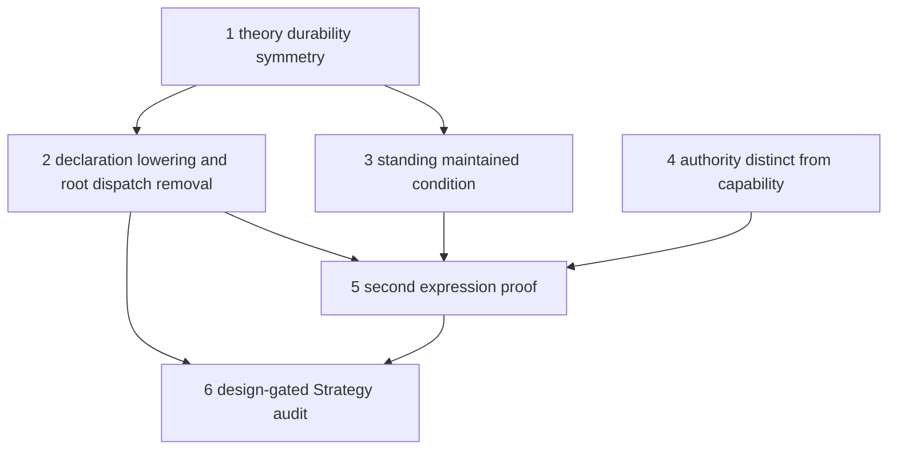

# Theory Elevation Program

Date: 2026-08-18
Status: active
Scope: elevate the hand-lowered docs stewardship image into durable installed theory, remove root expression dispatch, prove bounded runtime agnosticism, and retain later hypotheses behind explicit design gates

## Purpose

The strategy landing closed the docs freshness loop dynamically. Steps 1 through 4 then elevated the complete docs image into exact durable owner revisions, removed root expression dispatch, made standing maintained conditions causal, and separated effective authority from capability availability. The generic Strategy, Agent, and execution machinery carries no docs vocabulary.

The remaining architectural program concerns proof and accumulation. A dissimilar second expression must falsify hidden docs assumptions before package schemas freeze. The earlier settled-replay concept remains a hypothesis rather than an accepted endpoint. [PDS Authorized Implementation Workstreams](pds_implementation_workstreams.md) is closed as a superseded compatibility checkpoint. The active [PDS Boundary Program](pds_boundary_program.md) owns the bounded correction.

This program remains an architectural objective, not blanket implementation authority. Active delivery authority is limited to the current phase named by the PDS Boundary Program. [PDS Design-Gated Continuations](pds_design_gated_continuations.md) records work that remains outside that authorization.

[Canonical Persistent Domain Stewardship](../../cognitive_architecture/persistent_domain_stewardship.md) now fixes the target boundary. Steps 1 through 4 delivered a compatibility aggregate and remain valid evidence, but future work must split exact capabilities, Methods, construction policy, search controls, projection requests, and requested authority from PDS semantic theory.

## Ground

What holds on the strategy branch:

- Generic candidate construction, independent verification, and Agent authorization live in the world-model crate with no domain names in types or match arms.
- Execution admits Goals only with matching authorization and realizes the authorized composition exactly or fails without task-network mutation.
- Claim validation gates publication behind deterministic extraction, evidence-cited entailment verdicts, deterministic guards, bounded revision, and hash-fenced re-verification.
- Belief family and outcome interpretation for docs freshness are authored data under `theory/docs_freshness/`, and the belief-family registry provides durable content-hashed revisions.

What does not hold:

- A second dissimilar expression has not yet tested the generality of the elevated seams.
- No correctness or measured operational need for settled Strategy replay has been established.

## Program Sequence

Sequencing rule, carried from the stewardship reviews: runtime seams land before upper layers depend on them. Each step that changes runtime behavior takes an affected-domain assessment under the [Assessment By Domain Policy](../../../governance/assessment_by_domain_policy.md) before build.

## Program Progress

- Step 1 is implemented with durable exact owner revisions and complete receipts.
- Step 2 is implemented with named declaration lowering, owner activation, exact capability binding, declaration-selected belief context, and no root expression dispatch.
- Step 3 is implemented with Agent-owned maintained-condition revisions, complete-receipt activation, causal Goal lineage, and compatibility lowering for threshold-only records.
- Step 4 is implemented with exact execution-owned policy revisions and independent Agent, admission, planning, and dispatch enforcement.
- The bounded truth and lifecycle support in `W05` and `W06` is authorized, but full Step 5 completion is not.
- Step 6 is not authorized and requires a full design audit and necessity proof.

The delivered base through Step 4 is independently reconciled in the [Fresh Review Of Steps 1 Through 4](theory_elevation_steps_1_through_4_fresh_review.md).

### Step 1 — Theory durability symmetry

Apply the belief-family registry pattern — stable identity, content hash, append-only revisions, historical resolution — to every theory kind the docs image hand-lowers: settlement rules, prospective evidence routes, claim policies, outcome contract bindings, and capability strategy views. Registries are per domain, following existing ownership, not one central store. Success: every string identity in the docs stewardship image resolves through a durable registry, and the exact executed semantics of a past run are recoverable by revision.

Initiation and completion are governed by the [Theory Durability Symmetry Workstream](theory_durability_symmetry_workstream.md), with cross-domain ownership reconciled in the [Theory Durability Symmetry Contract Coherence Assessment](theory_durability_symmetry_contract_coherence_assessment.md).

### Step 2 — Declaration lowering and root dispatch removal

Replace the unconditional docs composition and the expression match in root assembly with lowering from a declared stewardship selection. The existing docs configuration remains a compatibility reader that lowers into the generic form, per the transitional-forms invariant. Success: adding a new stewardship expression requires no new root match arm in config or runtime assembly, and `src/docs/pds.rs` either lowers from installed theory or is retired to a regression fixture for the lowering path.

### Step 3 — Standing maintained condition

Make standing responsibility a first-class contract: a maintained condition that causes zero or more transient Goals over time. The hardcoded docs goal template with its threshold literal becomes a lowering product of the maintained condition. This is the stewardship invariant every catalogued expression depends on.

Implementation and evidence are recorded in the [Standing Maintained Condition Implementation Design](standing_maintained_condition_implementation_design.md) and [Standing Maintained Condition Completion Evidence](standing_maintained_condition_completion_evidence.md).

### Step 4 — Authority distinct from capability

Represent effective authority as the intersection of assignment request, principal grant, runtime policy, and restrictions, then verify that selected actions are covered. Capability availability remains a separate input. This step gates any expression whose interventions are consequential beyond workspace-local writes.

Implementation and evidence are recorded in the [Effective Authority Implementation Design](effective_authority_implementation_design.md) and [Effective Authority Completion Evidence](effective_authority_completion_evidence.md).

### Step 5 — Dependency-security second expression proof

Authorization status: only the bounded read-only truth slice and portable lifecycle contract in `W05` and `W06` are authorized. Completing this step requires real dependency-security domain and product design followed by explicit reauthorization.

The full step would implement dependency security as the second stewardship expression. CVE freshness remains its original use-case name and falsification surface, while dependency security is the owning domain because inventory, non-CVE advisories, source coverage, remediation, and verification are broader than one advisory identity system. It is the designed inverse of docs freshness: settlement by acquisition of external advisories rather than by evaluation of produced bytes, scoped negative obligations rather than positive thresholds, durable external wake conditions, and candidate scoping over a shared manifest artifact. Its required semantics are recorded in the [CVE Freshness Use Case](../../use_cases/cve_freshness.md) as a falsification list. The expression is rejected as a generality proof if it needs a root match arm, an application-named belief subsystem, a planner branch on application vocabulary, or capability treated as authorization. Passing the full step remains an evidence gate before package or declaration schemas may freeze, but the full step is not authorized.

The dedicated pre-requirements mapping is recorded in the [CVE Freshness Step 5 Discovery Ground Map](cve_freshness_step_5_discovery_ground_map.md). It identifies the current docs-shaped image boundary, assignment-scope and subject-instance gap, observation bridge, planner projection boundary, and cross-task effect arbitration as the design questions that must settle before implementation initiation. The candidate package boundary and its deliberately unresolved runtime-isolation posture are captured in the [External Domain Theory Attachment Proposition Brief](external_domain_theory_attachment_proposition_brief.md). Current sequencing treats generic attachment and docs parity as prerequisites to the dependency-security truth path rather than implementing a second expression against the fixed image.

### Step 6 — Design-gated Strategy audit

Authorization status: not authorized for implementation. The proposed Strategy changes require a full design audit that first demonstrates a correctness need or measured operational need and rules out simpler use of existing historical records.

The earlier hypothesis proposed promoting validated Strategy candidates into reusable durable records after settlement. That direction is not canonical. Exact owner revisions, package lineage, Agent authorization, realized Composition, and historical resolution may already provide the required behavior without a new replay path.

## Exit Criteria

- Two dissimilar stewardship expressions run through identical root assembly with no expression-named branches.
- Every theory identity executed by either expression resolves through a durable registry revision.
- A standing maintained condition, not a compiled goal template, causes each transient Goal.
- Any Strategy continuation has passed a full audit and explicit reauthorization, or the program records that existing historical resolution is sufficient.
- The bounded convergence behavior of the docs flywheel is preserved under the elevated theory path.

## Residual Register

Residuals adopted by this program:

- The hand-lowered production image and unconditional root composition were closed by steps 1 and 2. `src/docs/pds.rs` remains test-only.
- The hardcoded belief-context family binding was closed in step 2. Hydration now consumes the selected physical binding.
- The stale on-disk Method, available-action, and realization artifacts were retired in step 2.
- Claim-policy thresholds and weights are durable owner theory after step 1. Preset expansion remains deferred beyond the minimal step 2 declaration.
- The hardcoded standing Goal template was closed in step 3. Agent-owned maintained conditions now cause transient Goals through exact receipt-selected revisions.
- Capability availability as implicit authorization was closed in step 4. Exact authority policy revisions now bound Agent judgment, admission, planning, and dispatch.

Residuals tracked in their home documents, not gated by this program:

- Comparator calibration and the coupled satisfaction threshold, recorded in the [Flywheel Parity Workstream](flywheel_parity_workstream.md), which must be re-measured against the rewritten docs theory data.
- The declared-effects planner characterization pinned in the parity workstream slice six.
- Generator and verifier sharing one provider, and required-claim coverage, recorded in the [Docs Result Evidence Validation Assessment](docs_result_evidence_validation_assessment.md).
- The harness published consumer contract, phase four of the [Runtime Harness Plan](runtime_harness_plan.md).
- Silent-success residuals recorded in [Silent Success Findings](silent_success_findings.md).

## Read With

- [PDS Authorized Design Delivery Program](pds_authorized_design_delivery_program.md)
- [PDS Authorized Implementation Workstreams](pds_implementation_workstreams.md)
- [PDS Design-Gated Continuations](pds_design_gated_continuations.md)
- [Strategy Ground Map](../world_model/strategy/ground_map.md)
- [Minimal Slice Requirements](../world_model/strategy/minimal_slice_requirements.md)
- [PDS Theory Runtime Layer](pds_theory_runtime_layer.md)
- [PDS Proposal Index](../../persistent_domain_stewardship/proposal_index.md)
- [PDS Architectural Invariants](../../persistent_domain_stewardship/architectural_invariants.md)
- [Persistent Domain Stewardship](../../cognitive_architecture/persistent_domain_stewardship.md)
- [World Model Strategy](../../cognitive_architecture/world_model/strategy/README.md)
- [Synthesis Overview](../../cognitive_architecture/execution/synthesis/README.md)
