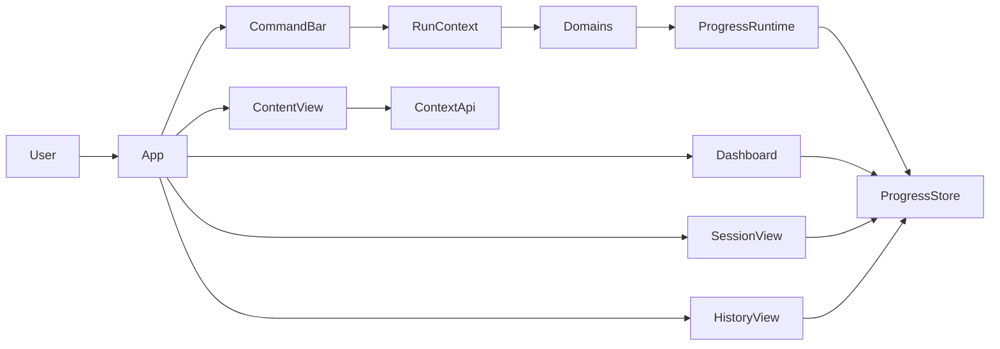

# `meld tui` specification

## 1. Purpose

`meld tui` is a feature gated interactive terminal interface for `meld`.

It has three jobs:

- monitor active work in real time through telemetry sessions and events
- browse workspace content and generated frames
- run existing `meld` commands without leaving the interface

The TUI is an adapter over the current codebase. It reads telemetry data from the durable store and delegates command execution to the same route layer the CLI already uses.

## 2. Product shape

The first release has four primary views:

- Dashboard
- Session
- Content
- History

The TUI also has shared overlays:

- Command bar
- Help overlay
- Output overlay for short command results
- Picker overlays for agent and provider selection

## 3. CLI surface

When the `tui` feature is enabled, the CLI exposes `meld tui`.

Initial launch modes:

- `meld tui` opens the dashboard
- `meld tui --session <id>` opens the session view for a known session
- `meld tui --history` opens the history view
- `meld tui --replay <id>` opens the session view in replay mode

When the feature is disabled, `meld tui` prints a short message that says the binary must be rebuilt with `--features tui`.

## 4. Design constraints from current code

- Command execution should go through `RunContext` rather than a TUI specific orchestration path.
- Session and event reads should come from `ProgressRuntime` and `ProgressStore`.
- The TUI should not add a second telemetry persistence format.
- The TUI should not call provider clients directly.
- The TUI should not reach across domain internals when a public facade already exists.

## 5. Core architecture



## 6. Domain boundaries

- `src/tui.rs` owns feature entry, startup, and top level wiring.
- `src/tui/app.rs` owns event loop, focus, current view, and overlay stack.
- `src/tui/command.rs` owns command bar input, parsing adapter, history, and dispatch.
- `src/tui/dashboard.rs` owns dashboard state and rendering.
- `src/tui/session.rs` owns session list, follow mode, replay mode, and view rendering.
- `src/tui/history.rs` owns history filters, pruning actions, and rendering.
- `src/tui/content.rs` owns content browser state and frame loading.
- `src/tui/state.rs` owns small UI local state that is shared across views.
- `src/tui/reader.rs` owns telemetry store reads and replay helpers.
- `src/tui/markdown.rs` owns markdown to terminal rendering.

The TUI depends on existing domains. Existing domains do not depend on the TUI.

## 7. Dashboard view

The dashboard is the default landing view.

It shows:

- workspace summary from the workspace status builder
- recent sessions from telemetry storage
- currently active sessions, if any exist
- loaded agent and provider from UI local state

Dashboard actions:

- open a selected session
- refresh dashboard data
- open the command bar with `context generate` prefilled
- run `scan` through the command route

Dashboard data sources:

- workspace summary from the existing workspace status path
- session metadata from `ProgressStore::list_sessions`

## 8. Session view

The session view is the primary real time monitoring surface.

It supports two modes:

- follow mode for active sessions
- replay mode for completed sessions

It shows:

- session metadata such as command, start time, status, and error
- aggregate progress derived from event reduction
- activity list per node or target path
- detail pane for the selected target

The first reducer should target the event set already emitted by the current engine:

- `session_started`
- `session_ended`
- `plan_constructed`
- `level_started`
- `node_generation_started`
- `workflow_turn_started`
- `workflow_turn_completed`
- `workflow_turn_failed`
- `node_generation_completed`
- `node_generation_failed`
- `file_changed`
- summary events emitted at command completion

The TUI may reuse reducer ideas from the current live progress panel, but should not reuse the terminal renderer from the CLI progress code.

## 9. Content view

The content view is a split browser for workspace navigation and generated frame review.

It shows:

- a tree browser for filesystem or meld nodes
- rendered frame content for the selected node
- frame metadata such as agent, provider, frame type, and frame id

Frame loading should use existing APIs:

- latest frame via `ContextApi::latest_context`
- filter by frame type via `ContextApi::context_by_type`
- filter by agent via `ContextApi::context_by_agent`

The content view should use loaded agent and provider defaults from TUI local state. Those defaults only shape UI choices and default command values. They do not change engine behavior.

## 10. History view

The history view shows prior sessions from the telemetry store.

It supports:

- sort by recency
- filter by command and status
- open a selected session in session view
- prune old completed sessions through existing telemetry policy
- delete a selected session record through the telemetry store contract

History reads should use the durable session metadata already stored by `ProgressStore`.

## 11. Command bar

The command bar accepts the same subcommands a user would type after `meld`.

Examples:

```text
:status
:workspace status --breakdown
:context generate src
:context get src/lib.rs --agent writer
```

Command bar rules:

- parse through the existing clap model with a small adapter
- inject the current workspace root from the active `RunContext`
- execute through `RunContext::execute`
- capture short textual results for the output overlay
- switch to session view when a command starts a new long running session

The command bar should not create a second command model.

## 12. Telemetry reading model

The TUI reads persisted sessions and events from the same sled trees the CLI uses today.

Read paths:

- session metadata via `ProgressStore::list_sessions`
- session events via `ProgressStore::read_events`
- follow mode via repeated `ProgressStore::read_events_after`

This means the TUI can:

- resume after a restart
- review finished sessions without special export logic
- replay known sessions without engine involvement

## 13. Feature gate and dependencies

Add a `tui` feature and keep all TUI code behind it.

Planned optional dependencies:

- `ratatui`
- `crossterm`
- `tui-tree-widget`

Markdown rendering can start simple and improve later. A minimal first release may render plain text with light styling before richer markdown support lands.

## 14. File layout

Planned files for the first implementation:

- `src/tui.rs`
- `src/tui/app.rs`
- `src/tui/command.rs`
- `src/tui/dashboard.rs`
- `src/tui/session.rs`
- `src/tui/history.rs`
- `src/tui/content.rs`
- `src/tui/state.rs`
- `src/tui/reader.rs`
- `src/tui/markdown.rs`
- `src/tui/keymap.rs`

If a subdomain grows, use `src/tui/<subdomain>.rs` with children under `src/tui/<subdomain>/`.

## 15. Delivery phases

### Phase 1

- add feature gate and CLI entry
- build dashboard, session, and history views
- wire telemetry readers to durable store

### Phase 2

- add command bar execution through `RunContext`
- add output overlay for short commands
- add replay support

### Phase 3

- add content view and tree browser
- add markdown rendering improvements
- add picker overlays for agent and provider

## 16. Required tests

### Unit tests

- event reducer handles active and completed sessions
- replay mode reproduces the same reduced state as live mode
- command bar adapter maps text input to existing commands
- dashboard loader handles empty and populated session stores
- content loader handles missing frames and valid frames

### Integration tests

- `meld tui --history` loads from a temp telemetry store
- command bar execution creates and follows a new session
- replay mode reads stored events in stable order
- content view loads frame text for a selected node

## 17. Out of scope for first release

- direct provider streaming panels
- multi workspace tabs
- remote telemetry transport
- editing frames inside the TUI
