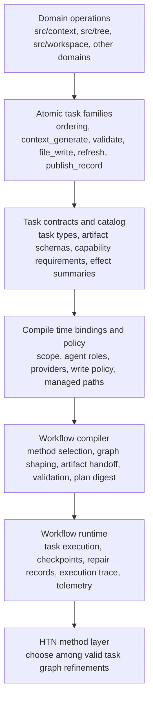

# Workflow Orchestrator Roadmap

Date: 2026-03-11
Status: active
Scope: HTN ready workflow foundation and task orchestration

## Thesis

This roadmap starts with current product behavior and moves upward into explicit workflow orchestration, then later HTN methods.
Meld already has real domain behavior in `src/context`.
The goal is not to hide that behavior inside a planner.
The goal is to lift stable capabilities into explicit atomic tasks, validate their wiring before execution, compile one explicit task graph, and persist enough runtime state for repair, resume, and audit.

The near-term outcome is a workflow architecture where orchestration is a first-class layer above domain operations and where HTN decomposition can be added later without another architectural reset.

## Decision Rules

- domains keep direct ownership of concrete behavior
- atomic tasks expose narrow, explicit execution boundaries
- task handoff stays typed, versioned, and validated
- scope, policy, agents, providers, and managed paths bind before execution
- workflow compiles before runtime executes
- runtime records are the source of truth for checkpoints, repair, resume, and audit
- compatibility wrappers protect current command behavior before cutover
- HTN methods refine valid task graph shapes rather than replace domain logic

## Out Of Scope For Now

- automated method learning
- broad search across arbitrary action libraries
- full uncertainty policy synthesis
- a large workflow authoring language before task contracts and runtime records are stable

## Architecture Diagram

## Layer Model

### 1. Domain Operations

`src/context` and peer domains keep real product behavior such as artifact production, queue execution, persistence, retrieval, and other concrete work.
Workflow calls those capabilities through explicit contracts rather than reimplementing them.

### 2. Atomic Task Families

Workflow lifts stable capabilities into reusable tasks such as ordering, context generation, validation, file materialization, workspace refresh, and record publication.
Each task exposes one narrow execution surface with explicit inputs, outputs, and side effects.

### 3. Task Contracts And Catalog

Task types carry typed inputs and outputs, schema versions, capability requirements, effect summaries, idempotency expectations, and retry guidance.
This is the layer that turns concrete capabilities into validated workflow building blocks.

### 4. Compile Time Bindings And Policy

Plan compilation binds write policy, agent roles, provider selection, managed scope, and related governance before any task runs.
These concerns stay visible at compile time because they determine validity, repeatability, and resume safety.

### 5. Workflow Compilation And Runtime

Workflow interprets top-level intent, selects a valid method shape, binds artifacts and capabilities, compiles one explicit graph, and executes it through a durable runtime.
The runtime owns checkpoints, repair records, execution trace, and telemetry.

### 6. HTN Method Layer

HTN methods arrive after the lower layers stabilize.
They choose among valid task graph refinements rather than replacing domain behavior or hiding execution details.

### 7. Migration And Compatibility

Current commands and turn flows should route through compatibility compilation before public behavior changes.
That preserves behavior while adding stable ids, artifacts, plan records, and telemetry.

## Opinionated Read Order

This is the default single-pass review path for the active design set.
Read straight through once.
Stop after item 18 if you only need the active architecture.
Continue through item 32 for target workflow structure, migration, terminology, research, and design history.

This order answers five questions in sequence:

- what behavior stays in domains
- which capabilities become atomic tasks
- how contracts and bindings make plans valid before execution
- how compilation, runtime, and telemetry fit together
- how target workflow structure and migration land without another reset

### 1. Existing Behavior And Migration Seam

1. [Workflow Orchestrator Roadmap](README.md) — roadmap, rules, and layer model
2. [Context Refactor Requirements](context/README.md) — current behavior that must survive
3. [Code Path Findings](context/code_path_findings.md) — where that behavior lives today
4. [Generation Surface Focus](context/generation_surface_focus/README.md) — highest-value generation paths
5. [Target Plan Input](context/target_plan_input/README.md) — workflow entry artifact and scope
6. [Workflow Contract Boundary](context/workflow_contract_boundary/README.md) — ownership line between `src/context` and workflow
7. [Typed Generation Artifacts](context/typed_generation_artifacts/README.md) — artifact shapes that cross that line
8. [Quality And Metadata Parity](context/quality_and_metadata_parity/README.md) — quality floor migration cannot lose
9. [Compatibility Compilation](context/compatibility_compilation/README.md) — how current commands compile without behavior drift

### 2. Atomic Task Surfaces

10. [Context Generate Task](context_generate_task/README.md) — context generation as an atomic task
11. [Ordering Task](ordering_task/README.md) — ordering as an explicit task family
12. [File Write Task](file_write_task/README.md) — materialization and file side effects

### 3. Contracts And Bindings

13. [Primitive Task Contract](primitive_task_contract/README.md) — minimum contract every task must honor
14. [Task Model](task_model/README.md) — workflow-level representation of tasks, artifacts, and graph nodes
15. [Write Policy](write_policy/README.md) — managed path rules and write governance
16. [Agent Binding](agent_binding/README.md) — agent role and provider selection before execution

### 4. Compilation And Runtime

17. [Workflow Definition](workflow_definition/README.md) — how intent becomes one validated task graph
18. [Telemetry Model](telemetry_model/README.md) — execution trace, repair signal, and audit record

### 5. Target Workflow Split

19. [New Workflow Subdomains](new_domains/README.md) — target domain map for workflow code
20. [Network Planning](new_domains/network_planning/README.md) — graph shaping and planning surface
21. [Catalog](new_domains/catalog/README.md) — registered tasks, schemas, and capabilities
22. [Compiler](new_domains/compiler/README.md) — plan binding and validation
23. [State](new_domains/state/README.md) — durable plan and run state
24. [Runtime](new_domains/runtime/README.md) — execution engine, checkpoints, and handoff
25. [Repair](new_domains/repair/README.md) — correction, resume, and recovery flow

### 6. Cutover And Reference Tail

26. [Migration Plan](migration_plan/README.md) — rollout order and compatibility cutover
27. [HTN Glossary](htn_glossary.md) — shared terminology
28. [HTN Codebase Structure Report](../../research/htn/README.md) — external implementation patterns
29. [Advancements in Hierarchical Task Network Planning Research Since 2020.pdf](../../research/htn/Advancements%20in%20Hierarchical%20Task%20Network%20Planning%20Research%20Since%202020.pdf) — recent HTN research survey
30. [Hierarchical Task Networks and Goal Oriented Action Planning for Modern Agentic Systems.pdf](../../research/htn/Hierarchical%20Task%20Networks%20and%20Goal%20Oriented%20Action%20Planning%20for%20Modern%20Agentic%20Systems.pdf) — HTN and GOAP framing for agentic systems
31. [Completed Workflow Bootstrap](../completed/workflow_bootstrap/README.md) — earlier internal workflow baseline
32. [Publish Arbiter Idea](../workflow_ideas/publish_arbiter_spec.md) — adjacent design history
