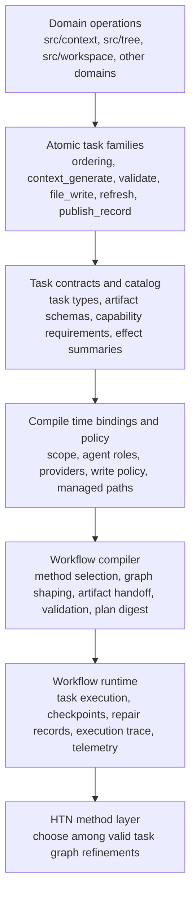

# Workflow Orchestrator Roadmap

Date: 2026-03-11
Status: active
Scope: HTN ready workflow foundation and task orchestration

## Overview

This document is the starting point for workflow orchestrator design.
Read it from the most concrete product capability up through workflow compilation and the later HTN method layer.

The core idea is straightforward.
Meld already has real domain behavior in `src/context`.
This effort does not hide that behavior inside a planner.
It lifts stable capabilities into explicit atomic tasks, compiles those tasks into validated workflow plans, and gives HTN methods a durable base for choosing among valid plan shapes.

## Why It Exists

- preserve domain ownership
- make orchestration visible
- validate task wiring before execution begins
- ground repair and resume in durable records
- create a stable base for later HTN methods without another architectural reset

## Mental Model

- `src/context` and other domains keep concrete behavior
- atomic tasks expose those capabilities through stable workflow contracts
- workflow binds scope, artifacts, policy, agents, and providers before execution begins
- workflow compiles one explicit task graph with stable ids and durable records
- runtime executes that compiled plan with checkpoints, repair data, and telemetry
- HTN methods later refine plan shape on top of that stable base

## Architecture Diagram

## Concrete To Abstract Stack

### 1. Context And Domain Operations

This is the most concrete layer because it already exists and already does real product work.
`src/context` owns context artifact production, queue execution, frame persistence, and retrieval.
Other domains should keep the same direct ownership of their own behavior.

Workflow should:

- call domain capabilities through explicit contracts
- preserve domain quality and data guarantees
- avoid reimplementing domain behavior in `src/workflow`

Primary doc:

- [Context Refactor Requirements](context/README.md)
- [Context Generate Task](context_generate_task/README.md)

### 2. Atomic Task Families

Atomic tasks are the first workflow-facing lift above concrete domain behavior.
Each task should wrap one domain-owned capability or one narrow execution surface.
This is where reusable workflow building blocks begin.

The first phase should cover ordering, context generation, validation, file materialization, workspace refresh, and record publication.

Workflow should:

- define stable execution boundaries
- make inputs, outputs, and side effects explicit
- let commands and later methods reuse the same task families

Primary docs:

- [Ordering Task](ordering_task/README.md)
- [Context Generate Task](context_generate_task/README.md)
- [File Write Task](file_write_task/README.md)

### 3. Task Contracts And Task Catalog

Once tasks exist, workflow needs a stable way to reason about them.
That layer is the task model and the primitive task contract.
It turns concrete capabilities into validated workflow building blocks.

Task contracts should carry high-signal information:

- task type id and version
- typed artifact inputs and outputs
- schema versions for artifacts
- capability requirements
- side effect and idempotency expectations
- observation and effect summaries
- retry and timeout guidance

Primary docs:

- [Primitive Task Contract](primitive_task_contract/README.md)
- [Task Model](task_model/README.md)

### 4. Compile-Time Policy And Bindings

After tasks become explicit, the next layer is the set of decisions that determine whether tasks can safely run together.
This includes write policy, agent roles, provider bindings, managed scopes, and related capability-level governance.

These concerns belong in plan compilation, not inside hidden task internals, because they affect validity, repeatability, and resume safety.

Primary docs:

- [Write Policy](write_policy/README.md)
- [Agent Binding](agent_binding/README.md)

### 5. Workflow Compilation And Runtime

Workflow is the first clearly more abstract layer above the concrete task surface.
Its job is not to perform domain work directly.
Its job is to interpret top-level intent, select a valid method shape, bind artifacts and capabilities, compile one explicit task graph, and execute that compiled plan through a durable runtime.

The runtime should own checkpoints, repair records, execution trace, and telemetry.
Planning and execution should remain clearly separate.

Primary docs:

- [Workflow Definition](workflow_definition/README.md)
- [Telemetry Model](telemetry_model/README.md)

### 6. HTN Method Layer

HTN is the highest abstraction in this design set, not the starting point.
The project should first stabilize concrete capabilities, atomic tasks, contracts, bindings, and compiled plan records.
Only then should richer method libraries expand on that base.

In this model, methods choose among valid task graph refinements.
They do not replace domain behavior.
They sit on top of stable workflow records.

### 7. Migration And Compatibility

Migration is the bridge from the current system into the new one.
Current commands and turn-based flows should compile through compatibility shapes before their public behavior changes.
This gives the project better ids, artifacts, plan records, and telemetry without a disruptive rewrite.

Primary doc:

- [Migration Plan](migration_plan/README.md)

## Core Design Rules

- domains own behavior
- tasks stay small and explicit
- compile before run
- artifact handoff stays typed and validated
- policy and bindings stay visible before execution
- runtime records are the source of truth for repair and audit
- compatibility comes before cutover

## Reading Order

Read in this order for the clearest path from concrete behavior to abstract orchestration:

1. [Context Refactor Requirements](context/README.md)
2. [Context Generate Task](context_generate_task/README.md)
3. [Ordering Task](ordering_task/README.md)
4. [File Write Task](file_write_task/README.md)
5. [Write Policy](write_policy/README.md)
6. [Primitive Task Contract](primitive_task_contract/README.md)
7. [Task Model](task_model/README.md)
8. [Agent Binding](agent_binding/README.md)
9. [Workflow Definition](workflow_definition/README.md)
10. [Telemetry Model](telemetry_model/README.md)
11. [Migration Plan](migration_plan/README.md)
12. [HTN Glossary](htn_glossary.md)

## Near-Term Outcome

Deliver a workflow architecture where orchestration is a first-class layer above domain operations and where HTN decomposition can be added without another architectural reset.
The system should compile explicit task graphs, validate task wiring before execution begins, persist durable run state, and coordinate artifacts across ordering, generation, validation, and materialization.

## Not Yet

- automated method learning
- broad search across arbitrary action libraries
- full uncertainty policy synthesis
- a large workflow authoring language before task contracts and runtime records are stable

## Research Anchors

- [HTN Codebase Structure Report](../../research/htn/README.md)
- [Advancements in Hierarchical Task Network Planning Research Since 2020.pdf](../../research/htn/Advancements%20in%20Hierarchical%20Task%20Network%20Planning%20Research%20Since%202020.pdf)
- [Hierarchical Task Networks and Goal Oriented Action Planning for Modern Agentic Systems.pdf](../../research/htn/Hierarchical%20Task%20Networks%20and%20Goal%20Oriented%20Action%20Planning%20for%20Modern%20Agentic%20Systems.pdf)

## Related Design History

- [Completed Workflow Bootstrap](../completed/workflow_bootstrap/README.md)
- [Publish Arbiter Idea](../workflow_ideas/publish_arbiter_spec.md)
